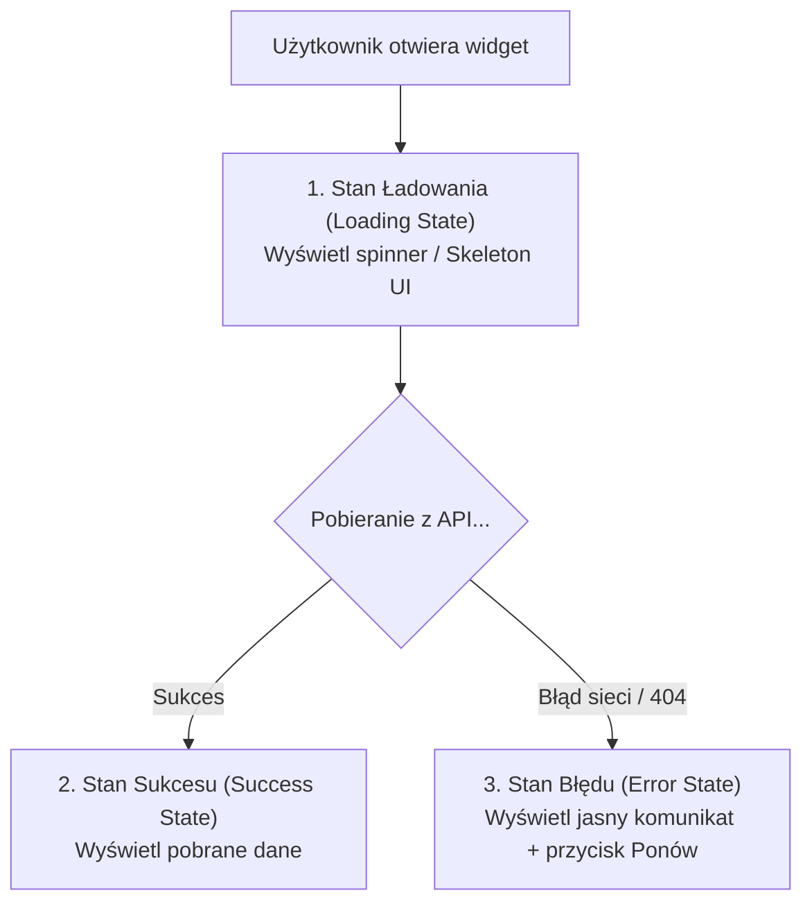

# Asynchroniczność, API i Stan Ładowania

Dynamiczne aplikacje internetowe muszę pobierać dane z serwerów zewnętrznych (API) bez przeładowywania strony. 

W tej lekcji dowiesz się, jak pobierać dane z użyciem instrukcji **`async/await`** i funkcji **`fetch()`** oraz jak projektować odpowiednie stany użytkownika (**UI/UX Loading, Error, Success**), by strona nie sprawiała wrażenia zaciętej.

Zbudujemy **Mini-projekt 3: Widget Kursów Walut NBP z obsługą strefy ładowania i błędów**.

---

## 🧠 Model mentalny: Trzy Stany Interfejsu Asynchronicznego

Każde pobieranie danych przez sieć musi przejść przez **trzy jawne stany interfejsu (UX)**:



Nigdy nie zostawiaj pustego ekranu podczas pobierania danych z sieci! Użytkownik musi wiedzieć, że aplikacja pracuje w tle.

---

## ⚙️ Krok 1: Struktura Widgetu HTML

Stwórz folder `C:\xampp\htdocs\waluty-js\` i plik `index.html`:

```html
<!DOCTYPE html>
<html lang="pl">
<head>
    <meta charset="UTF-8">
    <title>Kursy Walut NBP</title>
    <style>
        body { font-family: system-ui, sans-serif; max-width: 450px; margin: 2rem auto; padding: 1rem; }
        .widget-card { border: 1px solid #e2e8f0; border-radius: 8px; padding: 1.5rem; background: #ffffff; box-shadow: 0 4px 6px -1px rgba(0,0,0,0.1); }
        .spinner { color: #2563eb; font-weight: bold; }
        .error-banner { background: #fef2f2; border: 1px solid #fecaca; color: #991b1b; padding: 1rem; border-radius: 6px; }
        .rate-list { list-style: none; padding: 0; }
        .rate-item { display: flex; justify-content: space-between; padding: 0.5rem 0; border-bottom: 1px solid #f1f5f9; }
        button { background: #2563eb; color: white; border: none; padding: 0.5rem 1rem; border-radius: 4px; cursor: pointer; }
    </style>
</head>
<body>
    <div class="widget-card">
        <h2>Aktualne Kursy Walut</h2>
        <div id="widget-content">
            <!-- Tutaj JS wstawi Spinner, Dane lub Błąd -->
        </div>
    </div>

    <script type="module" src="app.js"></script>
</body>
</html>
```

---

## ⚙️ Krok 2: Pobieranie danych i obsługa stanów UX (`app.js`)

Napiszemy moduł pobierający oficjalną tabelę kursów z darmowego API Narodowego Banku Polskiego (NBP):

```javascript
// Element docelowy w DOM
const widgetContent = document.querySelector('#widget-content');

/**
 * Pobiera dane z API NBP i obsługuje stany UX
 */
async function loadCurrencyRates() {
  // 1. STAN 1: ŁADOWANIE (Loading State)
  widgetContent.innerHTML = `
    <div class="spinner" role="status" aria-live="polite">
      Pobieranie aktualnych kursów walut...
    </div>
  `;

  try {
    // Wykonujemy zapytanie sieciowe HTTP GET
    const response = await fetch('https://api.nbp.pl/api/exchangerates/tables/A/?format=json');

    // Sprawdzamy czy odpowiedź HTTP jest poprawna (status 200-299)
    if (!response.ok) {
      throw new Error(`Błąd serwera NBP (Kod statusu: ${response.status})`);
    }

    // Parsujemy odpowiedź JSON na obiekt JavaScript
    const data = await response.json();
    const rates = data[0].rates;

    // Wybieramy interesujące nas waluty
    const targetCurrencies = ['USD', 'EUR', 'GBP', 'CHF'];
    const filteredRates = rates.filter(r => targetCurrencies.includes(r.code));

    // 2. STAN 2: SUKCES (Success State)
    renderSuccess(filteredRates);

  } catch (error) {
    // 3. STAN 3: BŁĄD (Error State)
    renderError(error.message);
  }
}

/**
 * Wyświetla listę walut
 */
function renderSuccess(rates) {
  const listItems = rates.map(rate => `
    <li class="rate-item">
      <span><strong>${rate.code}</strong> (${rate.currency})</span>
      <span><strong>${rate.mid.toFixed(4)} PLN</strong></span>
    </li>
  `).join('');

  widgetContent.innerHTML = `
    <ul class="rate-list">
      ${listItems}
    </ul>
    <button id="refresh-btn" type="button">Odśwież kursy</button>
  `;

  document.querySelector('#refresh-btn')?.addEventListener('click', loadCurrencyRates);
}

/**
 * Wyświetla komunikat błędu z opcją ponownej próby (Graceful UX)
 */
function renderError(errorMessage) {
  widgetContent.innerHTML = `
    <div class="error-banner" role="alert">
      <p><strong>Błąd połączenia:</strong> ${errorMessage}</p>
      <button id="retry-btn" type="button">Spróbuj ponownie</button>
    </div>
  `;

  document.querySelector('#retry-btn')?.addEventListener('click', loadCurrencyRates);
}

// Uruchamiamy pobieranie na start
loadCurrencyRates();
```

### 🔍 Wyjaśnienie składni od zera:

- **`async function loadCurrencyRates()`** — Słowo **`async`** deklaruje funkcję asynchroniczną. Pozwala to na użycie wewnątrz słowa kluczowego `await`. Funkcja asynchroniczna zawsze zwraca obiekt `Promise`.
- **`await fetch(url)`** — Słowo **`await`** wstrzymuje wykonanie funkcji do momentu, aż zapytanie sieciowe z funkcji `fetch()` powróci z odpowiedzią. Strona nie zamraża się w tym czasie!
- **`response.ok`** — Flaga typu boolean. Zwraca `true`, jeśli serwer odpowiedział poprawnym kodem sukcesu (np. `200 OK`).
- **`await response.json()`** — Pobiera ciało odpowiedzi i przekształca tekstowy format JSON na prawdziwy obiekt/tablicę JavaScript.
- **`try { ... } catch (error) { ... }`** — Blok przechwytywania błędów. Jeśli w bloku `try` wystąpi brak internetu lub błąd serwera, wykonanie natychmiast przeskakuje do bloku `catch`, pozwalając na wyświetlenie przyjaznego błędu.
- **`rates.filter(...)`** — Metoda tablicowa filtrująca elementy według wybranego kryterium.
- **`rates.map(...).join('')`** — Metoda `map()` przekształca obiekty walut na fragmenty kodu HTML, a `join('')` łączy je w jeden długi tekst.

---

## 🎯 🛠️ Mini-projekt 3: Symulacja błędu sieciowego

1. Otwórz plik w przeglądarce (`http://localhost/waluty-js/`).
2. Zobaczysz stan ładowania, a po chwili listę kursów EUR, USD, GBP, CHF.
3. Wyłącz na chwilę połączenie z internetem w swoim komputerze i kliknij „Odśwież kursy”.
4. Zamiast zepsuć stronę, aplikacja płynnie przejdzie do **Stanu Błędu** z komunikatem o braku połączenia oraz przyciskiem „Spróbuj ponownie”!

---

## 🛠️ Diagnostyka i rozwiązywanie problemów

<data-gate>
  <data-quiz>
    <question>
      Dlaczego samo sprawdzenie bloku try/catch przy wywołaniu fetch() NIE wykryje błędu 404 Not Found z serwera?
    </question>
    <options>
      <item>Funkcja fetch nie potrafi łączyć się z serwerami zwracającymi błędy.</item>
      <item correct>Funkcja fetch rzuca wyjątek (ląduje w catch) tylko przy braku połączenia sieciowego. Jeśli serwer odpowie kodem 404 lub 500, zapytanie powiodło się technicznie, dlatego musimy dodatkowo sprawdzić if (!response.ok).</item>
      <item>Kody 404 są automatycznie zamieniane na obiekty JSON.</item>
    </options>
    <div data-hint="error">
      Zastanów się: serwer przesłał odpowiedź HTTP 404. Czy połączenie internetowe zadziałało? Tak! Dlatego musisz ręcznie sprawdzić `response.ok`.
    </div>
    <div data-hint="success">
      Znakomicie! Pamiętaj: `fetch()` zgłasza błąd w `catch` tylko gdy brak połączenia fizycznego z siecią. Zawsze sprawdzaj `if (!response.ok)`!
    </div>
  </data-quiz>
</data-gate>

---

### <span class="header-koala"><span>🦾</span><span>Executive Summary</span><span>🦾</span></span> Co masz wynieść z tej lekcji:

- Każde zapytanie asynchroniczne wymaga obsłużenia trzech stanów UI: **Loading**, **Success** oraz **Error**.
- Używaj instrukcji **`async/await`** i bloku **`try/catch`** dla czytelnej obsługi obietnic (`Promise`).
- Zawsze sprawdzaj **`if (!response.ok)`** po wywołaniu `fetch()`.
