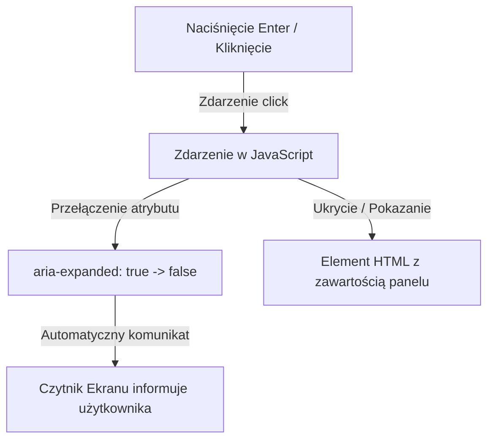

# Dynamiczne zdarzenia i Dostępność WCAG

Sama dynamiczność interfejsu to za mało. Dobre aplikacje internetowe muszą być **dostępne cyfrowo** (**WCAG 2.1**) dla każdego użytkownika — również dla osób obsługujących stronę wyłącznie klawiaturą lub korzystających z czytnika ekranu (*Screen Reader*).

W tej lekcji stworzymy **Mini-projekt 2: Dostępny Komponent Rozwijanego Menu (Accordion) z pełną obsługą nawigacji klawiaturowej**.

---

## 🧠 Model mentalny: Dostępna interakcja UI (WCAG + JS)

Kiedy tworzysz interaktywny widget (np. zwijany panel), czytnik ekranowy oraz użytkownik klawiatury muszą otrzymać trzy informacje:
1. **Tożsamość:** Co to za element? (`<button type="button">`).
2. **Stan:** Czy panel jest otwarty, czy zamknięty? (`aria-expanded="true|false"`).
3. **Sterowanie:** Możliwość otwarcia za pomocą klawisza `<kbd>Enter</kbd>` lub `<kbd>Spacja</kbd>`.



---

## ⚙️ Krok 1: Struktura Dostępnego HTML + CSS

Stwórz folder `C:\xampp\htdocs\accordion-js\` i plik `index.html`:

```html
<!DOCTYPE html>
<html lang="pl">
<head>
    <meta charset="UTF-8">
    <title>Dostępny Accordion WCAG</title>
    <style>
        body { font-family: system-ui, sans-serif; max-width: 600px; margin: 2rem auto; padding: 1rem; }
        .accordion-item { border: 1px solid #cbd5e1; border-radius: 6px; margin-bottom: 0.5rem; }
        
        .accordion-trigger {
            width: 100%;
            padding: 1rem;
            text-align: left;
            background: #f8fafc;
            border: none;
            font-size: 1rem;
            font-weight: bold;
            cursor: pointer;
            display: flex;
            justify-content: space-between;
        }

        /* Wskaźnik widocznego fokusu dla nawigacji klawiaturą (WCAG) */
        .accordion-trigger:focus-visible {
          outline: 3px solid #2563eb;
          outline-offset: -3px;
        }

        .accordion-panel {
            padding: 1rem;
            border-top: 1px solid #cbd5e1;
        }

        /* ukrywanie elementu w CSS gdy ma atrybut hidden */
        .accordion-panel[hidden] { display: none; }
    </style>
</head>
<body>
    <h1>Często zadawane pytania (FAQ)</h1>

    <div id="accordion-group">
        <div class="accordion-item">
            <button type="button" class="accordion-trigger" aria-expanded="false" aria-controls="panel-1" id="tab-1">
                Czym jest dostępność WCAG?
                <span class="icon" aria-hidden="true">+</span>
            </button>
            <div id="panel-1" class="accordion-panel" aria-labelledby="tab-1" hidden>
                WCAG to zestaw standardów zapewniających dostępność stron dla osób z niepełnosprawnościami.
            </div>
        </div>
    </div>

    <script type="module" src="accordion.js"></script>
</body>
</html>
```

---

## ⚙️ Krok 2: Logika JavaScript i Delegacja Zdarzeń (`accordion.js`)

Napiszemy modułowy skrypt, który wykorzystuje **Delegację Zdarzeń**:

```javascript
const accordionGroup = document.querySelector('#accordion-group');

function toggleAccordion(triggerBtn) {
  const panelId = triggerBtn.getAttribute('aria-controls');
  if (!panelId) return;

  const panel = document.getElementById(panelId);
  const icon = triggerBtn.querySelector('.icon');
  if (!panel) return;

  const isExpanded = triggerBtn.getAttribute('aria-expanded') === 'true';

  triggerBtn.setAttribute('aria-expanded', String(!isExpanded));
  panel.hidden = isExpanded;

  if (icon) {
    icon.textContent = isExpanded ? '+' : '−';
  }
}

accordionGroup?.addEventListener('click', (event) => {
  const target = event.target;
  const triggerBtn = target instanceof HTMLElement ? target.closest('.accordion-trigger') : null;

  if (triggerBtn instanceof HTMLButtonElement) {
    toggleAccordion(triggerBtn);
  }
});
```

---

## 🛠️ Interaktywne Wyzwanie Programistyczne (Web Challenge)

Skonfiguruj widoczny wskaźnik fokusu `:focus-visible` dla przycisków w wyzwaniu poniżej:

<data-gate>
  <data-web-challenge id="wcag-focus-challenge">
    <template data-type="html">
<button type="button" class="accordion-trigger">
  Naciśnij Tab na klawiaturze
</button>
    </template>
    
    <template data-type="css-readonly">
.accordion-trigger {
  padding: 1rem;
  background: #f8fafc;
  border: 1px solid #cbd5e1;
}
    </template>
    
    <template data-type="css">
/* Ustaw obrys outline: 3px solid #2563eb przy pseudoklasie :focus-visible */
.accordion-trigger:focus-visible {
  outline: 3px solid #2563eb;
}
    </template>
    
    <template data-type="requirements">
      [
        {"id": "focus-ring", "text": "Ustaw obrys :focus-visible na 3px solid #2563eb", "type": "selector-css", "selector": ".accordion-trigger:focus-visible", "property": "outline", "value": "3px solid #2563eb"}
      ]
    </template>
  </data-web-challenge>
</data-gate>

---

### <span class="header-koala"><span>🦾</span><span>Executive Summary</span><span>🦾</span></span> Co masz wynieść z tej lekcji:

- **Delegacja zdarzeń** pozwala na podpięcie jednego nasłuchiwacza na rodzicu z użyciem **`target.closest()`**.
- Zawsze używaj natywnego **`<button>`** dla interaktywnych akcji na stronie.
- Przełączaj **`aria-expanded="true|false"`** oraz właściwość **`hidden`**, aby informować o stanie użytkowników i czytniki ekranowe (WCAG).
