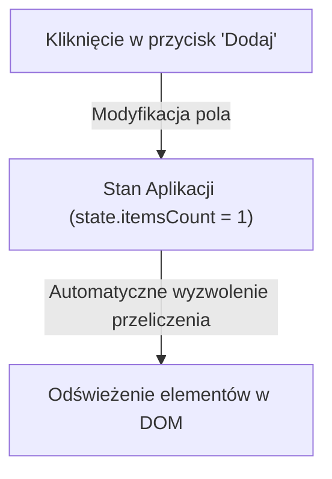

# Model Mentalny Stanu UI i Reaktywność

W tym kursie zbudujemy od zera **nowoczesny, interaktywny Panel Sklepowy i Koszyk (Dashboard)**. Nauczysz się pisać czysty, szybki i niezawodny kod JavaScript w najnowszych standardach ES2024+, bez uzależnienia od ciężkich frameworków.

W pierwszej lekcji zbudujemy **reaktywny licznik koszyka**. Zamiast ręcznie szukać elementów w drzewie DOM i zmieniać im tekst, stworzymy system, w którym zmiana danych w pamięci **_automatycznie aktualizuje interfejs_**.

---

## 🛠️ Twój cel: Reaktywny licznik przedmiotów w koszyku

Wyobraź sobie, że użytkownik klika przycisk „Dodaj do koszyka”. W starym podejściu musiałeś pamiętać o znalezieniu ikony koszyka w nagłówku, podsumowania w menu i tabeli produktów. Jeśli o czymś zapomniałeś — powstał błąd.

W nowym podejściu zmieniasz tylko liczbę w stanie `state.cartCount = 1`, a interfejs sam dba o resztę.



---

## ⚙️ Krok 1: Pisanie pierwszego skryptu i wyjaśnienie składni

Zacznijmy od stworzenia mechanizmu reaktywnego z wykorzystaniem natywnego obiektu **`Proxy`**. Spójrz na kod, a poniżej przeanalizujemy każde słowo kluczowe.

```javascript
/**
 * Tworzy reaktywny obiekt stanu
 */
export function createReactiveState(initialState, onChange) {
  return new Proxy(initialState, {
    set(target, property, value) {
      if (Reflect.get(target, property) === value) {
        return true;
      }

      const success = Reflect.set(target, property, value);
      if (success) {
        onChange({ ...target });
      }
      return success;
    }
  });
}
```

### 🔍 Wyjaśnienie składni JavaScript od zera (Linia po linii):

- **`export function`** — Słowo `export` pozwala innym plikom projektu na używanie tej funkcji za pomocą `import { createReactiveState } from './state.js'`. Słowo `function` definiuje funkcję.
- **`initialState, onChange`** — Parametry wejściowe funkcji. `initialState` to początkowy obiekt danych, a `onChange` to funkcja, która ma się wykonać, gdy dane ulegną zmianie.
- **`return new Proxy(initialState, { ... })`** — 
  - `return` zwraca wynik.
  - `new` tworzy nową instancję obiektu.
  - `Proxy` to wbudowany w JavaScript obiekt-strażnik. Opakowuje nasz zwykły obiekt i pozwala przechwycić operacje zapisu lub odczytu.
- **`set(target, property, value)`** — Tak zwana pułapka (*trap*). Wykonuje się automatycznie za każdym razem, gdy napiszesz w kodzie `state.itemsCount = 5`.
  - `target` — Oryginalny obiekt w pamięci.
  - `property` — Nazwa pola, np. `'itemsCount'`.
  - `value` — Nowa wartość, np. `5`.
- **`Reflect.get(...)` / `Reflect.set(...)`** — Natywne, bezpieczne narzędzia JavaScript do odczytywania i zapisywania właściwości w obiektach.
- **`onChange({ ...target })`** — Składnia `...` (Spread Operator) tworzy szybką kopię obiektu `target` i przekazuje ją do funkcji odświeżającej widok.

---

## ⚙️ Krok 2: Budowa reaktywnego widoku koszyka

Teraz połączymy nasz reaktywny stan z elementami na stronie HTML:

```javascript
import { createReactiveState } from './state.js';

// 1. Tworzymy reaktywny stan koszyka
const cartState = createReactiveState(
  { itemsCount: 0, totalPrice: 0 },
  (updatedState) => renderCart(updatedState)
);

// 2. Funkcja wyświetlająca UI
function renderCart(state) {
  const container = document.getElementById('cart-summary');
  if (!container) return;

  container.innerHTML = `
    <div class="cart-box">
      <h3>Twój Koszyk</h3>
      <p>Liczba produktów: <strong>${state.itemsCount}</strong></p>
      <p>Wartość: <strong>${state.totalPrice.toFixed(2)} PLN</strong></p>
    </div>
  `;
}
```

### 🔍 Wyjaśnienie składni widoku:

- **`const cartState`** — Słowo `const` tworzy stałą referencję do zmiennej. Używaj `const` zawsze, gdy nie planujesz przypisywać do zmiennej nowego obiektu.
- **`(updatedState) => renderCart(updatedState)`** — Funkcja strzałkowa (*Arrow Function*). Zwięzła wersja zapisu funkcji: `function(updatedState) { return renderCart(updatedState); }`.
- **`document.getElementById('cart-summary')`** — Pobiera element z drzewa DOM o podanym identyfikatorze `id`.
- **`if (!container) return;`** — Znak wykrzyknika `!` to negacja (NOT). Jeśli element nie istnieje (`null`), funkcja przerywa działanie, zapobiegając błędom.
- **`container.innerHTML = \`...\``** — Użycie grawisów (\`) otwiera ciąg szablonowy (*Template Literal*). Pozwala na wielowierszowy kod HTML oraz wstawianie zmiennych.
- **`${state.itemsCount}`** — Składnia `${...}` wstawia wartość zmiennej JavaScript bezpośrednio w tekst HTML.
- **`state.totalPrice.toFixed(2)`** — Metoda `toFixed(2)` formatuje liczbę do dwóch miejsc po przecinku (idealne dla walut).

---

## ⚙️ Krok 3: Reagowanie na kliknięcia użytkownika

Podepniemy przycisk dodawania produktu do koszyka:

```javascript
const addBtn = document.querySelector('#add-product-btn');

addBtn?.addEventListener('click', () => {
  // Po prostu modyfikujemy stan - UI odświeży się samo!
  cartState.itemsCount += 1;
  cartState.totalPrice += 49.99;
});
```

### 🔍 Wyjaśnienie składni zdarzeń:

- **`addBtn?.`** — Operator **Optional Chaining** (`?.`). Jeśli przycisk nie zostanie znaleziony na stronie, skrypt nie rzuci błędu `TypeError`, lecz bezpiecznie zignoruje dalsze wywołanie.
- **`addEventListener('click', () => { ... })`** — Rejestruje nasłuchiwacz zdarzenia kliknięcia myszą (`'click'`). Gdy użytkownik kliknie przycisk, wykona się przekazana funkcja strzałkowa.
- **`cartState.itemsCount += 1`** — Operator `+=` zwiększa dotychczasową wartość pola o `1`.

---

## 🎯 Ćwiczenie praktyczne: Synchronizacja wielu miejsc na stronie

Zaletą reaktywnego stanu jest to, że zmienienie `cartState.itemsCount` w jednym miejscu kodu natychmiast zaktualizuje zarówno nagłówek strony, jak i boczną szufladę koszyka:

```javascript
// Możemy podpiąć odświeżanie wielu elementów w funkcji renderującej
function renderCart(state) {
  // 1. Aktualizacja nagłówka
  const badge = document.querySelector('.nav-cart-badge');
  if (badge) badge.textContent = String(state.itemsCount);

  // 2. Aktualizacja przycisku kasy
  const checkoutBtn = document.querySelector('.checkout-btn');
  if (checkoutBtn) checkoutBtn.disabled = state.itemsCount === 0;
}
```

---

## 🛠️ Diagnostyka i rozwiązywanie problemów

<data-gate>
  <data-quiz>
    <question>
      Dlaczego użycie "cartState.itemsCount += 1" wyzwala odświeżenie interfejsu w naszym systemie reaktywnym?
    </question>
    <options>
      <item>Przeglądarka internetowa stale skanuje wszystkie zmienne w pamięci co 1 milisekundę.</item>
      <item correct>Operacja zapisu wyzwala pułapkę set() w naszym obiekcie Proxy, która wywołuje przekazaną funkcję renderCart().</item>
      <item>Znak += jest specjalną komendą do modyfikacji plików HTML.</item>
    </options>
    <div data-hint="error">
      Zastanów się: nasz obiekt `Proxy` przechwytuje operację zapisu do pola `itemsCount`. Co dzieje się wewnątrz pułapki `set`?
    </div>
    <div data-hint="success">
      Znakomicie! Obiekt `Proxy` przechwytuje zmianę wartości i automatycznie wywołuje powiązaną funkcję renderowania UI.
    </div>
  </data-quiz>
</data-gate>

---

### <span class="header-koala"><span>🦾</span><span>🐨</span><span>🦾</span></span> Co masz wynieść z tej lekcji:

- **`UI = f(State)`** — Zamiast szukać i zmieniać elementy HTML z palca, zmieniasz dane w stanie, a widok przelicza się sam.
- Obiekt **`Proxy`** śledzi zmiany właściwości i pozwala na natychmiastową reakcję interfejsu.
- Używaj stałych **`const`**, funkcji strzałkowych **`() => {}`** oraz ciągu szablonowego **`\`${var}\``** dla czystego kodu.
