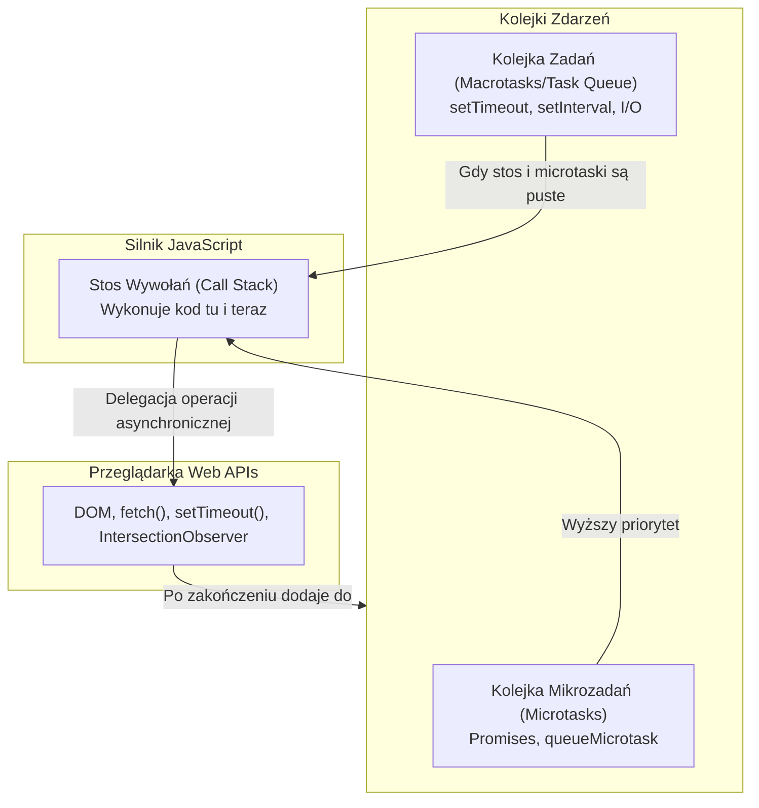
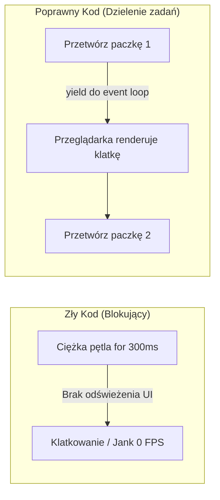

# Pętla Zdarzeń, Asynchroniczność i Niezawodność

JavaScript jest językiem **jednowątkowym** (*single-threaded*). Oznacza to, że silnik w przeglądarce może wykonywać tylko jedną operację w danym momencie. Mimo to, zaawansowane interfejsy potrafią w tle pobierać dane z API, płynnie animować elementy i reagować na ruchy myszką bez zamrażania ekranu.

Magia ta nosi nazwę **Pętli Zdarzeń** (*Event Loop*). Zrozumienie jej działania jest fundamentem pisania bezbłędnych i płynnych aplikacji webowych.

---

## 🧠 Model mentalny: Stos wywołań, Kolejka Zadań i Microtaski

Architektura środowiska uruchomieniowego JavaScript składa się z czterech współpracujących ze sobą elementów:



### Priorytety w Pętli Zdarzeń:
1. **Call Stack:** Wykonuje bieżący kod synchroniczny do samego końca.
2. **Microtask Queue:** Po opróżnieniu stosu, pętla zdarzeń natychmiast wykonuje **WSZYSTKIE** mikrozadania (np. rozwiązane `Promise.then()`).
3. **Render:** Przeglądarka odświeża obraz na ekranie (zazwyczaj 60 razy na sekundę).
4. **Macrotask Queue:** Pętla pobiera **JEDNO** zadanie z kolejki macrotask (np. `setTimeout`) i przekazuje na stos.

---

## ⚙️ Decyzja 1: Niezawodna obsługa asynchroniczności za pomocą `async/await`

Instrukcje `async/await` są cukrem składniowym nad obiektami `Promise`, ale znacząco podnoszą czytelność i odporność kodu na błędy. Zawsze używaj bloków `try/catch/finally` do obsługi błędów sieciowych.

```javascript
/**
 * Pobiera dane użytkownika w sposób odporny na błędy
 * @param {string} userId
 * @return {Promise<UserData|null>}
 */
export async function fetchUserProfile(userId) {
  const controller = new AbortController();
  const timeoutId = setTimeout(() => controller.abort(), 5000); // 5-sekundowy timeout

  try {
    const response = await fetch(`/api/users/${encodeURIComponent(userId)}`, {
      signal: controller.signal
    });

    if (!response.ok) {
      throw new Error(`Błąd HTTP: status ${response.status}`);
    }

    return await response.json();
  } catch (error) {
    if (error.name === 'AbortError') {
      console.warn('Zapytanie przekroczyło limit czasu (Timeout).');
    } else {
      console.error('Nie udało się pobrać profilu:', error.message);
    }
    return null;
  } finally {
    clearTimeout(timeoutId); // Zawsze czyścimy timer!
  }
}
```

---

## ⚙️ Decyzja 2: Unikanie blokowania głównego wątku (Jank / Zamrożenie UI)

Jeśli wykonasz w JavaScript długo trwające obliczenia synchroniczne (np. przetwarzanie dużej tablicy w pętli `for`), **stos wywołań zostanie zablokowany**. Przeglądarka nie będzie mogła przeliczyć układu stron (Reflow) ani zareagować na kliknięcia. Użytkownik zobaczy zamrożony interfejs.



### Rozwiązanie: Dzielenie zadań za pomocą `scheduler.yield()` lub `requestIdleCallback()`

```javascript
async function processLargeArrayChunked(items, processFn) {
  const chunkSize = 100;
  for (let i = 0; i < items.length; i += chunkSize) {
    const chunk = items.slice(i, i + chunkSize);
    chunk.forEach(processFn);

    // Dajemy przeglądarce chwilę na przenderowanie klatki UI
    if ('scheduler' in window && 'yield' in window.scheduler) {
      await window.scheduler.yield();
    } else {
      await new Promise(resolve => setTimeout(resolve, 0));
    }
  }
}
```

---

## 🎯 Ćwiczenie weryfikacyjne: Przewidywanie kolejności wykonania

Przeanalizuj poniższy kod. W jakiej kolejności w konsoli pojawią się numery?

```javascript
console.log('1'); // Synchroniczne

setTimeout(() => console.log('2'), 0); // Macrotask

Promise.resolve().then(() => console.log('3')); // Microtask

queueMicrotask(() => console.log('4')); // Microtask

console.log('5'); // Synchroniczne
```

**Poprawna kolejność:** `1 -> 5 -> 3 -> 4 -> 2`.
1. Kod synchroniczny: `1` i `5`.
2. Opróżnienie kolejki Microtask: `3` i `4`.
3. Jedno zadanie z kolejki Macrotask: `2`.

---

## 🛠️ Diagnostyka i rozwiązywanie problemów

<data-gate>
  <data-quiz>
    <question>
      Dlaczego pętla `while(true)` w kodzie JavaScript spowoduje całkowite zamrożenie karty przeglądarki i brak reakcji na przycisk "Zamknij"?
    </question>
    <options>
      <item>Pętla while zużywa cały dostępny adres IP serwera.</item>
      <item correct>Pętla nigdy nie zdejmuje ramki ze Stosu Wywołań (Call Stack). Pętla Zdarzeń (Event Loop) nie może przejść do obsługi zdarzeń interfejsu ani renderowania klatek obrazu.</item>
      <item>Przeglądarka automatycznie zamienia pętle while na obiekty Promise.</item>
    </options>
    <div data-hint="error">
      Zastanów się: kiedy Pętla Zdarzeń może pobrać nowe zdarzenia z kolejki? Tylko wtedy, gdy Stos Wywołań jest całkowicie pusty!
    </div>
    <div data-hint="success">
      Wspaniale! Ponieważ JavaScript jest jednowątkowy, nieskończona pętla synchroniczna uniemożliwia Pętli Zdarzeń pobranie jakiegokolwiek innego zadania, całkowicie blokując interfejs użytkownika.
    </div>
  </data-quiz>
</data-gate>

---

### <span class="header-koala"><span>🦾</span><span>🐨</span><span>🦾</span></span> Co masz wynieść z tej lekcji:

- **Call Stack** musi zostać opróżniony, zanim przeglądarka wyrenderuje klatkę obrazu lub zareaguje na kliknięcie.
- **Microtaski (Promise)** mają wyższy priorytet wykonania niż **Macrotaski (setTimeout)**.
- Zawsze używaj **`AbortController`** do przerywania zawieszonych zapytań sieciowych (`fetch`).
