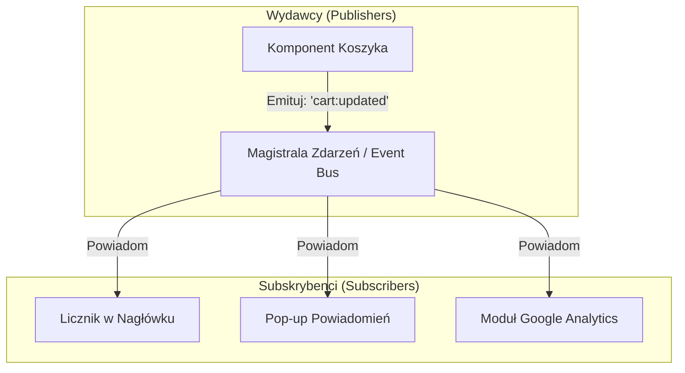
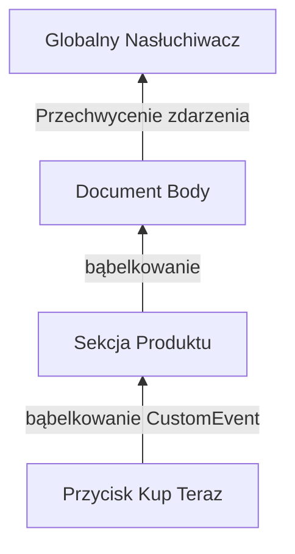

# Wzorce Zdarzeniowe (Pub-Sub, Observer, Custom Events)

W złożonych aplikacjach front-endowych komponenty interfejsu muszą komunikować się ze sobą, nie wiedząc o swoim bezpośrednim istnieniu. Związywanie ze sobą komponentu koszyka z komponentem powiadomień i modułem analityki poprzez bezpośrednie wywołania metod niszczy architekturę oprogramowania.

Wzorzec **Architektury Zdarzeniowej** (*Event-Driven Architecture*) rozluźnia te powiązania, zamieniając twarde zależności na **_luźną komunikację zdarzeniową_**.

---

## 🧠 Model mentalny: Magazyn Zdarzeń (Event Bus / Pub-Sub)

Wzorzec **Pub-Sub** (*Publisher-Subscriber*) wprowadza centralną magistralę. Wydawca (*Publisher*) emituje komunikat: *„Zdarzyło się X”*. Nadawca nie wie i nie dba o to, kto na to zdarzenie zareaguje.



Gdy w przyszłości zechcesz dodać czwarty moduł (np. automatyczny zapis w pamięci lokalnej), po prostu dopisujesz nowego subskrybenta bez dotykania kodu koszyka!

---

## ⚙️ Decyzja 1: Wzorzec Pub-Sub w czystym JavaScript

Implementacja własnej, bezpiecznej magistrali zdarzeń wymaga zaledwie kilkunastu linii kodu:

```javascript
/**
 * Prosta magistrala zdarzeń Pub-Sub
 */
export class EventBus {
  constructor() {
    /** @type {Map<string, Set<Function>>} */
    this.listeners = new Map();
  }

  /**
   * Subskrybuj zdarzenie
   * @param {string} event
   * @param {Function} callback
   * @return {() => void} Funkcja do anulowania subskrypcji (Unsubscribe)
   */
  on(event, callback) {
    if (!this.listeners.has(event)) {
      this.listeners.set(event, new Set());
    }

    this.listeners.get(event).add(callback);

    // Zwracamy funkcję sprzątającą
    return () => {
      this.listeners.get(event)?.delete(callback);
    };
  }

  /**
   * Emituj zdarzenie do wszystkich subskrybentów
   * @param {string} event
   * @param {any} [data]
   */
  emit(event, data) {
    const callbacks = this.listeners.get(event);
    if (callbacks) {
      callbacks.forEach(callback => {
        try {
          callback(data);
        } catch (error) {
          console.error(`Błąd w subskrybencie zdarzenia "${event}":`, error);
        }
      });
    }
  }
}

export const globalBus = new EventBus();
```

---

## ⚙️ Decyzja 2: Wykorzystanie Natywnych `CustomEvent` w DOM

Przeglądarka internetowa posiada już wbudowany, natywny system zdarzeń oparty na drzewie DOM. Możesz tworzyć i emitować własne zdarzenia na węzłach DOM za pomocą klasy **`CustomEvent`**.

```javascript
// 1. Tworzymy i emitujemy zdarzenie na konkretnym elemencie DOM
const cartElement = document.getElementById('shopping-cart');

const itemAddedEvent = new CustomEvent('cart:item-added', {
  detail: { itemId: 'prod-123', price: 99.99 },
  bubbles: true, // Zdarzenie bąbelkuje w górę drzewa DOM!
  cancelable: true
});

cartElement.dispatchEvent(itemAddedEvent);

// 2. Nasłuchujemy zdarzenia wyżej w drzewie DOM (np. na document)
document.addEventListener('cart:item-added', (event) => {
  console.log('Dodano przedmiot:', event.detail.itemId);
});
```



---

## ⚙️ Decyzja 3: Pamiętaj o sprzątaniu (Wycieki pamięci / Memory Leaks)

Najczęstszym błędem przy pracy ze zdarzeniami jest **zapominanie o usuwaniu nasłuchiwaczy** po usunięciu komponentu z ekranu.

Jeśli zarejestrujesz nasłuchiwacz na `window` lub obiekcie globalnym, komponent zostanie uwięziony w pamięci (Garbage Collector go nie usunie), co prowadzi do wycieków pamięci.

```javascript
// Zawsze zachowuj referencję do funkcji sprzątającej
class UserProfileComponent {
  constructor() {
    this.unsubscribe = globalBus.on('user:logged-out', () => this.cleanUp());
  }

  destroy() {
    // Odpinamy nasłuchiwacz podczas niszczenia komponentu!
    this.unsubscribe();
    document.getElementById('user-profile')?.remove();
  }

  cleanUp() {
    // Logika czyszczenia
  }
}
```

---

## 🎯 Ćwiczenie weryfikacyjne: Komunikacja dwóch niezależnych modułów

Wyobraź sobie dwa moduły: `ThemeSwitcher` (zmienia motyw strony) oraz `Analytics` (wysyła dane o zachowaniu użytkownika).

Dzięki Pub-Sub moduł motywu nie musi wiedzieć o analityce:

```javascript
// ThemeSwitcher.js
function toggleTheme(newTheme) {
  document.body.dataset.theme = newTheme;
  globalBus.emit('theme:changed', { theme: newTheme });
}

// Analytics.js
globalBus.on('theme:changed', ({ theme }) => {
  console.log(`[Analytics] Użytkownik zmienił motyw na: ${theme}`);
});
```

---

## 🛠️ Diagnostyka i rozwiązywanie problemów

<data-gate>
  <data-quiz>
    <question>
      Dlaczego przekazanie anonimowej funkcji strzałkowej bezpośrednio do `addEventListener` (np. window.addEventListener('resize', () => doSomething())) uniemożliwia jej wyrejestrowanie za pomocą `removeEventListener`?
    </question>
    <options>
      <item>Funkcje strzałkowe są odporne na usuwanie ze względów bezpieczeństwa.</item>
      <item correct>Każde utworzenie anonimowej funkcji tworzy nową instancję w pamięci. Metoda removeEventListener wymaga dokładnie tej samej referencji do obiektu funkcji, która została zarejestrowana.</item>
      <item>Wywołanie removeEventListener działa tylko dla zdarzeń myszy.</item>
    </options>
    <div data-hint="error">
      Zastanów się: w JavaScript `(() => {}) === (() => {})` zwraca `false`! Dwie anonimowe funkcje wyglądające tak samo to dwa zupełnie różne obiekty w pamięci.
    </div>
    <div data-hint="success">
      Znakomicie! Aby móc usunąć nasłuchiwacz, zawsze zapisuj funkcję w zmiennej lub metodzie instancji, np. `this.boundHandler = this.handler.bind(this)`.
    </div>
  </data-quiz>
</data-gate>

---

### <span class="header-koala"><span>🦾</span><span>🐨</span><span>🦾</span></span> Co masz wynieść z tej lekcji:

- **Pub-Sub rozluźnia zależności** — wydawca nie musi wiedzieć, kto nasłuchuje jego zdarzeń.
- Natywny **`CustomEvent`** pozwala na wykorzystanie bąbelkowania w drzewie DOM.
- Zawsze **odpinaj nasłuchiwacze** podczas usuwania komponentów z ekranu, aby uniknąć wycieków pamięci.
