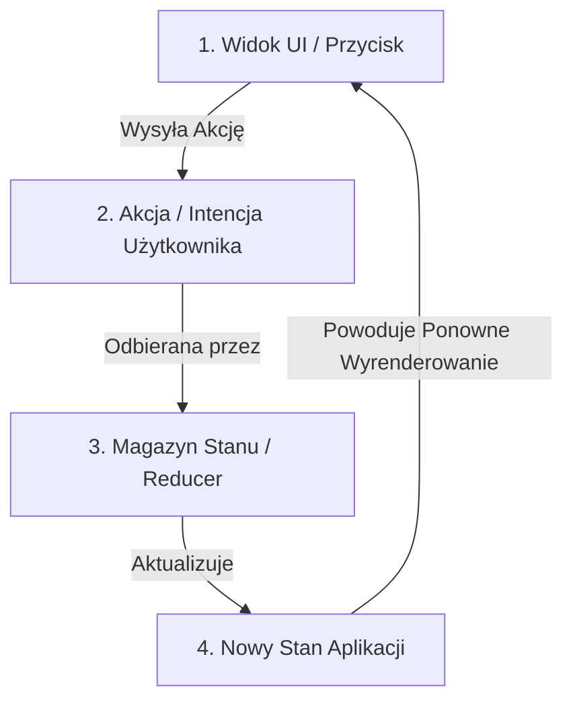
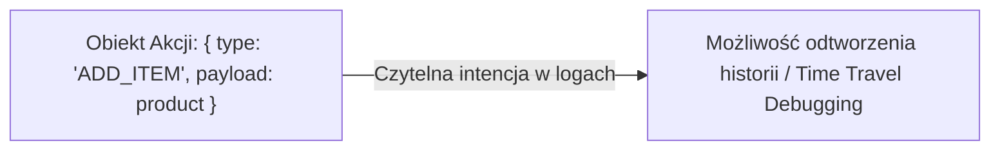

# Jednokierunkowy Przepływ Danych (Unidirectional Flow)

Dwukierunkowe wiązanie danych (*Two-Way Data Binding*) spopularyzowane we wczesnych frameworkach JS prowadziło do nieprzewidywalnych pętli aktualizacji. Gdy zmiana w widoku modyfikowała model, a zmiana w modelu modyfikowała inny widok, śledzenie przepływu informacji stawało się niemożliwe.

Nowoczesna architektura interfejsów opiera się na **Jednokierunkowym Przepływie Danych** (*Unidirectional Data Flow / Architektura Flux*).

---

## 🧠 Model mentalny: Pętla przepływu danych

Dane w aplikacji krążą w jednym, ściśle określonym kierunku:



1. **Widok** nie modyfikuje stanu bezpośrednio. Emituje jedynie **Akcję** opisującą co się stało (np. `cart/itemAdded`).
2. **Magazyn Stanu (Store)** odbiera akcję, oblicza nowy stan i powiadamia aplikację.
3. **Widok** przelicza się na podstawie nowego stanu.

---

## ⚙️ Decyzja 1: Tworzenie wzorca Store (Flux Reducer) w czystym JS

Napiszmy zwięzły, bezefektowy magazyn stanu oparty na akcjach i reduktorze (*Reducer*):

```javascript
/**
 * @template S
 * @typedef {(state: S, action: {type: string, payload?: any}) => S} Reducer
 */

export class Store {
  /**
   * @param {Reducer<S>} reducer
   * @param {S} initialState
   */
  constructor(reducer, initialState) {
    this.reducer = reducer;
    this.state = initialState;
    /** @type {Set<Function>} */
    this.listeners = new Set();
  }

  getState() {
    return this.state;
  }

  /**
   * Wysyła akcję do magazynu
   * @param {{type: string, payload?: any}} action
   */
  dispatch(action) {
    this.state = this.reducer(this.state, action);
    this.listeners.forEach(listener => listener(this.state));
  }

  /**
   * Subskrybuje zmiany stanu
   * @param {Function} listener
   */
  subscribe(listener) {
    this.listeners.add(listener);
    return () => this.listeners.delete(listener);
  }
}
```

---

## ⚙️ Decyzja 2: Reduktor jako czysta funkcja (Pure Reducer)

**Reduktor** to czysta funkcja, która przyjmuje *stary stan* oraz *akcję* i zwraca **_całkowicie nowy stan_**.

Czysta funkcja nie wykonuje żadnych zapytań SIECIOWYCH, nie modyfikuje zmiennych globalnych ani nie mutuje przekazanego obiektu.

```javascript
const initialState = { items: [], total: 0 };

function cartReducer(state = initialState, action) {
  switch (action.type) {
    case 'ADD_ITEM':
      return {
        ...state,
        items: [...state.items, action.payload],
        total: state.total + action.payload.price
      };
      
    case 'CLEAR_CART':
      return {
        ...state,
        items: [],
        total: 0
      };

    default:
      return state;
  }
}
```

---

## ⚙️ Decyzja 3: Akcje jako czyste obiekty opisu intencji

Akcja to prosty obiekt posiadający właściwość `type` (oraz opcjonalnie `payload`). 

```javascript
// Kreatory akcji (Action Creators)
export const addProductToCart = (product) => ({
  type: 'ADD_ITEM',
  payload: product
});

export const clearCart = () => ({
  type: 'CLEAR_CART'
});
```



---

## 🎯 Ćwiczenie weryfikacyjne: Połączenie Store z interfejsem

```javascript
const store = new Store(cartReducer, { items: [], total: 0 });

// Subskrybujemy widok do zmian stanu
store.subscribe((state) => {
  document.getElementById('cart-total').textContent = `${state.total.toFixed(2)} PLN`;
});

// Kliknięcie w przycisk wysyła akcję
document.getElementById('add-button').addEventListener('click', () => {
  store.dispatch(addProductToCart({ id: 1, name: 'Książka PHP', price: 49.99 }));
});
```

---

## 🛠️ Diagnostyka i rozwiązywanie problemów

<data-gate>
  <data-quiz>
    <question>
      Dlaczego modyfikowanie stanu bezpośrednio wewnątrz czystej funkcji reduktora (np. state.items.push(item); return state;) powoduje błędy w śledzeniu zmian UI?
    </question>
    <options>
      <item>Przeglądarka wyrzuca błąd TypeError przy próbie użycia metody push.</item>
      <item correct>Mutacja starego obiektu stanu sprawia, że referencja do obiektu się nie zmienia (oldState === newState). Systemy reaktywne porównujące referencje nie wykryją zmiany i nie zaktualizują widoku.</item>
      <item>Metoda push działa tylko dla wartości liczbowych.</item>
    </options>
    <div data-hint="error">
      Zastanów się: w JavaScript `const a = { x: 1 }; const b = a; b.x = 2; a === b` zwraca `true`. Jeśli zmutujesz ten sam obiekt, sprawdzanie czy stan się zmienił zwróci `false`.
    </div>
    <div data-hint="success">
      Wspaniała odpowiedź! Zawsze zwracaj nową kopię obiektu/tablicy (np. poprzez operator `...` spread), zachowując zasady niezmienności.
    </div>
  </data-quiz>
</data-gate>

---

### <span class="header-koala"><span>🦾</span><span>🐨</span><span>🦾</span></span> Co masz wynieść z tej lekcji:

- **Jednokierunkowy przepływ:** Widok wysyła Akcję -> Reduktor oblicza Nowy Stan -> Widok się przerenderowuje.
- **Reduktor musi być czystą funkcją** — zero skutków ubocznych, brak mutowania przekazanego stanu.
- **Niezmienność stanu** umożliwia deterministyczne debugowanie i błyskawiczne porównywanie zmian.
