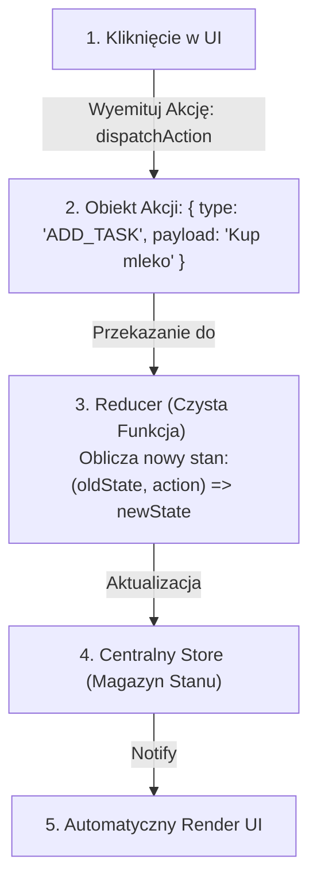

# Jednokierunkowy przepływ danych (Store i Reducer)

Gdy interfejs użytkownika staje się bardzo rozbudowany, losowe modyfikowanie zmiennych z dowolnego przycisku w aplikacji prowadzi do trudnego do opanowania chaosu.

Rozwiązaniem tego problemu jest wzorzec **Jednokierunkowego Przepływu Danych (Unidirectional Data Flow)**, znany z architektury Flux oraz bibliotek takich jak Redux czy Zustand.

W tej lekcji stworzymy **Mini-projekt 6: Aplikacja Menedżera Zadań (Interactive TODO App) z wykorzystaniem Reducera i Czystego Store'a**.

---

## 🧠 Model mentalny: Cykl Jednokierunkowego Przepływu Danych

W jednokierunkowym przepływie danych dane krążą w jednym, ściśle określonym kierunku:



**Dlaczego to robimy?**
- Nikt nie ma prawa zmieniać stanu `State` bezpośrednio. Jedynym sposobem na modyfikację jest **wyemitowanie Akcji (`dispatch`)**.
- **Reducer** to czysta funkcja bez skutków ubocznych — pobiera stary stan, akcję i zwraca **zupełnie nowy obiekt stanu**.

---

## ⚙️ Krok 1: Pisanie Czystej Funkcji Reducera (`reducer.js`)

Stwórz folder `C:\xampp\htdocs\todo-store\` i plik `reducer.js`:

```javascript
/**
 * Początkowy stan aplikacji
 */
export const initialState = {
  tasks: [],
  filter: 'ALL' // 'ALL' | 'COMPLETED' | 'ACTIVE'
};

/**
 * Czysta funkcja Reduktor (Reducer)
 */
export function taskReducer(state, action) {
  switch (action.type) {
    case 'ADD_TASK':
      return {
        ...state,
        tasks: [
          ...state.tasks,
          { id: Date.now(), text: action.payload, completed: false }
        ]
      };

    case 'TOGGLE_TASK':
      return {
        ...state,
        tasks: state.tasks.map(task => 
          task.id === action.payload ? { ...task, completed: !task.completed } : task
        )
      };

    case 'DELETE_TASK':
      return {
        ...state,
        tasks: state.tasks.filter(task => task.id !== action.payload)
      };

    case 'SET_FILTER':
      return {
        ...state,
        filter: action.payload
      };

    default:
      return state;
  }
}
```

### 🔍 Wyjaśnienie czystych funkcji od zera:

- **`{ ...state, tasks: [...] }`** — Niezmienność (**Immutability**). Nie modyfikujemy istniejącego obiektu `state.tasks.push()`. Zamiast tego tworzymy **nową kopię obiektu** za pomocą operatora `...` (Spread Operator).
- **`tasks.map(...)`** — Tworzy nową tablicę ze zmienionym stanem `completed` dla wybranego zadania.
- **`tasks.filter(...)`** — Tworzy nową tablicę bez usuniętego zadania.

---

## ⚙️ Krok 2: Tworzenie Centralnego Store'a (`store.js`)

Stwórzmy plik `store.js`, który zarządza subskrypcjami widoku:

```javascript
export function createUnidirectionalStore(reducer, initState) {
  let state = initState;
  const listeners = [];

  return {
    getState() {
      return state;
    },

    dispatch(action) {
      // Reduktor oblicza nowy stan na podstawie akcji
      state = reducer(state, action);
      
      // Powiadamiamy wszystkich słuchaczy widoku
      listeners.forEach(listener => listener(state));
    },

    subscribe(listener) {
      listeners.push(listener);
      return () => {
        const index = listeners.indexOf(listener);
        if (index > -1) listeners.splice(index, 1);
      };
    }
  };
}
```

---

## 🎯 🛠️ Mini-projekt 6: Aplikacja TODO z Jednokierunkowym Przepływem (`app.js`)

Utwórzmy plik `app.js` łączący nasz Store z widokiem HTML:

```javascript
import { createUnidirectionalStore } from './store.js';
import { taskReducer, initialState } from './reducer.js';

const store = createUnidirectionalStore(taskReducer, initialState);

const form = document.querySelector('#todo-form');
const input = document.querySelector('#todo-input');
const list = document.querySelector('#todo-list');

// 1. Renderowanie UI na podstawie aktualnego stanu ze Store
function render(state) {
  if (!list) return;

  const filteredTasks = state.tasks.filter(task => {
    if (state.filter === 'COMPLETED') return task.completed;
    if (state.filter === 'ACTIVE') return !task.completed;
    return true;
  });

  list.innerHTML = filteredTasks.map(task => `
    <li class="todo-item ${task.completed ? 'completed' : ''}">
      <span data-id="${task.id}" class="toggle-btn">${task.text}</span>
      <button data-id="${task.id}" class="delete-btn" type="button">Usuń</button>
    </li>
  `).join('');
}

// 2. Subskrybujemy odświeżanie widoku przy każdej zmianie w Store
store.subscribe(render);

// 3. Emisja akcji po dodaniu zadania
form?.addEventListener('submit', (e) => {
  e.preventDefault();
  const text = input.value.trim();
  if (text) {
    store.dispatch({ type: 'ADD_TASK', payload: text });
    input.value = '';
  }
});

// 4. Delegacja zdarzeń dla kliknięć w liście
list?.addEventListener('click', (e) => {
  const target = e.target;
  if (!(target instanceof HTMLElement)) return;

  const id = Number(target.dataset.id);
  if (!id) return;

  if (target.classList.contains('toggle-btn')) {
    store.dispatch({ type: 'TOGGLE_TASK', payload: id });
  }

  if (target.classList.contains('delete-btn')) {
    store.dispatch({ type: 'DELETE_TASK', payload: id });
  }
});
```

---

## 🛠️ Diagnostyka i rozwiązywanie problemów

<data-gate>
  <data-quiz>
    <question>
      Dlaczego w reduktorze (Reducer) nie wolno modyfikować istniejącego stanu bezpośrednio (np. state.tasks.push(newTask))?
    </question>
    <options>
      <item>Przeglądarka wyrzuci błąd błąd podczas próby wykonania metody push.</item>
      <item correct>Modyfikacja istniejącego obiektu zrywa niezmienność (Immutability). Porównanie referencji (oldState === newState) zwróci true, przez co Store i komponenty UI nie wykryją, że stan uległ zmianie.</item>
      <item>Metoda push działa tylko dla zmiennych tekstowych.</item>
    </options>
    <div data-hint="error">
      Zastanów się: jeśli zmodyfikujesz ten sam obiekt w pamięci, stara i nowa zmienna wskazują na ten sam adres w RAM. Czy system odnotuje zmianę?
    </div>
    <div data-hint="success">
      Wspaniale! Niezmienność umożliwia błyskawiczne porównywanie referencji obiektów oraz bezproblemowe śledzenie historii stanu (Time Travel Debugging).
    </div>
  </data-quiz>
</data-gate>

---

### <span class="header-koala"><span>🦾</span><span>Executive Summary</span><span>🦾</span></span> Co masz wynieść z tej lekcji:

- **Jednokierunkowy Przepływ Danych:** Akcja -> Reducer -> Store -> Wyświetlenie UI.
- **Reduktor (Reducer)** to czysta funkcja przyjmująca stary stan oraz akcję i zwracająca nowy obiekt stanu.
- **Zawsze zachowuj niezmienność (`...spread`, `map`, `filter`)** zamiast mutować istniejące obiekty.
