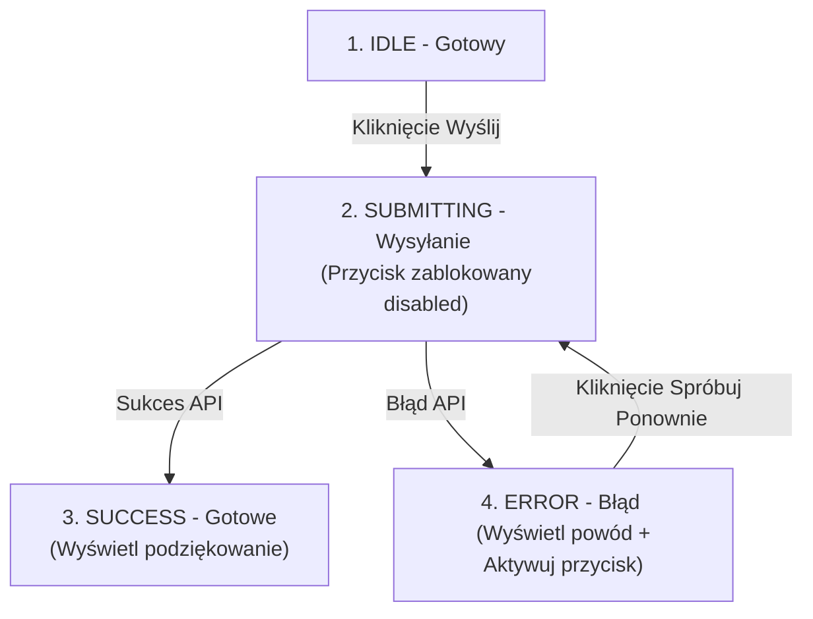

# Maszyna Stanów FSM - Stop zduplikowanym kliknięciom

Częstym błędem na stronach internetowych jest brak zabezpieczenia przycisków wysyłania formularzy. Użytkownik z wolnym łączem internetowym, zniecierpliwiony brakiem reakcji, klika przycisk „Zapłać” pięć razy z rzędu. Bez odpowiedniej ochrony serwer utworzy pięć osobnych zamówień!

W tej lekcji stworzymy **Skończoną Maszynę Stanów (Finite State Machine - FSM)**, która wyklucza nieniemożliwe stany interfejsu.

Zbudujemy **Mini-projekt 5: Formularz Zamówienia z blokadą podwójnego kliknięcia**.

---

## 🧠 Model mentalny: Stany i Przejścia w Maszynie Stanów (FSM)

W danym momencie Twój formularz może znajdować się w **wyłącznie jednym z czterech dopuszczalnych stanów**:



**Zasada działania:**
Gdy formularz przejdzie do stanu `SUBMITTING`, **żadne kolejne kliknięcie w przycisk nie wywoła ponownego zapytania**.

---

## ⚙️ Krok 1: Definicja stanów i przejść w JS (`fsm.js`)

Stwórz folder `C:\xampp\htdocs\fsm-form\` i plik `fsm.js`:

```javascript
export const FORM_STATES = {
  IDLE: 'IDLE',
  SUBMITTING: 'SUBMITTING',
  SUCCESS: 'SUCCESS',
  ERROR: 'ERROR'
};

export class FormFSM {
  constructor(onStateChange) {
    this.currentState = FORM_STATES.IDLE;
    this.onStateChange = onStateChange;
  }

  transition(newState) {
    if (this.currentState === FORM_STATES.SUBMITTING && newState === FORM_STATES.SUBMITTING) {
      console.warn('Ignorowano zduplikowane kliknięcie w trakcie wysyłania!');
      return false;
    }

    this.currentState = newState;
    this.onStateChange(this.currentState);
    return true;
  }
}
```

---

## 🛠️ Interaktywny Trening Układania Kolejności Stanów FSM (Sortable List)

Ułóż prawidłową chronologiczną kolejność przejść w Maszynie Stanów (FSM) podczas składania zamówienia:

<data-sortable-list title="Ułóż w odpowiedniej kolejności cykl życia formularza FSM">
  <item data-correct="2">SUBMITTING — Przycisk zostaje natychmiast zablokowany (disabled = true) i pojawia się spinner</item>
  <item data-correct="1">IDLE — Formularz oczekuje na uzupełnienie i kliknięcie przycisku przez użytkownika</item>
  <item data-correct="3">SUCCESS / ERROR — Otrzymanie odpowiedzi z API i renderowanie komunikatu końcowego UX</item>
</data-sortable-list>

---

### <span class="header-koala"><span>🦾</span><span>Executive Summary</span><span>🦾</span></span> Co masz wynieść z tej lekcji:

- **Maszyna Stanów (FSM)** pilnuje, aby aplikacja znajdowała się w jednym, dopuszczalnym stanie w danym momencie.
- Blokuj przycisk (**`disabled = true`**) i zabraniaj ponownych przejść w trakcie stanu **`SUBMITTING`**.
- FSM wyklucza zduplikowane transakcje i podwójne obciążenia konta klienta.
