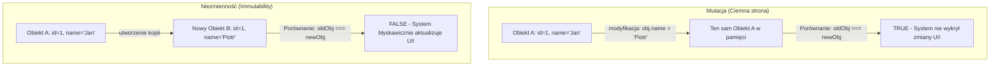

# Niezmienność (Immutability) i Skutki Uboczne

W języku JavaScript obiekty oraz tablice są przekazywane przez **referencję** (odniesienie do adresu w pamięci). Bezpośrednia zmiana właściwości obiektu (`user.age = 30`) jest mutacją, która wpływa na wszystkie miejsca w kodzie posiadające wskaźnik do tego samego obiektu.

**Niezmienność** (*Immutability*) nakazuje, aby raz utworzony stan nigdy nie ulegał zmianie. Zamiast tego tworzymy nową kopię ze zmodyfikowaną wartością.

---

## 🧠 Model mentalny: Porównanie przez referencję vs Porównanie płytkie

Systemy renderowania (np. Virtual DOM lub sygnały) sprawdzają, czy stan uległ zmianie, wykonując błyskawiczne porównanie referencji: `oldState === newState`.



Gdy mutujesz obiekt, `oldState === newState` zwraca `true`, mimo że dane wewnątrz się zmieniły! System reaktywny ignoruje zmianę i interfejs pozostaje nieaktualny.

---

## ⚙️ Decyzja 1: Niezmienna praca z tablicami (Array Methods)

Zawsze używaj metod tablicowych, które **zwracają nową tablicę**, zamiast metod mutujących oryginalną w miejscu:

| Operacja | ❌ Metoda Mutująca | ✅ Metoda Niezmienna (Zwraca kopię) |
| :--- | :--- | :--- |
| Dodawanie elementu | `push()`, `unshift()` | `[...arr, item]`, `concat()` |
| Usuwanie elementu | `pop()`, `shift()`, `splice()` | `filter()` |
| Modyfikacja elementu | `arr[i] = val`, `sort()` | `map()`, `toSorted()`, `toSpliced()` |

```javascript
const originalList = [{ id: 1, text: 'Kup mleko' }, { id: 2, text: 'Umyj auto' }];

// 1. Dodawanie elementu (Spread Operator)
const newList = [...originalList, { id: 3, text: 'Napisz kod' }];

// 2. Usuwanie elementu (filter)
const filteredList = originalList.filter(item => item.id !== 1);

// 3. Modyfikacja jednego elementu (map)
const updatedList = originalList.map(item => 
  item.id === 2 ? { ...item, text: 'Umyj auto i rower' } : item
);
```

---

## ⚙️ Decyzja 2: Głębokie zamrażanie obiektów za pomocą `Object.freeze()`

Aby wymusić niezmienność w środowisku programistycznym, możemy użyć natywnej metody `Object.freeze()`. Zachowuje się ona jednak **płytko** (nie zamraża obiektów zagnieżdżonych).

```javascript
/**
 * Głęboko zamraża obiekt (Deep Freeze)
 * @template T
 * @param {T} obj
 * @return {T}
 */
export function deepFreeze(obj) {
  if (obj === null || typeof obj !== 'object') return obj;

  Object.keys(obj).forEach(prop => {
    if (typeof obj[prop] === 'object' && obj[prop] !== null) {
      deepFreeze(obj[prop]);
    }
  });

  return Object.freeze(obj);
}

const config = deepFreeze({ api: { endpoint: '/v1' } });
// config.api.endpoint = '/v2'; // W trybie strict-mode wyrzuci TypeError!
```

---

## ⚙️ Decyzja 3: Izolowanie Skutków Ubocznych (Side Effects)

**Skutek uboczny** (*Side Effect*) to każda operacja, która zmienia stan poza swoim lokalnym zakresem (np. zapis do `localStorage`, zapytanie `fetch`, zmiana `document.title`).

Rozdziel kod na:
1. **Czystą logikę (Pure Functions):** Przelicza nowy stan na podstawie starych danych. Zero I/O.
2. **Procedury skutków ubocznych:** Uruchamiane wyłącznie po wyliczeniu nowego stanu.

```javascript
// Czysta funkcja
export function calculateDiscount(price, discountPercent) {
  return price * (1 - discountPercent / 100);
}

// Procedura skutku ubocznego
export function syncCartToLocalStorage(cartData) {
  try {
    localStorage.setItem('user_cart', JSON.stringify(cartData));
  } catch (e) {
    console.error('Nie udało się zapisać koszyka:', e);
  }
}
```

---

## 🎯 Ćwiczenie weryfikacyjne: Bezpieczna aktualizacja zagnieżdżonego stanu

Mamy złożony obiekt stanu użytkownika. Zmieńmy miasto w adresie bez mutowania oryginalnego obiektu:

```javascript
const userProfile = {
  id: 'usr-99',
  details: { name: 'Anna', city: 'Warszawa' },
  preferences: { theme: 'dark' }
};

// Bezpieczna, niezmienna aktualizacja zagnieżdżonego pola:
const updatedProfile = {
  ...userProfile,
  details: {
    ...userProfile.details,
    city: 'Kraków'
  }
};

console.log(userProfile.details.city); // nadal 'Warszawa'
console.log(updatedProfile.details.city); // 'Kraków'
```

---

## 🛠️ Diagnostyka i rozwiązywanie problemów

<data-gate>
  <data-quiz>
    <question>
      Jaki wynik da porównanie `[1, 2] === [1, 2]` w języku JavaScript i dlaczego?
    </question>
    <options>
      <item>True — ponieważ zawartość obu tablic jest identyczna.</item>
      <item correct>False — ponieważ w JavaScript tablice są obiektami, a operator === porównuje ich adresy w pamięci RAM, które są różne dla dwóch niezależnie utworzonych tablic.</item>
      <item>TypeError — nie wolno porównywać tablic operatorem potrójnego równe.</item>
    </options>
    <div data-hint="error">
      Zastanów się: tworząc dwie tablice `[]`, alokujesz dwa osobne bloki pamięci. Porównanie referencyjne sprawdzi tylko, czy wskazują na ten sam adres.
    </div>
    <div data-hint="success">
      Wyczerpująca odpowiedź! Dlatego w systemach reaktywnych zmiana referencji (utworzenie nowej tablicy `[...oldArray]`) jest sygnałem, że dane uległy zmianie.
    </div>
  </data-quiz>
</data-gate>

---

### <span class="header-koala"><span>🦾</span><span>🐨</span><span>🦾</span></span> Co masz wynieść z tej lekcji:

- **Porównanie referencyjne (`oldState === newState`)** to najszybsza metoda wykrywania zmian w UI.
- Używaj **metod niezmiennych** (`map`, `filter`, `spread operator`) zamiast mutujących (`push`, `splice`).
- **Izoluj skutki uboczne** (np. `localStorage`, zytania fetch) od czystej logiki przeliczania stanu.
