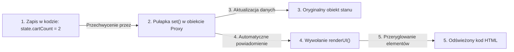

# Reaktywny stan z użyciem Proxy

W skomplikowanych aplikacjach internetowych ręczne szukanie elementów w drzewie DOM przy każdej zmianie wartości prowadzi do powstawania trudnych do wykrycia błędów.

W tej lekcji stworzymy lekki, natywny mechanizm reaktywny oparty na obiekcie **`Proxy`**. Dzięki niemu zrealizujemy wzorzec **`UI = f(State)`** — każda zmiana stanu w pamięci automatycznie odświeży odpowiednie widoki na stronie.

Zbudujemy **Mini-projekt 4: Reaktywny Licznik i Koszyk Zakupów**.

---

## 🧠 Model mentalny: Obiekt Proxy jako Strażnik Danych

Pomyśl o obiekcie `Proxy` jak o inteligentnym strażniku stojącym przy drzwiach do Twojego magazynu danych:



Kiedy zmodyfikujesz jakąkolwiek właściwość obiektu opakowanego w `Proxy`, strażnik automatycznie wywoła przypisaną funkcję odświeżającą interfejs DOM.

---

## ⚙️ Krok 1: Tworzenie uniwersalnego pomocnika reaktywnego (`store.js`)

Stwórz folder `C:\xampp\htdocs\proxy-cart\` i plik `store.js`:

```javascript
export function createStore(initialState, onStateChange) {
  return new Proxy(initialState, {
    set(target, property, value) {
      if (Reflect.get(target, property) === value) {
        return true;
      }

      const success = Reflect.set(target, property, value);

      if (success) {
        onStateChange({ ...target });
      }

      return success;
    }
  });
}
```

---

## 🎯 🛠️ Mini-projekt 4: Połączenie stanu z widokiem (`app.js`)

Utwórzmy moduł `app.js`:

```javascript
import { createStore } from './store.js';

const countElement = document.querySelector('#item-count');
const priceElement = document.querySelector('#total-price');

function render(state) {
  if (countElement) countElement.textContent = String(state.itemsCount);
  if (priceElement) priceElement.textContent = `${state.totalPrice.toFixed(2)} PLN`;
}

const cartStore = createStore(
  { itemsCount: 0, totalPrice: 0.0 },
  (updatedState) => render(updatedState)
);
```

---

## 🛠️ Interaktywne Połączenie Pojęć Reaktywnych (Connection Matcher)

Sprawdź swoje opanowanie architektury reaktywnej — połącz pojęcia w pary:

<data-connection-matcher title="Dopasuj pojęcia architektury reaktywnej Proxy i UI = f(State)">
    <div class="cmw-item" data-left="Obiekt Proxy" data-right="Strażnik danych przechwytujący zapis i odczyt właściwości w pamięci"></div>
    <div class="cmw-item" data-left="Wzorzec UI = f(State)" data-right="Interfejs jest czystą bezstanową funkcją reprezentującą stan w pamięci"></div>
    <div class="cmw-item" data-left="Pułapka set()" data-right="Funkcja wyzwalana automatycznie przy próbie modyfikacji pola obiektu"></div>
    <div class="cmw-item" data-left="Reflect.set()" data-right="Natywna bezpieczna metoda wykonująca rzeczywiste przypisanie wartości"></div>
</data-connection-matcher>

---

### <span class="header-koala"><span>🦾</span><span>Executive Summary</span><span>🦾</span></span> Co masz wynieść z tej lekcji:

- **`Proxy`** śledzi próby odczytu i zapisu danych w obiektach JavaScript.
- Wzorzec **`UI = f(State)`** rozdziela logikę biznesową (stan) od wyglądu (DOM).
- Zamiast ręcznie zmieniać HTML w wielu miejscach, zmieniasz stan w pamięci, a interfejs przelicza się sam.
