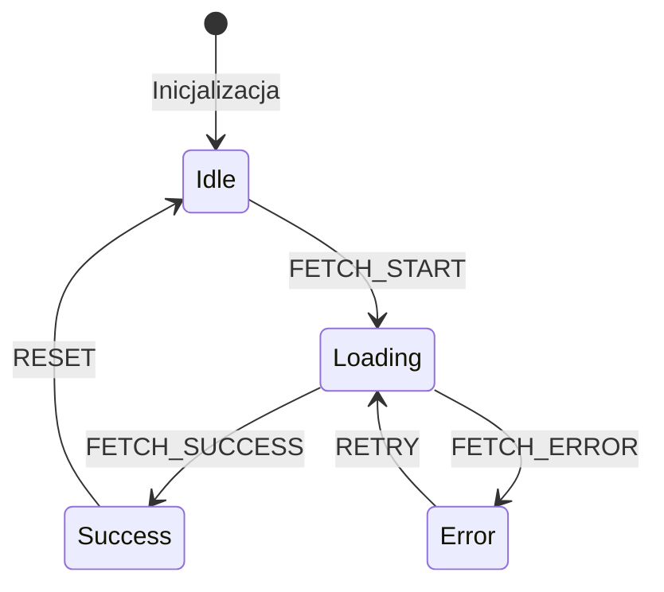
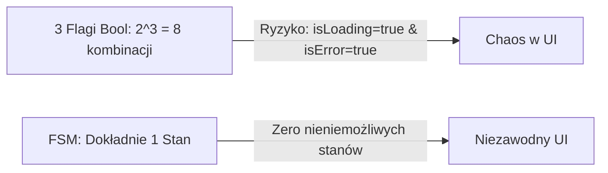

# Skończone Maszyny Stanów (FSM) w UI (Loading, Error, Success)

Najczęstszym źródłem błędów UX w aplikacjach webowych są **nieniemożliwe stany interfejsu** (*Impossible UI States*). Przykład: na ekranie jednocześnie pojawia się spinner ładowania oraz komunikat o błędzie i stary formularz.

Stosowanie zmiennych boolowskich takich jak `isLoading = true`, `isError = true`, `isSuccess = false` prowadzi do iloczynu 2^N kombinacji, z których większość jest błędna. Rozwiązaniem są **Skończone Maszyny Stanów** (*Finite State Machines — FSM*).

---

## 🧠 Model mentalny: Stany i Przejścia (States & Transitions)

Maszyna Stanów gwarantuje, że interfejs znajduje się w **dokładnie jednym wykluczającym się stanie** w danym momencie, a przejście do innego stanu wymaga określonego zdarzenia.



W stanie `Idle` system nie jest w stanie odebrać zdarzenia `FETCH_SUCCESS`. Niewłaściwe zdarzenie w danym stanie jest po prostu ignorowane.

---

## ⚙️ Decyzja 1: Tworzenie lekkiej Maszyny Stanów w JavaScript

Napiszmy deklaratywną maszynę stanów dla pobierania danych z API:

```javascript
/**
 * @typedef {'idle' | 'loading' | 'success' | 'error'} FetchState
 */

export class FetchStateMachine {
  constructor() {
    /** @type {FetchState} */
    this.currentState = 'idle';
    this.data = null;
    this.error = null;
    /** @type {Set<Function>} */
    this.listeners = new Set();

    // Tabela przejść (Transitions Table)
    this.transitions = {
      idle: { FETCH: 'loading' },
      loading: { RESOLVE: 'success', REJECT: 'error' },
      success: { FETCH: 'loading', RESET: 'idle' },
      error: { RETRY: 'loading', RESET: 'idle' }
    };
  }

  transition(event, payload = null) {
    const allowedNextState = this.transitions[this.currentState]?.[event];

    if (!allowedNextState) {
      console.warn(`Niedozwolone przejście ze stanu "${this.currentState}" zdarzeniem "${event}"`);
      return;
    }

    this.currentState = allowedNextState;
    if (event === 'RESOLVE') this.data = payload;
    if (event === 'REJECT') this.error = payload;

    this.notify();
  }

  subscribe(listener) {
    this.listeners.add(listener);
    return () => this.listeners.delete(listener);
  }

  notify() {
    this.listeners.forEach(l => l({
      state: this.currentState,
      data: this.data,
      error: this.error
    }));
  }
}
```

---

## ⚙️ Decyzja 2: Odwzorowanie Stanów FSM na Komponenty UX

W warstwie prezentacji uderzamy w wykluczające się bloki na podstawie aktualnego stanu FSM:

```javascript
const fsm = new FetchStateMachine();

fsm.subscribe(({ state, data, error }) => {
  const container = document.getElementById('content-container');
  if (!container) return;

  switch (state) {
    case 'idle':
      container.innerHTML = `<button id="load-btn">Pobierz dane</button>`;
      break;

    case 'loading':
      container.innerHTML = `<div class="spinner">Ładowanie danych...</div>`;
      break;

    case 'success':
      container.innerHTML = `<div class="card">Data: ${JSON.stringify(data)}</div>`;
      break;

    case 'error':
      container.innerHTML = `
        <div class="error-box">
          <p>Błąd: ${error}</p>
          <button id="retry-btn">Spróbuj ponownie</button>
        </div>
      `;
      break;
  }
});
```

---

## ⚙️ Decyzja 3: Eliminowanie niemożliwych stanów z kodu

### ❌ Zły kod (Zmienne boolowskie)
```php
// Zły przykład - 8 możliwych kombinacji, z czego większość bez sensu
let isLoading = false;
let isError = false;
let isSuccess = false;
```

### ✅ Poprawny kod (Enum / Unia stanów)
```javascript
// Poprawny przykład - Dokładnie 1 stan w danym czasie
let currentState = 'IDLE'; // 'IDLE' | 'LOADING' | 'SUCCESS' | 'ERROR'
```



---

## 🎯 Ćwiczenie weryfikacyjne: Przyciski z ochroną przed wielokrotnym kliknięciem

Dzięki FSM w stanie `loading` ponowne kliknięcie w przycisk „Wyślij” nie wyemituje kolejnego zapytania HTTP do serwera, ponieważ przejście ze stanu `loading` zdarzeniem `FETCH` nie istnieje na liście przejść!

```javascript
async function handleSubmit() {
  if (fsm.currentState !== 'idle' && fsm.currentState !== 'error') {
    return; // Zablokuj wykonanie w innych stanach
  }

  fsm.transition('FETCH');
  try {
    const res = await apiCall();
    fsm.transition('RESOLVE', res);
  } catch (err) {
    fsm.transition('REJECT', err.message);
  }
}
```

---

## 🛠️ Diagnostyka i rozwiązywanie problemów

<data-gate>
  <data-quiz>
    <question>
      Jaki problem UX rozwiązuje zastosowanie Skończonej Maszyny Stanów (FSM) w formularzu płatności?
    </question>
    <options>
      <item> przyspiesza połączenie internetowe użytkownika o 50%.</item>
      <item correct>Uniemożliwia podwójne obciążenie karty płatniczej klienta, blokując powtórne wywołanie wysyłki, gdy formularz znajduje się już w stanie przetwarzania (SUBMITTING).</item>
      <item>Automatycznie szyfruje numery kart w pamięci podręcznej przeglądarki.</item>
    </options>
    <div data-hint="error">
      Zastanów się: co się stanie, gdy nerwowy użytkownik kliknie przycisk „Zapłać” pięć razy z rzędu w ciągu sekundy?
    </div>
    <div data-hint="success">
      Znakomicie! Maszyna stanów odrzuca powtórne kliknięcia w stanie `SUBMITTING`, chroniąc użytkownika przed wielokrotną realizacją transakcji.
    </div>
  </data-quiz>
</data-gate>

---

### <span class="header-koala"><span>🦾</span><span>🐨</span><span>🦾</span></span> Co masz wynieść z tej lekcji:

- **FSM wyklucza nieniemożliwe stany UI** — interfejs przebywa w dokładnie jednym stanie.
- Zdarzenia spoza tabeli przejść danego stanu są **bezpiecznie ignorowane**.
- Unikaj flag boolowskich (`isLoading`, `isError`) na rzecz jawnej unii stanów.
