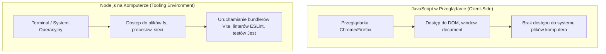

# Czym jest Node.js, npm i bundler Vite (Cz. 1 - Środowisko Node.js, npm i package.json)

Witaj w pierwszej części drugiego modułu kursu nowoczesnego JavaScriptu. 

Jako Twój mentor przeprowadzę Cię przez współczesny ekosystem narzędziowy programisty front-endowego. Dowiesz się, czym jest środowisko **Node.js**, jak menedżer pakietów **npm** zarządza bibliotekami oraz dlaczego pliki **`package.json`** i **`package-lock.json`** są kluczowe dla stabilności Twojego projektu.

---

## 🎓 Krok 1: Dlaczego programista wy wy wy używa Node.js?

Początkujący programiści często pytają: *„Dlaczego muszę instalować Node.js na swoim komputerze, skoro piszę kod dla przeglądarki?”*.

**Node.js** to środowisko uruchomieniowe wyciągnięte bezpośrednio z silnika V8 przeglądarki Chrome. Pozwala ono na wykonywanie kodu JavaScript **bezpośrednio w terminalu Twojego systemu operacyjnego**:



### Do czego służy Node.js we front-endzie?
1. **Budowanie i Kompilacja:** Przekształcanie nowoczesnego kodu ES2024 / TypeScriptu / JSX na uniwersalny kod rozumiany przez starsze przeglądarki.
2. **Serwer Deweloperski (Dev Server):** Uruchamianie lokalnego serwera z automatycznym odświeżaniem na żywo (*Hot Module Replacement*).
3. **Zarządzanie Zależnościami:** Instalowanie i aktualizowanie bibliotek zewnętrznych (np. React, Lodash, Chart.js).

---

## 🎓 Krok 2: Anatomia pliku `package.json` i folderu `node_modules`

Gdy zaczynasz nowy projekt narzędziowy, sercem Twojej aplikacji staje się plik **`package.json`**. Możesz go wygenerować w dowolnym folderze poleceniem:

```bash
npm init -y
```

Oto przykład wygenerowanego pliku `package.json`:

```json
{
  "name": "nowoczesna-aplikacja-js",
  "version": "1.0.0",
  "type": "module",
  "scripts": {
    "dev": "vite",
    "build": "vite build"
  },
  "dependencies": {
    "date-fns": "^3.0.0"
  },
  "devDependencies": {
    "vite": "^5.0.0"
  }
}
```

### 🔍 Wyjaśnienie kluczowych pól od zera (Od Mentora):

- **`"type": "module"`** — Nakazuje Node.js traktować wszystkie pliki `.js` w tym projekcie jako natywne moduły ES6 (`import` / `export`).
- **`"dependencies"`** — Biblioteki wymagane do działania aplikacji na produkcji (np. biblioteki graficzne, React).
- **`"devDependencies"`** — Narzędzia potrzebne **wyłącznie w trakcie pisania i budowania kodu** na komputerze programisty (np. bundler Vite, lintery).
- **`node_modules/`** — Folder, w którym `npm` zapisuje kod wszystkich pobranych z sieci paczek. Może zawierać dziesiątki tysięcy plików.

> [!CAUTION]
> **Złota Zasada Git:** Folder `node_modules/` zalicza się do plików generowanych automatycznie. **NIGDY nie dodawaj folderu `node_modules/` do systemu kontroli wersji Git!** Zawsze dopisuj go do pliku `.gitignore`. 
> Gdy inny programista pobierze Twój projekt z GitHuba, wpisze po prostu `npm install`, a npm automatycznie odtworzy cały folder `node_modules` na podstawie pliku `package.json`.

---

## 🎓 Krok 3: Rola pliku `package-lock.json`

Podczas instalacji paczek npm generuje drugi, bardzo ważny plik: **`package-lock.json`**.

Zawiera on **dokładne drzewo wersji wszystkich zainstalowanych zależności** (wraz z ich sumami kontrolnymi sha512). Gwarantuje to, że jeśli 5 programistów w zespole uruchomi `npm install`, każdy z nich otrzyma **dokładnie ten sam, co do bita kod bibliotek**, co zapobiega powstawaniu błędów typu *„u mnie działa, a u ciebie nie”*.

---

## 🛠️ Interaktywne Wyzwanie Pojęć Ekosystemu Node (Connection Matcher)

Sprawdź swoje opanowanie narzędzi deweloperskich — połącz element ekosystemu Node/npm z jego rolą w projekcie:

<data-connection-matcher title="Połącz pliki i narzędzia ekosystemu Node.js z ich rolą w projekcie">
    <div class="cmw-item" data-left="package.json" data-right="Główny plik konfiguracyjny projektu zawierający metadane, skrypty i listę paczek"></div>
    <div class="cmw-item" data-left="package-lock.json" data-right="Plik blokujący dokładne wersje wszystkich zależności dla powtarzalności instalacji w zespole"></div>
    <div class="cmw-item" data-left="node_modules/" data-right="Katalog pobranych bibliotek wykluczany z repozytorium Git w pliku .gitignore"></div>
    <div class="cmw-item" data-left="devDependencies" data-right="Sekcja paczek potrzebnych wyłącznie na komputerze programisty w fazie tworzenia kodu"></div>
</data-connection-matcher>

---

### <span class="header-koala"><span>🦾</span><span>Executive Summary</span><span>🦾</span></span> Co masz wynieść z tej lekcji:

- **Node.js** to środowisko uruchamiające JavaScript w terminalu i pozwalające na używanie narzędzi deweloperskich.
- **`package.json`** przechowuje konfigurację projektu i listę zależności zainstalowanych przez **npm**.
- Zawsze dopisuj folder **`node_modules/`** do pliku **`.gitignore`**.
