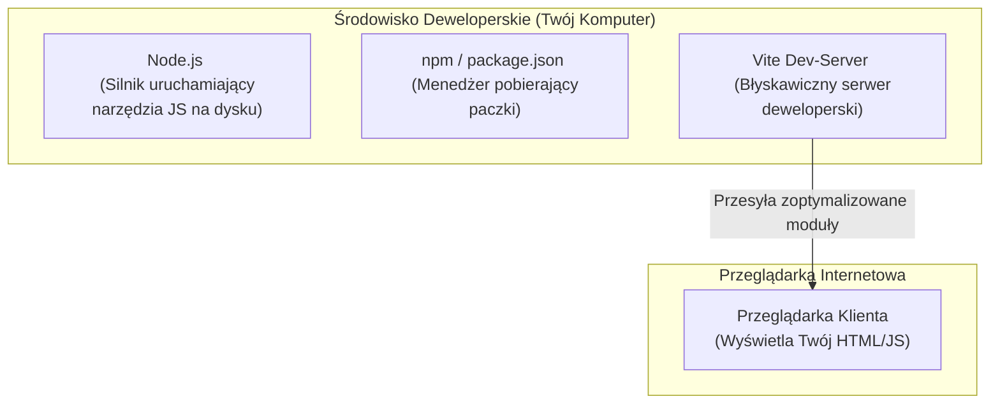

# Czym jest Node.js, npm i bundler Vite

Do tej pory pisaliśmy kod JavaScript uruchamiany bezpośrednio w przeglądarce za pomocą plików `<script type="module">`. Jednak przy profesjonalnych projektach potrzebujemy narzędzi ułatwiających instalowanie gotowych bibliotek, automatyczne odświeżanie strony (Hot Module Replacement) oraz pakowanie kodu produkcyjnego.

W tej lekcji dowiesz się, czym jest środowisko **Node.js**, menedżer paczek **npm** oraz nowoczesne narzędzie **Vite**.

Zbudujemy **Mini-projekt 7: Pierwsza nowoczesna aplikacja z wykorzystaniem bundlera Vite**.

---

## 🧠 Model mentalny: Rola Node.js i Vite na komputerze programisty

Początkujący programiści często mylą Node.js z przeglądarką. Wyjaśnijmy to prosto:



- **Node.js:** Środowisko uruchomieniowe na Twoim komputerze. Służy do odpalania narzędzi deweloperskich w terminalu.
- **npm (*Node Package Manager*):** Menedżer paczek. Pobiera i aktualizuje biblioteki z rejestru `npmjs.com`.
- **Vite:** Narzędzie budujące (bundler). Tworzy błyskawiczny serwer deweloperski, który automatycznie odświeża stronę po zapisaniu pliku w edytorze.

---

## ⚙️ Krok 1: Anatomia pliku `package.json`

Gdy tworzysz projekt z Node.js, głównym plikiem konfiguracyjnym jest **`package.json`**:

```json
{
  "name": "moj-projekt-vite",
  "private": true,
  "version": "1.0.0",
  "type": "module",
  "scripts": {
    "dev": "vite",
    "build": "vite build"
  },
  "devDependencies": {
    "vite": "^5.0.0"
  }
}
```

### 🔍 Wyjaśnienie konfiguracji `package.json` (Linia po linii):

- **`"type": "module"`** — Nakazuje Node.js używanie natywnych modułów ES6 (`import` / `export`) we wszystkich plikach `.js`.
- **`"scripts"`** — Skróty poleceń terminala. Wpisanie `npm run dev` uruchomi serwer Vite!
- **`"devDependencies"`** — Lista narzędzi potrzebnych tylko programiście w trakcie tworzenia kodu (np. Vite).

---

## ⚙️ Krok 2: Tworzenie projektu w Vite bez instalowania czegokolwiek na stałe

Możesz stworzyć czysty projekt Vite w ułamku sekundy, używając polecenia `npx` w swoim terminalu:

```bash
# Wpisz w terminalu w wybranym folderze:
npx create-vite moj-sklep --template vanilla
```

Przejdź do utworzonego folderu i zainstaluj zależności:

```bash
cd moj-sklep
npm install
```

Przeglądarka i serwer deweloperski uruchomią się po wpisaniu polecenia:

```bash
npm run dev
```

---

## 🎯 🛠️ Mini-projekt 7: Modułowa Aplikacja w Vite z podglądem na żywo

Vite automatycznie śledzi zmiany w Twoim kodzie. Wyedytujmy plik `main.js` w naszym nowym projekcie:

```javascript
// Vite pozwala na bezpośrednie importowanie plików CSS do kodu JS!
import './style.css';

const app = document.querySelector('#app');

if (app) {
  app.innerHTML = `
    <div class="card">
      <h1>Witaj w projekcie zbudowanym z Vite!</h1>
      <p>Edytuj plik <code>main.js</code> i zapisz go - strona odświeży się natychmiastowo bez przeładowania!</p>
      <button id="counter-btn" type="button">Licznik: 0</button>
    </div>
  `;

  let count = 0;
  const btn = document.querySelector('#counter-btn');
  btn?.addEventListener('click', () => {
    count++;
    btn.textContent = `Licznik: ${count}`;
  });
}
```

---

## 🛠️ Diagnostyka i rozwiązywanie problemów

<data-gate>
  <data-quiz>
    <question>
      Jaka jest rola folderu "node_modules/", który pojawia się po wpisaniu polecenia "npm install"?
    </question>
    <options>
      <item>Zawiera pliki bazy danych MySQL dla Twojego projektu.</item>
      <item correct>Folder node_modules zawiera kod pobranych bibliotek i narzędzi zewnętrznych. Nie wysyła się go do repozytorium Git - można go w każdej chwili odtworzyć komendą npm install na podstawie pliku package.json.</item>
      <item>Jest to tymczasowy folder pamięci podręcznej przeglądarki Chrome.</item>
    </options>
    <div data-hint="error">
      Zastanów się: co się stanie, gdy skasujesz folder `node_modules/` z dysku? Wystarczy wpisać `npm install`, a npm pobierze wszystko z powrotem na podstawie pliku `package.json`!
    </div>
    <div data-hint="success">
      Wspaniale! Folder `node_modules/` jest generowany automatycznie i zawsze dopisujemy go do pliku `.gitignore`.
    </div>
  </data-quiz>
</data-gate>

---

### <span class="header-koala"><span>🦾</span><span>Executive Summary</span><span>🦾</span></span> Co masz wynieść z tej lekcji:

- **Node.js** uruchamia narzędzia deweloperskie w terminalu na Twoim komputerze.
- **`package.json`** opisuje Twój projekt oraz listę zainstalowanych paczek w **`npm`**.
- **Vite** udostępnia błyskawiczny serwer deweloperski z funkcją automatycznego odświeżania na żywo (*Hot Module Replacement*).
