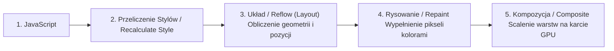
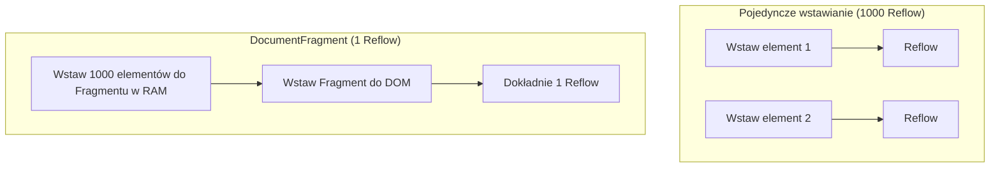

# DOM, Reflow, Repaint i Optymalizacja Renderowania

Powolne działanie stron internetowych rzadko wynika ze zbyt wolnego przeliczania logiki w JavaScript. W 90% przypadków przyczyna leży w nieefektywnym operowaniu na drzewie **DOM** (*Document Object Model*) i wywoływaniu kosztownych operacji rysowania w przeglądarce: **Reflow** oraz **Repaint**.

Zrozumienie ścieżki krytycznej renderowania (*Critical Rendering Path*) pozwala budować interfejsy działające z idealną płynnością 60 klatek na sekundę (60 FPS).

---

## 🧠 Model mentalny: Ścieżka Krytyczna Renderowania

Kiedy edytujesz właściwości elementu w JavaScript, przeglądarka musi wykonać następujące kroki, aby wyświetlić zmianę na ekranie:



- **Reflow (Layout):** Najdroższa operacja. Przeglądarka przelicza pozycje i rozmiary **wszystkich** elementów na stronie. Zmiana szerokości jednego elementu może wpłynąć na ułożenie reszty dokumentu.
- **Repaint:** Przeglądarka przerysowuje kolor, tło czy cień elementu, bez zmiany jego geometrii. Szybsze niż Reflow, ale wciąż obciąża procesor.
- **Composite:** Zmiana właściwości takich jak `transform` lub `opacity` omija Reflow i Repaint! Operacja trafia bezpośrednio do procesora graficznego (GPU).

---

## ⚙️ Decyzja 1: Unikanie zjawiska Layout Thrashing (Synchroniczne Wymuszenie Układu)

**Layout Thrashing** występuje, gdy w pętli na przemian **_odczytujesz_** geometrię elementu (np. `offsetHeight`) i **_zapisujesz_** nową właściwość w CSS. Zmusza to przeglądarkę do wielokrotnego wykonywania synchronicznego Reflow w ciągu jednej klatki.

### ❌ Zły kod (Layout Thrashing)
```javascript
// ZŁY KOD - Odczyt i Zapis naprzemiennie w pętli
const blocks = document.querySelectorAll('.block');

for (let i = 0; i < blocks.length; i++) {
  // ODCZYT: Zmusza przeglądarkę do natychmiastowego Reflow!
  const width = blocks[i].offsetWidth; 
  // ZAPIS: Unieważnia aktualny układ!
  blocks[i].style.width = (width + 10) + 'px'; 
}
```

### ✅ Poprawny kod (Grupowanie Odczytów i Zapisów)
```javascript
// POPRAWNY KOD - Najpierw wszystkie odczyty, potem wszystkie zapisy
const blocks = document.querySelectorAll('.block');
const widths = [];

// 1. FAZA ODCZYTU (Read Phase)
for (let i = 0; i < blocks.length; i++) {
  widths.push(blocks[i].offsetWidth);
}

// 2. FAZA ZAPISU (Write Phase)
for (let i = 0; i < blocks.length; i++) {
  blocks[i].style.width = (widths[i] + 10) + 'px';
}
```

---

## ⚙️ Decyzja 2: Wykorzystanie `DocumentFragment` i `requestAnimationFrame`

Gdy musisz wstawić 1000 nowych elementów do drzewa DOM, nie dodawaj ich pojedynczo w pętli (`container.appendChild()`), ponieważ wywołasz 1000 operacji przerenderowania.

Używaj **`DocumentFragment`** jako wirtualnego kontenera w pamięci RAM:

```javascript
/**
 * Wstawia listę elementów w sposób zoptymalizowany
 * @param {HTMLElement} container
 * @param {string[]} itemsText
 */
export function renderListOptimized(container, itemsText) {
  const fragment = document.createDocumentFragment();

  itemsText.forEach(text => {
    const li = document.createElement('li');
    li.textContent = text;
    fragment.appendChild(li); // Zapis tylko w pamięci RAM!
  });

  // Tylko JEDNA operacja modyfikacji drzewa DOM na stronie!
  requestAnimationFrame(() => {
    container.appendChild(fragment);
  });
}
```



---

## ⚙️ Decyzja 3: Właściwości bezpieczne dla GPU (`transform` & `opacity`)

Jeśli tworzysz animację przesunięcia lub ukrycia elementu, nigdy nie animuj właściwości `left`, `top`, `width` czy `margin`!

Animuj **wyłącznie**:
- **`transform: translate(x, y)`** (zamiast `top/left`)
- **`transform: scale()`** (zamiast `width/height`)
- **`opacity`** (zamiast `display/visibility`)

Właściwości te są przekazywane bezpośrednio do układu **GPU Composite**, gwarantując brak operacji Reflow i idealną płynność 60 FPS.

---

## 🎯 Ćwiczenie weryfikacyjne: Mierzenie czasu renderowania

Użyjmy metody `console.time()` do zmierzenia różnicy wydajnościowej:

```javascript
const container = document.getElementById('test-container');

console.time('Bez optymalizacji');
for (let i = 0; i < 500; i++) {
  const div = document.createElement('div');
  div.textContent = `Item ${i}`;
  container.appendChild(div);
}
console.timeEnd('Bez optymalizacji');

container.innerHTML = '';

console.time('Z DocumentFragment');
const frag = document.createDocumentFragment();
for (let i = 0; i < 500; i++) {
  const div = document.createElement('div');
  div.textContent = `Item ${i}`;
  frag.appendChild(div);
}
container.appendChild(frag);
console.timeEnd('Z DocumentFragment');
```

---

## 🛠️ Diagnostyka i rozwiązywanie problemów

<data-gate>
  <data-quiz>
    <question>
      Dlaczego odczytanie właściwości typu "element.offsetHeight" lub "element.getBoundingClientRect()" zaraz po zmianie "element.style.width" w JavaScript spowalnia działanie interfejsu?
    </question>
    <options>
      <item>Metoda getBoundingClientRect pobiera dane bezpośrednio z karty sieciowej.</item>
      <item correct>Zmusza to przeglądarkę do natychmiastowego wykonania synchronicznego przeliczenia układu (Reflow), aby zwrócić dokładny wymiar w pikselach, psując optymalizację grupowania zadań.</item>
      <item>Właściwość offsetHeight jest przestarzała i wycofana z użycia.</item>
    </options>
    <div data-hint="error">
      Zastanów się: zmiana stylu unieważnia układ strony. Gdy zapytasz o dokładną wysokość w pikselach w następnej linii, przeglądarka nie może czekać na koniec klatki — musi policzyć pozycje natychmiast!
    </div>
    <div data-hint="success">
      Wyśmienita odpowiedź! Zjawisko to nazywa się Synchronicznym Wymuszeniem Układu (Forced Synchronous Layout). Zawsze oddzielaj fazę odczytu geometrii od fazy modyfikacji stylów.
    </div>
  </data-quiz>
</data-gate>

---

### <span class="header-koala"><span>🦾</span><span>🐨</span><span>🦾</span></span> Co masz wynieść z tej lekcji:

- **Reflow (Layout)** jest najdroższą operacją — unikaj zmiana geometrii elementów podczas animacji.
- Używaj **`transform` oraz `opacity`**, aby przenieść ciężar animacji na kartę graficzną (GPU Composite).
- Używaj **`DocumentFragment`** do grupowania zmian DOM w pamięci RAM przed wstawieniem ich na stronę.
