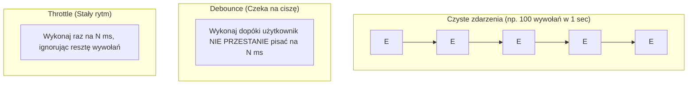
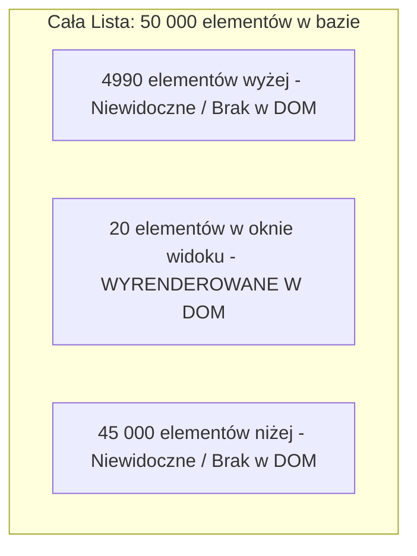

# Kondensacja Zdarzeń (Debounce, Throttle, Virtualization)

Niektóre zdarzenia w przeglądarce — takie jak przewijanie strony (`scroll`), zmiana rozmiaru okna (`resize`), ruch myszą (`mousemove`) czy wpisywanie tekstu w polu wyszukiwania (`input`) — potrafią emitować **setki wywołań na sekundę**.

Jeśli do każdego takiego zdarzenia podepniesz ciężką operację (np. zapytanie HTTP do API lub przeliczenie DOM), doprowadzisz do natychmiastowej awarii wydajnościowej. Narzędziami obrony są **Debounce**, **Throttle** oraz **Wirtualizacja**.

---

## 🧠 Model mentalny: Debounce vs Throttle



- **Debounce:** Odkłada wykonanie funkcji do momentu, gdy po ostatnim zdarzeniu upłynie określony czas spokoju (np. wyszukiwarka wpisywanego hasła).
- **Throttle:** Gwarantuje, że funkcja wykona się **maksymalnie raz na podany odstęp czasu** (np. śledzenie pozycji paska przewijania podczas `scroll`).

---

## ⚙️ Decyzja 1: Implementacja i użycie `debounce()`

Zastosuj `debounce` przy polach tekstowych Autocomplete. Nie chcesz wysyłać zapytania HTTP do serwera po naciśnięciu każdej pojedynczej litery!

```javascript
/**
 * Tworzy funkcję typu Debounce
 * @param {Function} fn
 * @param {number} delayMs
 * @return {(...args: any[]) => void}
 */
export function debounce(fn, delayMs = 300) {
  let timeoutId = null;

  return function (...args) {
    if (timeoutId !== null) {
      clearTimeout(timeoutId); // Kasujemy poprzedni stoper
    }

    timeoutId = setTimeout(() => {
      fn.apply(this, args);
      timeoutId = null;
    }, delayMs);
  };
}

// Użycie w polu wyszukiwania:
const searchInput = document.getElementById('search-input');

const handleSearch = debounce((event) => {
  console.log('Wysyłam zapytanie do API dla:', event.target.value);
}, 400);

searchInput?.addEventListener('input', handleSearch);
```

---

## ⚙️ Decyzja 2: Implementacja i użycie `throttle()`

Zastosuj `throttle` przy obsłudze zdarzeń `scroll` lub `resize`, gdzie potrzebujemy płynnych informacji zwrotnych w stałych odstępach czasu:

```javascript
/**
 * Tworzy funkcję typu Throttle
 * @param {Function} fn
 * @param {number} limitMs
 * @return {(...args: any[]) => void}
 */
export function throttle(fn, limitMs = 100) {
  let inThrottle = false;

  return function (...args) {
    if (!inThrottle) {
      fn.apply(this, args);
      inThrottle = true;
      setTimeout(() => (inThrottle = false), limitMs);
    }
  };
}

// Użycie przy przewijaniu strony:
const handleScroll = throttle(() => {
  console.log('Aktualna pozycja scroll:', window.scrollY);
}, 200);

window.addEventListener('scroll', handleScroll);
```

---

## ⚙️ Decyzja 3: Wirtualizacja List (Virtual Scrolling)

Gdy aplikacja musi wyświetlić listę 50 000 elementów (np. tabela transakcji finansowych), dodanie 50 000 węzłów HTML do drzewa DOM zniszczy pamięć przeglądarki.

**Wirtualizacja** polega na renderowaniu w drzewie DOM **_wyłącznie tych elementów, które są w tym momencie widoczne w oknie widoku (Viewport)_** (np. 20 elementów) oraz symulowaniu całkowitej wysokości paska przewijania za pomocą zapasowego kontenera.



---

## 🎯 Ćwiczenie weryfikacyjne: Budowa wyszukiwarki Live Search

Stwórzmy bezpieczne pole wyszukiwania, które nie wysyła zbędnych zapytań i ignoruje niepotrzebne spacje:

```javascript
const handleLiveSearch = debounce(async (searchTerm) => {
  const query = searchTerm.trim();
  if (query.length < 3) return; // Walidacja: min. 3 znaki

  const results = await fetch(`/api/search?q=${encodeURIComponent(query)}`)
    .then(r => r.json());

  renderSearchResults(results);
}, 350);

document.getElementById('query-input')?.addEventListener('input', (e) => {
  handleLiveSearch(e.target.value);
});
```

---

## 🛠️ Diagnostyka i rozwiązywanie problemów

<data-gate>
  <data-quiz>
    <question>
      Jaka jest główna różnica w zachowaniu funkcji zdebouncowanej (Debounce) a skondensowanej (Throttle)?
    </question>
    <options>
      <item>Debounce działa tylko na serwerze Node.js, a Throttle w przeglądarce.</item>
      <item correct>Debounce odkłada wykonanie funkcji, dopóki zdarzenia nie przestaną nadchodzić na dany czas, natomiast Throttle wykonuje funkcję w cyklicznych, stałych odstępach czasu.</item>
      <item>Throttle usuwa elementy z drzewa DOM po ich sklonowaniu.</item>
    </options>
    <div data-hint="error">
      Zastanów się: co się stanie, gdy użytkownik ciągle pisze bez przerwy na klawiaturze przez 10 sekund? Debounce poczeka do końca pisania, Throttle odpali się np. co 200ms.
    </div>
    <div data-hint="success">
      Wyśmienicie! Zapamiętaj: Debounce stosujemy przy wpisywaniu tekstu (czekamy na koniec pisania), a Throttle przy ciągłych strumieniach zdarzeń (np. scroll, resize).
    </div>
  </data-quiz>
</data-gate>

---

### <span class="header-koala"><span>🦾</span><span>🐨</span><span>🦾</span></span> Co masz wynieść z tej lekcji:

- **Debounce:** Wykonuje funkcję po upływie czasu ciszy od ostatniego zdarzenia (np. Autocomplete).
- **Throttle:** Wykonuje funkcję ze stałym limitem częstotliwości (np. zdarzenie Scroll).
- **Wirtualizacja:** Utrzymuje w drzewie DOM wyłącznie widoczne elementy, umożliwiając płynne przewijanie milionów rekordów.
