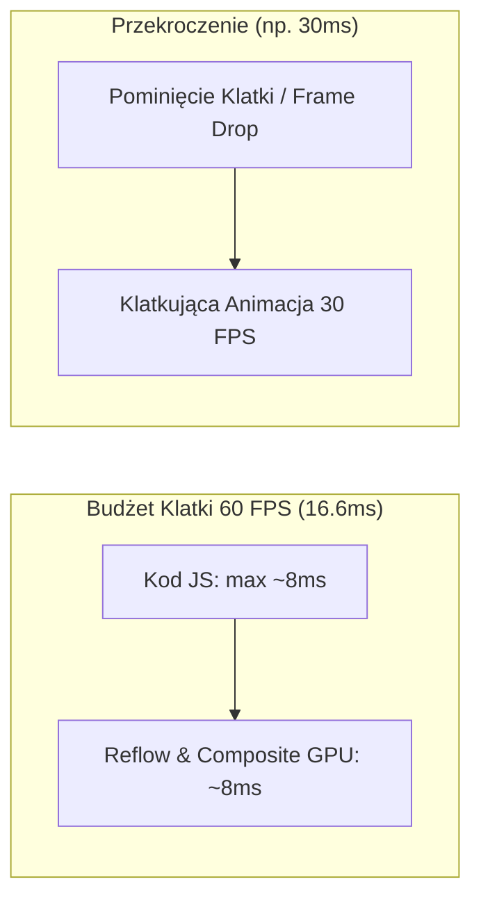
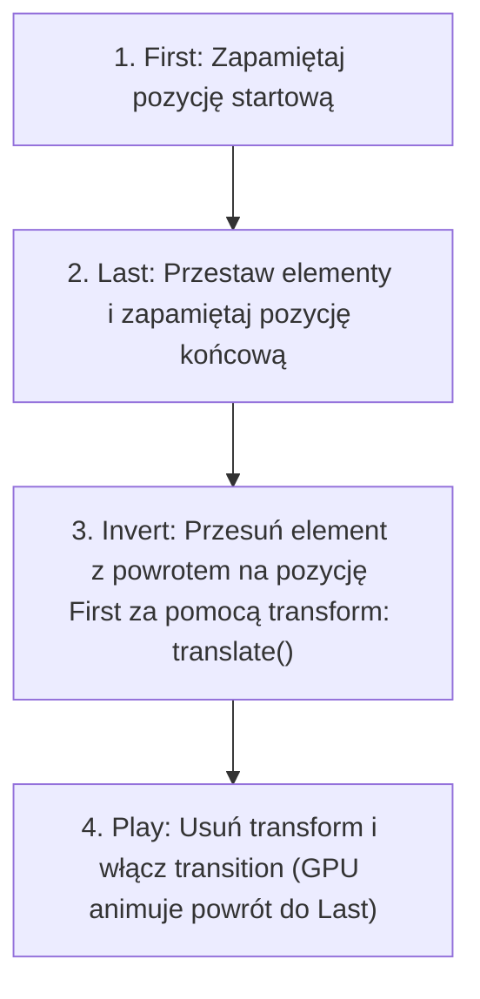

# Mikrointerakcje, Animacje i Płynność UI (FLIP, RAF)

Płynny interfejs użytkownika to nie tylko kwestia estetyki. **Mikrointerakcje** informują użytkownika o stanie systemu i potwierdzają wykonanie akcji (np. delikatne ugięcie przycisku po kliknięciu czy płynne przesunięcie usuniętego elementu listy).

Jeśli animacja gubi klatki (tzw. *Jank*), użytkownik odbiera aplikację jako niedopracowaną i niesolidną. W tej lekcji nauczysz się tworzyć animacje z użyciem **`requestAnimationFrame`** oraz techniki **FLIP**.

---

## 🧠 Model mentalny: Budżet Klatki (16.6ms)

Większość współczesnych monitorów odświeża obraz z częstotliwością 60 Hz (lub 120 Hz). Oznacza to, że przeglądarka ma dokładnie **16.6 milisekundy** na wykonanie całego kodu JavaScript, przeliczenie układu i przerysowanie pikseli w każdej klatce.



Jeśli Twój kod JavaScript wewątrz pętli animacji wykonuje się dłużej niż 8-10 ms, klatka zostanie pominięta, a animacja zacznie klatkować.

---

## ⚙️ Decyzja 1: Tworzenie płynnych pętli z `requestAnimationFrame`

Nigdy nie używaj `setInterval()` ani `setTimeout()` do tworzenia animacji w JavaScript! Nie są one zsynchronizowane z odświeżaniem monitora.

Używaj **`requestAnimationFrame()` (rAF)**, które prosi przeglądarkę o wykonanie funkcji tuż przed kolejnym przerysowaniem ekranu.

```javascript
/**
 * Płynna animacja elementu za pomocą requestAnimationFrame
 * @param {HTMLElement} element
 * @param {number} durationMs
 */
export function animateFadeIn(element, durationMs = 300) {
  let startTime = null;
  element.style.opacity = '0';
  element.style.display = 'block';

  function step(timestamp) {
    if (!startTime) startTime = timestamp;
    const progress = Math.min((timestamp - startTime) / durationMs, 1);

    // Modyfikujemy tylko właściwość kompozytową opacity!
    element.style.opacity = String(progress);

    if (progress < 1) {
      requestAnimationFrame(step); // Prosimy o kolejną klatkę
    }
  }

  requestAnimationFrame(step);
}
```

---

## ⚙️ Decyzja 2: Technika FLIP (First, Last, Invert, Play)

Animowanie właściwości układu (np. zmiana kolejności elementów na liście za pomocą `top` lub `height`) powoduje ciągły Reflow i psuje wydajność.

Technika **FLIP** opracowana przez Paula Lewisa pozwala animować zmianę układu z wydajnością 60 FPS przy użyciu wyłącznie bezpiecznych dla GPU właściwości `transform`.



```javascript
export function animateFlipItem(element, changeLayoutFn) {
  // 1. FIRST: Pozycja i rozmiar początkowy
  const firstRect = element.getBoundingClientRect();

  // 2. LAST: Wykonujemy zmianę układu (np. zmiana kolejności w DOM)
  changeLayoutFn();
  const lastRect = element.getBoundingClientRect();

  // 3. INVERT: Obliczamy delta pozycji i nakładamy natychmiastowy transform
  const deltaX = firstRect.left - lastRect.left;
  const deltaY = firstRect.top - lastRect.top;

  element.style.transform = `translate(${deltaX}px, ${deltaY}px)`;
  element.style.transition = 'none';

  // 4. PLAY: W kolejnej klatce włączamy przejście i czyścimy transform
  requestAnimationFrame(() => {
    element.style.transition = 'transform 300ms cubic-bezier(0.4, 0, 0.2, 1)';
    element.style.transform = '';
  });
}
```

---

## ⚙️ Decyzja 3: Szanowanie preferencji użytkownika (`prefers-reduced-motion`)

Niektórzy użytkownicy cierpią na zaburzenia błędnika lub choroby lokomocyjne wywoływane przez intensywne animacje na ekranie. Systemy operacyjne pozwalają na włączenie opcji ograniczenia ruchu.

Zawsze sprawdzaj intencję użytkownika w JavaScript przed uruchomieniem animacji:

```javascript
export function shouldAnimate() {
  const mediaQuery = window.matchMedia('(prefers-reduced-motion: reduce)');
  return !mediaQuery.matches;
}
```

---

## 🎯 Ćwiczenie weryfikacyjne: Animowany przycisk akcji (Ripple Effect)

Stwórzmy mikrointerakcję fali na przycisku po kliknięciu:

```javascript
document.addEventListener('click', (e) => {
  const btn = e.target.closest('.ripple-btn');
  if (!btn || !shouldAnimate()) return;

  const rect = btn.getBoundingClientRect();
  const circle = document.createElement('span');
  const diameter = Math.max(rect.width, rect.height);

  circle.style.width = circle.style.height = `${diameter}px`;
  circle.style.left = `${e.clientX - rect.left - diameter / 2}px`;
  circle.style.top = `${e.clientY - rect.top - diameter / 2}px`;
  circle.classList.add('ripple-effect');

  btn.appendChild(circle);
  setTimeout(() => circle.remove(), 600);
});
```

---

## 🛠️ Diagnostyka i rozwiązywanie problemów

<data-gate>
  <data-quiz>
    <question>
      Co oznacza litera 'I' (Invert) w technice animacji FLIP?
    </question>
    <options>
      <item>Odwrócenie kolorów tła animowanego elementu.</item>
      <item correct>Nałożenie przesunięcia CSS (transform: translate) równego różnicy pozycji między nowym a starym układem, tak aby wizualnie element powrócił na swoją pozycję początkową bez zmiany układu DOM.</item>
      <item>Inicjalizację silnika animacji w osobnym procesie Web Worker.</item>
    </options>
    <div data-hint="error">
      Zastanów się: po zmierzeniu starej pozycji (First) i nowej pozycji (Last), jak natychmiastowo cofnąć element wizualnie bez wywoływania ponownego Reflow?
    </div>
    <div data-hint="success">
      Wyśmienicie! Krok Invert udaje, że element się nie poruszył, dzięki użyciu szybkiej właściwości `transform`. Następnie w kroku Play płynnie zdejmujemy to przesunięcie.
    </div>
  </data-quiz>
</data-gate>

---

### <span class="header-koala"><span>🦾</span><span>🐨</span><span>🦾</span></span> Co masz wynieść z tej lekcji:

- **16.6 ms to budżet klatki** przy 60 FPS — Kod JS nie może go przekraczać.
- Technika **FLIP** umożliwia 60 FPS dla zmian układu poprzez przeliczenie pozycji i użycie `transform`.
- Zawsze respektuj **`prefers-reduced-motion`** ze względów dostępności i zdrowia użytkowników.
