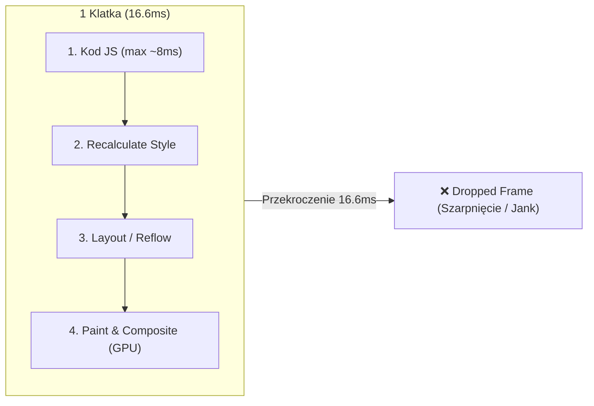

# Płynne animacje 60 FPS (Cz. 1 - Budżet Klatki 16ms i requestAnimationFrame)

Witaj w pierwszej części modułu poświęconego inżynierii animacji w JavaScript.

Jako Twój mentor przeprowadzę Cię przez matematykę płynności interfejsu (60 klatek na sekundę), koncepcję **Budżetu Klatki (Frame Budget 16.6ms)** oraz opanujesz natywną funkcję **`requestAnimationFrame()`**.

---

## 🎓 Krok 1: Budżet Klatki (Frame Budget 16.6ms)

Aby interfejs strony internetowej wydawał się płynny dla ludzkiego oka, przeglądarka musi wyrenderować **60 klatek na sekundę (60 FPS)**.

Podzielmy 1 sekundę (1000ms) przez 60 klatek:
$$\frac{1000\text{ ms}}{60} \approx 16.66\text{ ms}$$

Oznacza to, że silnik ma **zaledwie 16.6 milisekundy** na wykonanie CAŁEGO kodu JavaScript, przeliczenie stylów CSS, wykonanie Reflow i narysowanie pikseli na ekranie!



> [!CAUTION]
> **Dlaczego `setInterval()` lub `setTimeout()` NIE nadają się do animacji?**
> Stoper `setTimeout` wykonuje się niezależnie od tego, kiedy przeglądarka odświeża ekran (np. w środku cyklu odświeżania monitora). Powoduje to powstawanie nierównomiernych klatek i widocznego szarpania animacji!

---

## 🎓 Krok 2: Jak działa `requestAnimationFrame()`?

Funkcja **`requestAnimationFrame(callback)`** informuje przeglądarkę: *„Chcę wykonać animację. Uruchom moją funkcję tuż przed tym, jak zaczniesz rysować kolejną klatkę ekranu!”*.

```javascript
function step(timestamp) {
  // timestamp to dokładny czas w milisekundach od otwarcia strony (high precision timer)
  console.log('Nowa klatka wyrenderowana w czasie:', timestamp);

  // Jeśli animacja ma trwać dalej, prosimy o kolejną klatkę!
  requestAnimationFrame(step);
}

// Uruchamiamy pierwszą klatkę animacji
requestAnimationFrame(step);
```

### Zalety `requestAnimationFrame()`:
1. **Perfect Sync:** Idealna synchronizacja z czestotliwością odświeżania monitora (60Hz, 120Hz, 144Hz).
2. **Oszczędność Baterii:** Gdy użytkownik zminimalizuje przeglądarkę lub przejdzie do innej karty, `requestAnimationFrame` **automatycznie wstrzymuje wykonywanie animacji**, oszczędzając baterię i procesor!

---

## 🛠️ Warsztat z Mentorem: Płynny Licznik Animowany (`CounterAnimation.js`)

Zbudujmy płynnie animowany licznik statystyk, który zwiększa cyfrę od 0 do 10 000 w ciągu dokładnie 2 sekund (2000ms):

```javascript
export function animateCounter(element, start, end, duration) {
  let startTime = null;

  function updateCounter(currentTime) {
    if (!startTime) startTime = currentTime;

    // Obliczamy ile czasu upłynęło od startu animacji (0.0 do 1.0)
    const elapsedTime = currentTime - startTime;
    const progress = Math.min(elapsedTime / duration, 1.0);

    // Obliczamy aktualną wartość liczbową
    const currentCount = Math.floor(start + (end - start) * progress);
    element.textContent = currentCount.toLocaleString('pl-PL');

    // Jeśli animacja nie dobiegła końca (progress < 1.0), żądamy kolejnej klatki!
    if (progress < 1.0) {
      requestAnimationFrame(updateCounter);
    }
  }

  // Uruchomienie pierwszej klatki
  requestAnimationFrame(updateCounter);
}
```

### 🔍 Rozbicie składni linia po linii (Od Mentora):

- **`progress = Math.min(elapsedTime / duration, 1.0)`** — Wyznacza postęp animacji jako ułamek od `0.0` (start) do `1.0` (meta). `Math.min` gwarantuje, że nie przekroczymy 100%.
- **`requestAnimationFrame(updateCounter)`** — Zamawia wykonanie kolejnej klatki w następnym cyklu odświeżania monitora.

---

## 🛠️ Interaktywne Wyzwanie Pojęć Animacji (Connection Matcher)

Sprawdź swoje opanowanie inżynierii animacji — połącz pojęcie z jego parametrem w kodzie:

<data-connection-matcher title="Połącz mechanizmy animacji JavaScript z ich rolą w wydajności">
    <div class="cmw-item" data-left="16.6ms" data-right="Maksymalny budżet czasowy jednej klatki dla zachowania płynności 60 FPS"></div>
    <div class="cmw-item" data-left="requestAnimationFrame()" data-right="Natywna funkcja synchronizująca wykonanie animacji z cyklem odświeżania ekranu"></div>
    <div class="cmw-item" data-left="Dropped Frame / Jank" data-right="Zjawisko szarpania animacji występujące przy przekroczeniu limitu 16.6ms w klatce"></div>
    <div class="cmw-item" data-left="Auto-pause w rAF" data-right="Automatyczne zatrzymanie animacji przy zmianie karty w przeglądarce dla oszczędności baterii"></div>
</data-connection-matcher>

---

### <span class="header-koala"><span>🦾</span><span>Executive Summary</span><span>🦾</span></span> Co masz wynieść z tej lekcji:

- Budżet na wyrenderowanie 1 klatki przy 60 FPS wynosi **zaledwie 16.6ms**.
- Nigdy nie używaj `setInterval` do animowania elementów w DOM.
- Używaj natywnej funkcji **`requestAnimationFrame()`** dla idealnej płynności i oszczędności baterii.
