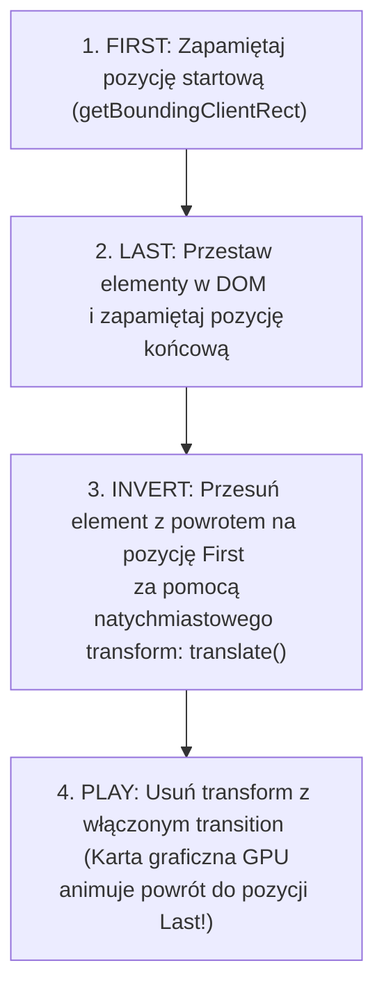

# Płynne animacje 60 FPS (FLIP i RAF)

Kiedy elementy w aplikacji zmieniają pozycję (np. przy rearanżacji listy czy filtrowaniu), skokowa zmiana wyglądu powoduje dezorientację użytkownika. Animacje sprawiają, że interfejs wydaje się naturalny i płynny.

Jednak nieprawidłowo napisane animacje powodują tak zwany **Jank** (klatkowanie). W tej lekcji poznasz budżet klatki **16.6 ms**, funkcję **`requestAnimationFrame`** oraz słynną technikę **FLIP**.

Zbudujemy **Mini-projekt 9: Animowaną Listę z Płynną Rearanżacją Elementów (FLIP Technique)**.

---

## 🧠 Model mentalny: Technika FLIP (First, Last, Invert, Play)

Animowanie właściwości układowych (takich jak `top`, `left`, `margin`) wywołuje kosztowny **Reflow** w każdej klatce. Technika **FLIP** oszukuje przeglądarkę, używając wyłącznie płynnej i akcelerowanej sprzętowo właściwości `transform`.



---

## ⚙️ Krok 1: Pisanie Pomocnika FLIP z obsługą `prefers-reduced-motion`

Stwórz folder `C:\xampp\htdocs\flip-animation\` i plik `flip.js`:

```javascript
/**
 * Sprawdza czy użytkownik prosi o ograniczenie animacji (A11y / WCAG)
 */
export function prefersReducedMotion() {
  return window.matchMedia('(prefers-reduced-motion: reduce)').matches;
}

/**
 * Animuje element techniką FLIP
 * @param {HTMLElement} element 
 * @param {Function} changeLayoutFn 
 */
export function animateFlip(element, changeLayoutFn) {
  // Jeśli użytkownik ma włączone ograniczenie ruchu - wykonujemy zmianę bez animacji
  if (prefersReducedMotion()) {
    changeLayoutFn();
    return;
  }

  // 1. FIRST: Mierzymy pozycję początkową
  const firstRect = element.getBoundingClientRect();

  // 2. LAST: Wykonujemy zmianę układu w DOM i mierzymy nową pozycję
  changeLayoutFn();
  const lastRect = element.getBoundingClientRect();

  // 3. INVERT: Obliczamy różnicę przesunięcia
  const deltaX = firstRect.left - lastRect.left;
  const deltaY = firstRect.top - lastRect.top;

  // Cofamy element wizualnie bez odpalania Reflow!
  element.style.transform = `translate(${deltaX}px, ${deltaY}px)`;
  element.style.transition = 'none';

  // 4. PLAY: W kolejnej klatce mikser GPU wykonuje płynne przejście
  requestAnimationFrame(() => {
    requestAnimationFrame(() => {
      element.style.transition = 'transform 300ms cubic-bezier(0.4, 0, 0.2, 1)';
      element.style.transform = '';
    });
  });
}
```

### 🔍 Wyjaśnienie składni od zera:

- **`getBoundingClientRect()`** — Zwraca dokładne rozmiary i położenie elementu na ekranie w pikselach.
- **`translate(${deltaX}px, ${deltaY}px)`** — Przesunięcie transformacji CSS. Jest wykonywane w całości przez kartę graficzną (GPU), nie obciążając głównego wątku procesora.
- **`requestAnimationFrame(callback)`** — Nakazuje przeglądarce wykonanie kodu tuż przed kolejnym odświeżeniem ekranu (zsynchronizowane z Hz monitora).

---

## 🎯 🛠️ Mini-projekt 9: Animowana Rearanżacja Listy (`app.js`)

Utwórzmy plik `app.js` z interaktywną zmianą kolejności:

```javascript
import { animateFlip } from './flip.js';

const list = document.querySelector('#item-list');
const shuffleBtn = document.querySelector('#shuffle-btn');

shuffleBtn?.addEventListener('click', () => {
  if (!list) return;

  const items = Array.from(list.children);
  if (items.length === 0) return;

  // Wybieramy losowy element do przesunięcia na początek
  const randomItem = items[Math.floor(Math.random() * items.length)];

  // Uruchamiamy FLIP dla wybranego elementu
  animateFlip(randomItem, () => {
    // Zmiana układu w DOM: przenosimy element na samą górę listy
    list.insertBefore(randomItem, list.firstChild);
  });
});
```

---

## 🛠️ Diagnostyka i rozwiązywanie problemów

<data-gate>
  <data-quiz>
    <question>
      Dlaczego funkcja requestAnimationFrame jest lepsza od setTimeout do tworzenia pętli animacji JS?
    </question>
    <options>
      <item>setTimeout automatycznie wyłącza kartę graficzną.</item>
      <item correct>requestAnimationFrame jest idealnie zsynchronizowany z częstotliwością odświeżania monitora (np. 60Hz lub 144Hz) i automatycznie wstrzymuje animację gdy karta przeglądarki jest nieaktywna, oszczędzając baterię.</item>
      <item>requestAnimationFrame działa tylko na urządzeniach Apple.</item>
    </options>
    <div data-hint="error">
      Zastanów się: co się dzieje z pętlą `setTimeout`, gdy użytkownik przełączy kartę w przeglądarce? Nadal działa w tle!
    </div>
    <div data-hint="success">
      Wspaniale! `requestAnimationFrame` gwarantuje idealną synchronizację i oszczędność zasobów procesora.
    </div>
  </data-quiz>
</data-gate>

---

### <span class="header-koala"><span>🦾</span><span>Executive Summary</span><span>🦾</span></span> Co masz wynieść z tej lekcji:

- Budżet klatki dla 60 FPS wynosi **16.6 ms**.
- Technika **FLIP (First, Last, Invert, Play)** wykorzystuje szybkie właściwości `transform` akcelerowane przez GPU.
- Zawsze weryfikuj preferencje użytkownika za pomocą **`prefers-reduced-motion`**.
