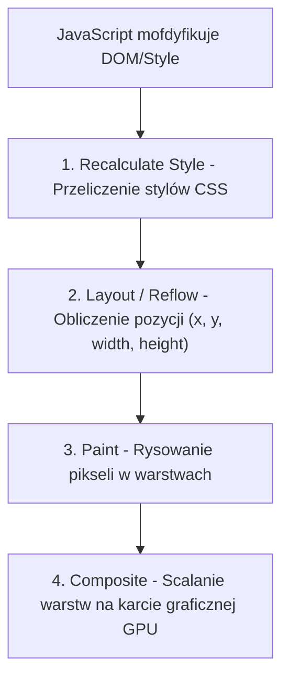
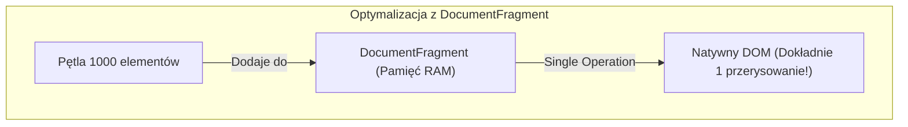

# Wydajność DOM, Debounce i Throttle (Cz. 1 - Layout Thrashing i DocumentFragment)

Witaj w pierwszej części modułu poświęconego inżynierii wydajnościowej interfejsów użytkownika.

Jako Twój mentor przeprowadzę Cię przez najczęstszą przyczynę powstawania przycięć (*Jank*) na stronach internetowych: **Layout Thrashing (Gwałtowne przeliczanie układu)**. Nauczysz się optymalizować operacje na drzewie DOM z użyciem **`DocumentFragment`** oraz kontrolować częstotliwość zdarzeń.

---

## 🎓 Krok 1: Jak przeglądarka renderuje stronę? (Reflow vs Repaint)

Gdy modyfikujesz drzewo DOM w JavaScript, przeglądarka wykonuje rygorystyczny proces renderowania:



- **Reflow (Layout):** Najdroższa operacja! Następuje przy zmianie szerokości, wysokości, marginesów, czcionki lub odczycie właściwości takich jak `element.offsetHeight` czy `getBoundingClientRect()`.
- **Repaint:** Przeliczenie kolorów (np. `background-color`, `color`) bez zmiany geometrii elementów.

---

## 🎓 Krok 2: Czym jest Layout Thrashing? (Przeplatanie Odczytu i Zapisu)

**Layout Thrashing** występuje wtedy, gdy w pętli wielokrotnie naprzemiennie **zapisujesz właściwość DOM** i od razu **odczytujesz właściwość geometryczną DOM**:

### ❌ Zły kod (Layout Thrashing - Przeglądarka zawiesza się):
```javascript
// BŁĄD: Odczyt offsetWidth zmusza przeglądarkę do natychmiastowego Reflow w każdym obiegu pętli!
const boxes = document.querySelectorAll('.box');

for (let i = 0; i < boxes.length; i++) {
  // Zapis do DOM
  boxes[i].style.width = '200px'; 
  // Odczyt z DOM -> Wymusza natychmiastowy Reflow (Forced Synchronous Layout)!
  const width = boxes[i].offsetWidth; 
}
```

### ✅ Poprawny kod (Grupowanie Odczytów i Zapisów):
```javascript
// DOBRE PODEJŚCIE: Najpierw odczytujemy wszystko, a potem wykonujemy zapisy!
const boxes = document.querySelectorAll('.box');
const width = boxes[0].offsetWidth; // Jeden odczyt na początku

for (let i = 0; i < boxes.length; i++) {
  boxes[i].style.width = '200px'; // Zapis w pętli bez ponownego wymuszania Reflow
}
```

---

## 🛠️ Warsztat z Mentorem: Optymalizacja wstawiania elementów z `DocumentFragment`

Wyobraź sobie, że musisz wstawić 1 000 nowych elementów `<li>` do listy w DOM.

### ❌ Zły kod (1 000 przerysowań DOM):
```javascript
const list = document.querySelector('#item-list');

// BŁĄD: Każde wywołanie appendChild zmusza przeglądarkę do modyfikacji drzewa DOM!
for (let i = 0; i < 1000; i++) {
  const li = document.createElement('li');
  li.textContent = `Pozycja nr ${i}`;
  list.appendChild(li); // 1000 ZAPISÓW DO LIVE DOM!
}
```

### ✅ Poprawny kod (Użycie wirtualnego kontenera `DocumentFragment`):
```javascript
const list = document.querySelector('#item-list');

// 1. Tworzymy lekki niewidoczny wirtualny kontener w pamięci RAM
const fragment = document.createDocumentFragment();

for (let i = 0; i < 1000; i++) {
  const li = document.createElement('li');
  li.textContent = `Pozycja nr ${i}`;
  fragment.appendChild(li); // Wstawiamy do pamięci RAM (Zero kosztu w DOM!)
}

// 2. Wstawiamy cały kontener do prawidziwego DOM W TYLKO JEDNEJ OPERACJI!
list.appendChild(fragment);
```



---

## 🛠️ Interaktywne Połączenie Pojęć Wydajności DOM (Connection Matcher)

Sprawdź swoje opanowanie inżynierii wydajnościowej DOM — połącz pojęcie z jego opisem technologicznym:

<data-connection-matcher title="Połącz techniki optymalizacji renderowania z ich wpływem na wydajność">
    <div class="cmw-item" data-left="Layout Thrashing" data-right="Zjawisko wielokrotnego wymuszania Reflow przez przeplatanie odczytu i zapisu w DOM"></div>
    <div class="cmw-item" data-left="DocumentFragment" data-right="Wirtualny kontener w RAM pozwalający na wstawienie 1000 elementów w 1 operacji DOM"></div>
    <div class="cmw-item" data-left="Reflow / Layout" data-right="Kosztowna operacja przeliczania geometrii elementów na ekranie"></div>
    <div class="cmw-item" data-left="Forced Synchronous Layout" data-right="Odczyt właściwości offsetWidth/clientHeight zmuszający przeglądarkę do kalkulacji"></div>
</data-connection-matcher>

---

### <span class="header-koala"><span>🦾</span><span>Executive Summary</span><span>🦾</span></span> Co masz wynieść z tej lekcji:

- **Layout Thrashing** występuje przy przeplataniu odczytów i zapisów do DOM.
- Najpierw wykonuj **wszystkie odczyty**, a dopiero potem **wszystkie zapisy**.
- Używaj **`document.createDocumentFragment()`** do grupowego wstawiania elementów.
