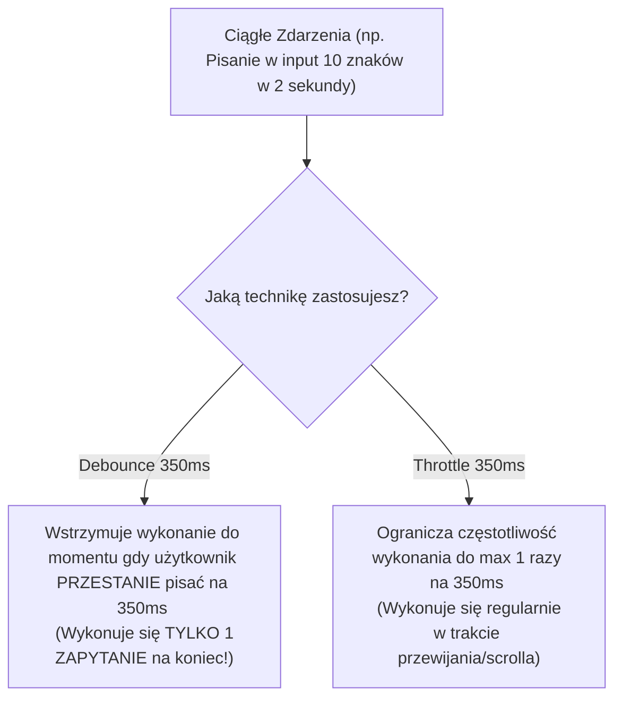

# Wydajność DOM, Debounce i Throttle (Cz. 2 - Optymalizacja Live Search z Debounce 350ms)

Witaj w drugiej części modułu poświęconego optymalizacji wydajnościowej aplikacji internetowych.

W poprzedniej lekcji poznałeś mechanizm Reflow oraz `DocumentFragment`. Dzisiaj jako Twój mentor omówię z Tobą dwie najważniejsze techniki ograniczania częstotliwości wykonywania funkcji: **Debounce** oraz **Throttle**.

Zbudujemy **Mini-projekt 8: Wyszukiwarkę Live Search z opóźnieniem 350ms**.

---

## 🎓 Krok 1: Debounce vs Throttle (Różnice Architektoniczne)

Podczas pisania na klawiaturze w polu wyszukiwarki lub przesuwania suwaka myszą przeglądarka potrafi wygenerować **60 zdarzeń na sekundę**.

Jeśli każde to zdarzenie wyśle zapytanie do serwera API, baza danych ulegnie zatkaniu.



### Kiedy stosować którą technikę?
- **Debounce:** Pole wyszukiwania Live Search, autozapis formularza po przestaniu pisania, zmiana rozmiaru okna (`resize`).
- **Throttle:** Obsługa przewijania strony (`scroll`), śledzenie pozycji kursora myszy (`mousemove`), nieskończona lista (*Infinite Scroll*).

---

## 🛠️ Warsztat z Mentorem: Implementacja Funkcji `debounce()` od Zera

Zanim skorzystamy z gotowych bibliotek, napiszmy uniwersalny helper `debounce` w czystym JavaScript, aby zrozumieć, jak działa pod spodem domknięcie (*Closure*) oraz `setTimeout`:

```javascript
/**
 * Uniwersalna funkcja Debounce
 * @param {Function} fn - Funkcja docelowa do wywołania
 * @param {number} delay - Opóźnienie w milisekundach (np. 350ms)
 * @return {Function}
 */
export function debounce(fn, delay = 350) {
  let timerId = null;

  return function (...args) {
    // Jeśli stoper już odlicza, kasujemy go i zaczynamy odliczanie od nowa!
    if (timerId !== null) {
      clearTimeout(timerId);
    }

    // Ustawiamy nowy stoper
    timerId = setTimeout(() => {
      fn.apply(this, args);
      timerId = null;
    }, delay);
  };
}
```

### 🔍 Rozbicie składni linia po linii (Od Mentora):

- **`let timerId = null;`** — Zmienna w domknięciu (Closure) pamiętająca identyfikator aktywnego stopera.
- **`clearTimeout(timerId);`** — Gdy użytkownik naciśnie kolejny klawisz przed upływem 350ms, stary stoper zostaje skasowany, a odliczanie rusza od zera.
- **`fn.apply(this, args);`** — Wywołuje docelową funkcję z zachowaniem kontekstu `this` oraz przekazanych argumentów (np. zdarzenia `event`).

---

## 🎯 🛠️ Mini-projekt 8: Wyszukiwarka Live Search (`LiveSearch.jsx` / `app.js`)

Połączmy naszą funkcję `debounce` z dynamicznym pobieraniem danych:

```javascript
import { debounce } from './debounce.js';

const searchInput = document.querySelector('#search-input');
const resultsContainer = document.querySelector('#search-results');

// 1. Funkcja wykonująca rzeczywiste zapytanie do API
async function performSearch(query) {
  if (query.trim().length < 3) {
    resultsContainer.innerHTML = '';
    return;
  }

  resultsContainer.innerHTML = '<p className="loading">Szukanie produktów...</p>';

  try {
    const response = await fetch(`https://dummyjson.com/products/search?q=${encodeURIComponent(query)}`);
    const data = await response.json();

    if (data.products.length === 0) {
      resultsContainer.innerHTML = '<p>Brak wyników dla podanej frazy.</p>';
      return;
    }

    resultsContainer.innerHTML = data.products.map(p => `
      <div className="search-item">
        <strong>${p.title}</strong> — ${p.price} USD
      </div>
    `).join('');

  } catch (err) {
    resultsContainer.innerHTML = '<p className="error">Błąd pobierania danych.</p>';
  }
}

// 2. Opakowujemy funkcję w debounce z opóźnieniem 350ms
const debouncedSearch = debounce((event) => {
  performSearch(event.target.value);
}, 350);

// 3. Podpinamy opóźniony nasłuchiwacz zdarzeń
searchInput.addEventListener('input', debouncedSearch);
```

---

## 🛠️ Interaktywne Wyzwanie Programistyczne w Edytorze Monaco

Skonfiguruj wskaźnik stanu ładowania oraz karty wyników wyszukiwarki Live Search w wyzwaniu poniżej:

<data-gate>
  <data-web-challenge id="js-debounce-live-search-challenge">
    <template data-type="html">
<div class="search-results">
  <div class="search-item">
    <strong>Monitor Dell 27"</strong> — 299 USD
  </div>
</div>
    </template>
    
    <template data-type="css-readonly">
.search-results {
  padding: 1rem;
  border-radius: 8px;
}
    </template>
    
    <template data-type="css">
/* Skonfiguruj tło .search-results oraz obramowanie .search-item */
.search-results {
  background-color: #f8fafc;
}
.search-item {
  padding: 0.75rem;
  border-bottom: 1px solid #e2e8f0;
}
    </template>
    
    <template data-type="requirements">
      [
        {"id": "results-bg", "text": "Ustaw kolor tła .search-results na #f8fafc", "type": "selector-css", "selector": ".search-results", "property": "background-color", "value": "#f8fafc"},
        {"id": "item-border", "text": "Ustaw dolne obramowanie .search-item na 1px solid #e2e8f0", "type": "selector-css", "selector": ".search-item", "property": "border-bottom", "value": "1px solid #e2e8f0"}
      ]
    </template>
  </data-web-challenge>
</data-gate>

---

### <span class="header-koala"><span>🦾</span><span>Executive Summary</span><span>🦾</span></span> Co masz wynieść z tej lekcji:

- **`debounce()`** wstrzymuje wykonanie funkcji do momentu, gdy użytkownik **przestanie pisać na N milisekund** (np. 350ms).
- **`throttle()`** ogranicza częstotliwość wykonania do **maksymalnie 1 raz na N milisekund** (dla zdarzeń scroll).
- Stosuj Debounce w wyszukiwarkach Live Search dla drastycznej redukcji obciążenia bazy danych.
