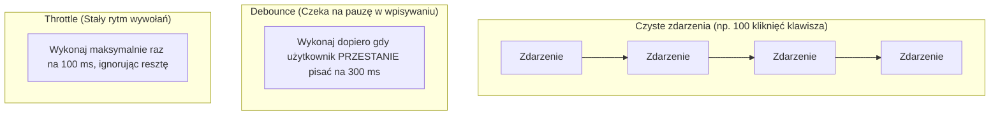

# Wydajność DOM, Debounce i Throttle

Podpinanie ciężkich operacji (np. zapytań HTTP do API) pod zdarzenia emitujące setki wywołań na sekundę — takie jak wpisywanie tekstu (`input`) czy przewijanie strony (`scroll`) — doprowadzi do natychmiastowej awarii wydajnościowej.

W tej lekcji nauczysz się unikać **Layout Thrashingu** oraz stosować techniki **Debounce** (czekanie na ciszę) i **Throttle** (cykliczny limit).

Zbudujemy **Mini-projekt 8: Wyszukiwarka produktów Live Search z opóźnieniem wpisywania**.

---

## 🧠 Model mentalny: Debounce vs Throttle

Różnicę w działaniu tych dwóch technik najłatwiej zobrazować na schemacie:



- **Debounce:** Używamy przy polach tekstowych (np. wyszukiwarka Autocomplete). Zapytanie HTTP wyśle się dopiero po zakończeniu pisania.
- **Throttle:** Używamy przy ciągłym przewijaniu strony (`scroll`) lub zmianie rozmiaru okna (`resize`).

---

## ⚙️ Krok 1: Pisanie uniwersalnej funkcji `debounce()` (`utils.js`)

Stwórz folder `C:\xampp\htdocs\live-search\` i plik `utils.js`:

```javascript
/**
 * Tworzy skondensowaną funkcję typu Debounce
 * @param {Function} fn Funkcja do odłożenia w czasie
 * @param {number} delayMs Czas oczekiwania w milisekundach
 */
export function debounce(fn, delayMs = 300) {
  let timerId = null;

  return function (...args) {
    // 1. Kasujemy poprzedni stoper jeśli użytkownik wciąż pisze
    if (timerId !== null) {
      clearTimeout(timerId);
    }

    // 2. Ustawiamy nowy stoper
    timerId = setTimeout(() => {
      fn.apply(this, args);
      timerId = null;
    }, delayMs);
  };
}
```

### 🔍 Wyjaśnienie składni od zera:

- **`let timerId = null;`** — Zmienna przechowująca identyfikator aktywnego stopera `setTimeout`.
- **`clearTimeout(timerId)`** — Kasuje stary stoper. Jeśli użytkownik naciśnie kolejną literę po 100 ms, stary stoper zostaje skasowany i odliczanie 300 ms zaczyna się od nowa!

---

## 🎯 🛠️ Mini-projekt 8: Wyszukiwarka Live Search (`app.js`)

Stwórzmy plik `app.js` obsługujący bezstresowe wyszukiwanie:

```javascript
import { debounce } from './utils.js';

const searchInput = document.querySelector('#search-input');
const resultsContainer = document.querySelector('#results-list');
const statusText = document.querySelector('#status-text');

// Symulowana baza produktów
const products = [
  'Laptop Dell XPS 15', 'Laptop Apple MacBook Pro', 'Myszka Bezprzewodowa Logitech',
  'Klawiatura Mechaniczna Keychron', 'Monitor Dell 27 cali', 'Słuchawki Sony WH-1000XM5'
];

/**
 * Funkcja wykonująca ciężkie wyszukiwanie
 */
function performSearch(query) {
  const cleanQuery = query.trim().toLowerCase();
  
  if (cleanQuery.length === 0) {
    if (resultsContainer) resultsContainer.innerHTML = '';
    if (statusText) statusText.textContent = '';
    return;
  }

  if (statusText) statusText.textContent = `Szukam produktów dla: "${cleanQuery}"...`;

  const matched = products.filter(p => p.toLowerCase().includes(cleanQuery));

  // Używamy DocumentFragment dla wydajnej aktualizacji DOM
  const fragment = document.createDocumentFragment();

  matched.forEach(item => {
    const li = document.createElement('li');
    li.textContent = item;
    fragment.appendChild(li);
  });

  if (resultsContainer) {
    resultsContainer.innerHTML = '';
    resultsContainer.appendChild(fragment);
  }

  if (statusText) {
    statusText.textContent = `Znaleziono produktów: ${matched.length}`;
  }
}

// Opakowujemy naszą funkcję w Debounce 350ms
const debouncedSearch = debounce((event) => {
  performSearch(event.target.value);
}, 350);

// Podpinamy pod zdarzenie input
searchInput?.addEventListener('input', debouncedSearch);
```

### 🔍 Wyjaśnienie wydajnego `DocumentFragment`:

- **`document.createDocumentFragment()`** — Wirtualny kontener w pamięci RAM. Doklejanie 1000 elementów do fragmentu i wstawienie go do DOM **wykonuje tylko jeden Reflow**, zamiast 1000 osobnych przeliczeń układu!

---

## 🛠️ Diagnostyka i rozwiązywanie problemów

<data-gate>
  <data-quiz>
    <question>
      Dlaczego doklejanie 100 elementów w pętli bezpośrednio do container.appendChild(el) jest wolniejsze od użycia DocumentFragment?
    </question>
    <options>
      <item>Funkcja appendChild nie działa w pętlach for.</item>
      <item correct>Każde bezpośrednie wstawienie elementu do widocznego drzewa DOM powoduje natychmiastowe przeliczenie układu strony (Reflow i Repaint). DocumentFragment grupuję wszystkie elementy w pamięci i wykonuje tylko jedno przeliczenie.</item>
      <item>DocumentFragment automatycznie szyfruje kod HTML.</item>
    </options>
    <div data-hint="error">
      Zastanów się: ile razy przeglądarka musi przeliczyć pozycję pikseli na ekranie przy 100 wywołaniach `appendChild()` na żywym DOM? 100 razy!
    </div>
    <div data-hint="success">
      Wspaniale! `DocumentFragment` to kluczowa technika optymalizacji wydajności przy masowych modyfikacjach drzewa DOM.
    </div>
  </data-quiz>
</data-gate>

---

### <span class="header-koala"><span>🦾</span><span>Executive Summary</span><span>🦾</span></span> Co masz wynieść z tej lekcji:

- **Debounce** odkłada wykonanie funkcji do momentu, aż użytkownik zatrzyma pisanie na określony czas.
- **Throttle** gwarantuje stały limit częstotliwości wykonania funkcji (np. przy `scroll`).
- Używaj **`document.createDocumentFragment()`** do hurtowego wstawiania elementów do DOM bez zacinania strony.
