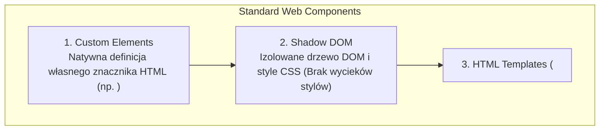
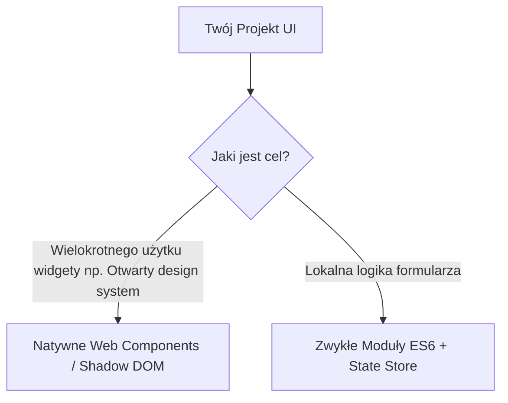

# Architektura Komponentowa bez Frameworków

Tworzenie czystego, niezawodnego kodu w JavaScript nie wymaga instalowania gigantycznych frameworków takich jak React, Vue czy Angular. Natywne przeglądarki dostarczają potężnego standardu **Web Components** (w tym **Custom Elements** oraz **Shadow DOM**).

W tej lekcji dowiesz się, jak tworzyć **_autonomiczne, wielokrotnego użytku komponenty UI_** przy użyciu czystych standardów sieciowych.

---

## 🧠 Model mentalny: Anatomia Web Komponentu

Web Komponent składa się z trzech natywnych technologii:



Dzięki temu komponent posiada **_własny cykl życia, własny odizolowany styl CSS_** i może być wstawiany do dowolnej strony tak jak natywny tag `<video>` czy `<select>`.

---

## ⚙️ Decyzja 1: Definiowanie Custom Element i Cykl Życia

Tworzymy klasę rozszerzającą natywny `HTMLElement` i rejestrujemy ją w przeglądarce:

```javascript
/**
 * Natywny komponent karty użytkownika
 */
export class UserCardComponent extends HTMLElement {
  constructor() {
    super();
    // Tworzymy odizolowane drzewo Shadow DOM w trybie otwartym
    this.attachShadow({ mode: 'open' });
  }

  // 1. Cykl życia: Komponent został wstawiony do drzewa DOM
  connectedCallback() {
    this.render();
  }

  // 2. Cykl życia: Deklarujemy, które atrybuty obserwujemy
  static get observedAttributes() {
    return ['name', 'avatar', 'role'];
  }

  // 3. Cykl życia: Wywoływane automatycznie przy zmianie obserwowanego atrybutu
  attributeChangedCallback(name, oldValue, newValue) {
    if (oldValue !== newValue) {
      this.render();
    }
  }

  // 4. Cykl życia: Komponent został usunięty z drzewa DOM
  disconnectedCallback() {
    // Sprzątanie nasłuchiwaczy...
  }

  render() {
    if (!this.shadowRoot) return;

    const name = this.getAttribute('name') || 'Anonim';
    const role = this.getAttribute('role') || 'Użytkownik';
    const avatar = this.getAttribute('avatar') || '/default-avatar.png';

    // Style CSS zdefiniowane tutaj NIE WYCIEKAJĄ poza ten komponent!
    this.shadowRoot.innerHTML = `
      <style>
        :host {
          display: block;
          font-family: system-ui, sans-serif;
        }
        .card {
          display: flex;
          align-items: center;
          gap: 1rem;
          padding: 1rem;
          border: 1px solid #e2e8f0;
          border-radius: 8px;
          background: #ffffff;
        }
        img { width: 48px; height: 48px; border-radius: 50%; }
        h4 { margin: 0; color: #0f172a; }
        p { margin: 0; font-size: 0.875rem; color: #64748b; }
      </style>

      <div class="card">
        
        <div>
          <h4>${name}</h4>
          <p>${role}</p>
        </div>
      </div>
    `;
  }
}

// Rejestrujemy znacznik (Nazwa MUSI zawierać myślnik!)
customElements.define('user-card', UserCardComponent);
```

---

## ⚙️ Decyzja 2: Użycie Komponentu w pliku HTML

Po zarejestrowaniu w JavaScript, nasz komponent staje się pełnoprawnym znacznikiem HTML:

```html
<!-- Użycie naszego natywnego Web Komponentu w dowolnym HTML -->
<user-card 
  name="Katarzyna Nowak" 
  role="Architekt PHP" 
  avatar="https://i.pravatar.cc/150?img=5">
</user-card>

<script type="module">
  // Zmiana atrybutu automatycznie wywoła attributeChangedCallback i przerenderuje komponent!
  const card = document.querySelector('user-card');
  setTimeout(() => {
    card.setAttribute('role', 'Lead Software Engineer');
  }, 2000);
</script>
```

---

## ⚙️ Decyzja 3: Gdzie używać Web Components, a gdzie czystego JS?



- **Web Components** są idealne do tworzenia **Design Systemów** (przycisków, modali, powiadomień, kart), które mają działać w dowolnym środowisku bez zależności od wersji frameworka.
- **Zwykłe Moduły ES6** wystarczą do organizacji logiki biznesowej i zarządzania stanem.

---

## 🎯 Ćwiczenie weryfikacyjne: Nazewnictwo Custom Elements

Pamiętaj o złotej zasadzie Custom Elements: **Nazwa znacznika musi zawierać co najmniej jeden myślnik (`-`)**.

- ❌ `customElements.define('button', MyButton)` — ZABRONIONE (konflikt z natywnym HTML).
- ❌ `customElements.define('card', MyCard)` — ZABRONIONE (brak myślnika).
- ✅ `customElements.define('app-card', MyCard)` — POPRAWNE.

---

## 🛠️ Diagnostyka i rozwiązywanie problemów

<data-gate>
  <data-quiz>
    <question>
      Dlaczego definicja nowego Custom Element musi zawierać myślnik w nazwie (np. <ui-button> zamiast <uibutton>)?
    </question>
    <options>
      <item>Myślnik wymusza szybsze ładowanie stylów w przeglądarce.</item>
      <item correct>Gwarantuje to rozróżnienie natywnych znaczników HTML dostarczanych przez konsorcjum W3C od niestandardowych elementów tworzonych przez programistów, chroniąc przed konfliktami nazw w przyszłości.</item>
      <item>Jest to wyraz szacunku dla twórców języka JavaScript.</item>
    </options>
    <div data-hint="error">
      Zastanów się: co by się stało, gdybyś nazwał swój komponent `<dialog>`, a za rok W3C wprowadziło natywny znacznik `<dialog>` do specyfikacji HTML?
    </div>
    <div data-hint="success">
      Wyczerpująca odpowiedź! Przestrzeń nazw z myślnikiem jest zarezerwowana dla programistów. W3C gwarantuje, że żaden natywny znacznik HTML nigdy nie będzie zawierał myślnika w nazwie.
    </div>
  </data-quiz>
</data-gate>

---

### <span class="header-koala"><span>🦾</span><span>🐨</span><span>🦾</span></span> Co masz wynieść z tej lekcji:

- **Web Components** tworzą izolowane, wielokrotnego użytku elementy UI bez zewnętrznych zależności.
- **Shadow DOM** izoluje CSS — style ze środka nie wyciekają na zewnątrz i vice versa.
- Nazwa Custom Element **musi zawierać myślnik** (np. `<app-user-card>`).
