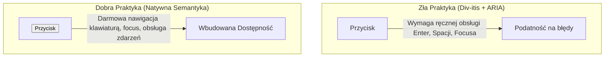

# Dostępność UI (A11y, ARIA) i Nawigacja Klawiaturą

Dostępność cyfrowa (**A11y** — *Accessibility*) to miara tego, jak łatwo z aplikacji mogą korzystać osoby z niepełnosprawnościami wzrokowymi, ruchowymi czy poznawczymi. Tworzenie niedostępnych interfejsów to wykluczanie użytkowników oraz łamanie wymogów prawnych (European Accessibility Act / EAA).

Projektowanie zorientowane na dostępność gwarantuje, że cała aplikacja jest w pełni obsługiwana za pomocą **klawiatury** oraz czytników ekranowych (*Screen Readers*).

---

## 🧠 Model mentalny: Semantyka natywna vs Atrybuty ARIA

Pierwsza zasada ułatwień dostępu (First Rule of ARIA) brzmi: **Jeśli możesz użyć natywnego elementu HTML o odpowiedniej semantyce, nie używaj atrybutów ARIA.**



Natywny element `<button>` ma wbudowaną obsługę klawiatury (`<kbd>Enter</kbd>`, `<kbd>Spacja</kbd>`), zarządzanie fokusem oraz właściwe ogłoszenie w czytnikach ekranu.

---

## ⚙️ Decyzja 1: Pułapka Fokusa w oknach dialogowych (Focus Trap)

Gdy otwierasz modalne okno dialogowe (Modal/Dialog), użytkownik poruszający się klawiaturą (klawiszem `<kbd>Tab</kbd>`) **_nie może wyjść fokusem poza to okno_**. Gdy fokus dotrze do ostatniego przycisku w modalu, naciśnięcie `<kbd>Tab</kbd>` musi przenieść go z powrotem do pierwszego elementu w tym oknie.

```javascript
/**
 * Przechwytuje fokus wewnątrz wskazanego kontenera (Focus Trap)
 * @param {HTMLElement} modalElement
 * @return {() => void} Funkcja przywracająca stary fokus
 */
export function trapFocus(modalElement) {
  const previousActiveElement = document.activeElement;
  
  const focusableSelector = 'button, [href], input, select, textarea, [tabindex]:not([tabindex="-1"])';
  const focusables = Array.from(modalElement.querySelectorAll(focusableSelector));

  if (focusables.length === 0) return () => {};

  const firstElement = focusables[0];
  const lastElement = focusables[focusables.length - 1];

  // Ustawiamy fokus na pierwszym elemencie modalu
  firstElement.focus();

  function handleKeyDown(event) {
    if (event.key === 'Escape') {
      // Zamknięcie klawiszem ESC
      modalElement.dispatchEvent(new CustomEvent('modal:close'));
      return;
    }

    if (event.key !== 'Tab') return;

    if (event.shiftKey) { // Shift + Tab (Cofanie)
      if (document.activeElement === firstElement) {
        event.preventDefault();
        lastElement.focus();
      }
    } else { // Tab (Do przodu)
      if (document.activeElement === lastElement) {
        event.preventDefault();
        firstElement.focus();
      }
    }
  }

  modalElement.addEventListener('keydown', handleKeyDown);

  // Zwracamy funkcję sprzątającą przy zamykaniu modalu
  return () => {
    modalElement.removeEventListener('keydown', handleKeyDown);
    if (previousActiveElement instanceof HTMLElement) {
      previousActiveElement.focus(); // Przywracamy stary fokus!
    }
  };
}
```

---

## ⚙️ Decyzja 2: Atrybuty `aria-expanded`, `aria-hidden` i Live Regions

W dynamicznych interfejsach JavaScript musi informować czytnik ekranu o zmianach w strefach niewidocznych.

### 1. Rozwijane menu (Accordion / Dropdown)
Używaj `aria-expanded="true|false"` na przycisku otwierającym:

```javascript
export function setupAccordion(buttonElement, contentElement) {
  buttonElement.addEventListener('click', () => {
    const isExpanded = buttonElement.getAttribute('aria-expanded') === 'true';
    buttonElement.setAttribute('aria-expanded', String(!isExpanded));
    contentElement.hidden = isExpanded;
  });
}
```

### 2. Dynamiczne powiadomienia (Live Regions)
Strefy `aria-live="polite"` lub `aria-live="assertive"` powodują, że czytnik ekranu automatycznie przeczyta nowy tekst dodany wewnątrz tego elementu przez JavaScript.

```html
<!-- Czytnik przeczyta tekst z tego diva zaraz po jego wstawieniu przez JS -->
<div id="status-message" aria-live="polite" class="sr-only"></div>
```

---

## ⚙️ Decyzja 3: Widoczny wskaźnik Fokusu (Focus Ring)

Nigdy nie usuwaj stylu `outline: none` bez podania zamiennika w CSS! Osoba nawigująca klawiatura bez widocznego wskaźnika fokusu jest całkowicie ślepa w interfejsie.

Używaj nowoczesnej pseudoklasy `:focus-visible`:

```css
/* Wskaźnik pojawia się tylko przy nawigacji klawiaturą, nie przy kliknięciu myszą */
button:focus-visible {
  outline: 3px solid #2563eb;
  outline-offset: 2px;
}
```

---

## 🎯 Ćwiczenie weryfikacyjne: Komponent powiadomień ukryty dla wzroku (Screen-Reader Only)

Klasa CSS `.sr-only` pozwala na dodanie tekstu dostępnego wyłącznie dla czytników ekranu (np. opis ikony koszyka bez tekstu):

```css
.sr-only {
  position: absolute;
  width: 1px;
  height: 1px;
  padding: 0;
  margin: -1px;
  overflow: hidden;
  clip: rect(0, 0, 0, 0);
  white-space: nowrap;
  border: 0;
}
```

```html
<button type="button">
  <svg aria-hidden="true"><!-- Ikona koszyka --></svg>
  <span class="sr-only">Twój koszyk, zawiera 3 przedmioty</span>
</button>
```

---

## 🛠️ Diagnostyka i rozwiązywanie problemów

<data-gate>
  <data-quiz>
    <question>
      Dlaczego użycie zamiennika <div onclick="..."> z dodanym atrybutem tabindex="0" jest gorsze od natywnego <button>?
    </question>
    <options>
      <item>Węzeł div pobiera więcej pamięci RAM niż button.</item>
      <item correct>Natywny element <button> domyślnie obsługuje kliknięcie przyciskiem Spacji oraz Entera, wywołując zdarzenie click. Dla elementu <div> musisz ręcznie napisać własny listener zdarzenia keydown dla tych klawiszy.</item>
      <item>Elementy div są niedostępne w przeglądarkach mobilnych.</item>
    </options>
    <div data-hint="error">
      Zastanów się: co się stanie, gdy użytkownik nawigujący klawiaturą zatrzyma się na `<div tabindex="0">` i naciśnie klawisz Spacji? Zdarzenie `onclick` nie wywoła się bez dodatkowego kodu!
    </div>
    <div data-hint="success">
      Wyczerpująca odpowiedź! Natywne elementy HTML niosą ze sobą darmową, dopracowaną zachowawczość i semantykę. Używaj `button`, `a`, `input` zamiast reaktywowania divów.
    </div>
  </data-quiz>
</data-gate>

---

### <span class="header-koala"><span>🦾</span><span>🐨</span><span>🦾</span></span> Co masz wynieść z tej lekcji:

- **Pierwsza zasada ARIA:** Zawsze stawiaj natywne elementy HTML (`<button>`, `<a href>`) ponad ulepszanie divów.
- **Focus Trap** jest obowiązkowym elementem każdego modalnego okna dialogowego.
- **Nigdy nie usuwaj `:focus-visible`** — wskaźnik fokusu jest kluczowy dla użytkowników klawiatury.
