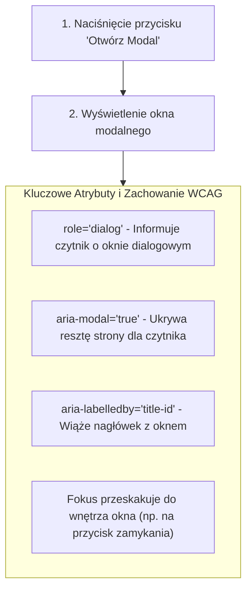

# Modalne Okna Dialogowe i WCAG (Cz. 1 - Dostępna Struktura Modal Dialog i Portale)

Witaj w pierwszej części trzeciego modułu kursu nowoczesnego JavaScriptu.

Jako Twój mentor przeprowadzę Cię przez najtrudniejszy komponent z punktu widzenia dostępności cyfrowej (**WCAG 2.1**): **Modalne Okno Dialogowe (Modal Dialog)**. Nauczysz się projektować bezbłędną strukturę semantyczną z atrybutami ARIA oraz radzić sobie z problemem kontekstu nakładania (Z-Index Stacking Context).

---

## 🎓 Krok 1: Wymagania Dostępności dla Okien Dialogowych (WCAG 2.1)

Aby okno modalne było uznane za dostępne cyfrowo dla osób korzystających z czytników ekranu (Screen Readers) oraz nawigacji klawiaturą, musi spełniać surowe wymogi:



---

## 🎓 Krok 2: Problem Kontekstu Nakładania (Z-Index Stacking Context)

Jeśli osadzisz okno modalne głęboko wewnątrz struktury HTML (np. wewnątrz karty o właściwości `overflow: hidden` lub własnym `z-index`), okno modalne może zostać przycięte przez krawędzie kontenera-rodzica!

### Rozwiązanie: Osadzanie na poziomie korzenia (`document.body`):
W czystym JS oraz React (Portals) okna modalne zawsze wstawiamy **na samym dole kontenera `document.body`**, tuż przed zamykającym znacznikiem `</body>`.

---

## 🛠️ Warsztat z Mentorem: Konstrukcja Dostępnego HTML + CSS Modalu

Stwórzmy strukturę widoku modalu:

```html
<!-- Tło zasłaniające (Backdrop) + Kontener Dialogowy -->
<div id="modal-overlay" class="modal-overlay" hidden>
    <div 
        id="confirm-dialog"
        class="modal-box"
        role="dialog" 
        aria-modal="true" 
        aria-labelledby="modal-title"
        aria-describedby="modal-desc"
    >
        <div class="modal-header">
            <h2 id="modal-title">Potwierdzenie Usuwania</h2>
            <button type="button" class="btn-close" id="close-modal-btn" aria-label="Zamknij okno">
                &times;
            </button>
        </div>

        <div class="modal-body">
            <p id="modal-desc">Czy na pewno chcesz usunąć ten element? Operacji nie można cofnąć.</p>
        </div>

        <div class="modal-footer">
            <button type="button" id="cancel-btn" class="btn-secondary">Anuluj</button>
            <button type="button" id="confirm-btn" class="btn-danger">Usuń Rekord</button>
        </div>
    </div>
</div>
```

### 🔍 Rozbicie atrybutów ARIA linia po linii (Od Mentora):

- **`role="dialog"`** — Główna rola informująca technologię wspomagającą, że element jest oknem dialogowym oddzielonym od reszty dokumentu.
- **`aria-modal="true"`** — Wyłącza interakcję z resztą strony pod spodem dla czytników ekranu.
- **`aria-labelledby="modal-title"`** — Odwołuje się do ID nagłówka `<h2>`. Kiedy czytnik wejdzie do modalu, od razu przeczyta jego tytuł!
- **`aria-describedby="modal-desc"`** — Odwołuje się do opisu modalu, przeczytując szczegółową treść pytania.

---

## 🛠️ Interaktywne Wyzwanie Programistyczne w Edytorze Monaco

Napisz reguły CSS dla tła nakładki `.modal-overlay` oraz pudełka `.modal-box` w wyzwaniu poniżej:

<data-gate>
  <data-web-challenge id="js-modal-wcag-structure-challenge">
    <template data-type="html">
<div class="modal-overlay">
  <div class="modal-box" role="dialog" aria-modal="true">
    <h2 id="modal-title">Potwierdzenie Akcji</h2>
    <button type="button" class="btn-danger">Potwierdzam</button>
  </div>
</div>
    </template>
    
    <template data-type="css-readonly">
.modal-overlay {
  position: fixed;
  top: 0;
  left: 0;
  width: 100%;
  height: 100%;
}
    </template>
    
    <template data-type="css">
/* Skonfiguruj półprzezroczyste tło .modal-overlay oraz styl .modal-box */
.modal-overlay {
  background-color: rgba(15, 23, 42, 0.75);
}
.modal-box {
  background-color: #ffffff;
  border-radius: 12px;
  padding: 1.5rem;
}
    </template>
    
    <template data-type="requirements">
      [
        {"id": "overlay-bg", "text": "Ustaw kolor tła .modal-overlay na rgba(15, 23, 42, 0.75)", "type": "selector-css", "selector": ".modal-overlay", "property": "background-color", "value": "rgba(15, 23, 42, 0.75)"},
        {"id": "box-radius", "text": "Ustaw zaokrąglenie rogów .modal-box na 12px", "type": "selector-css", "selector": ".modal-box", "property": "border-radius", "value": "12px"}
      ]
    </template>
  </data-web-challenge>
</data-gate>

---

### <span class="header-koala"><span>🦾</span><span>Executive Summary</span><span>🦾</span></span> Co masz wynieść z tej lekcji:

- Kontener modalu musi posiadać atrybuty **`role="dialog"`** oraz **`aria-modal="true"`**.
- Łącz tytuł z oknem dialogowym za pomocą atrybutu **`aria-labelledby="title-id"`**.
- Osadzaj okna modalne na poziomie korzenia **`document.body`** dla uniknięcia błędów nakładania `z-index`.
