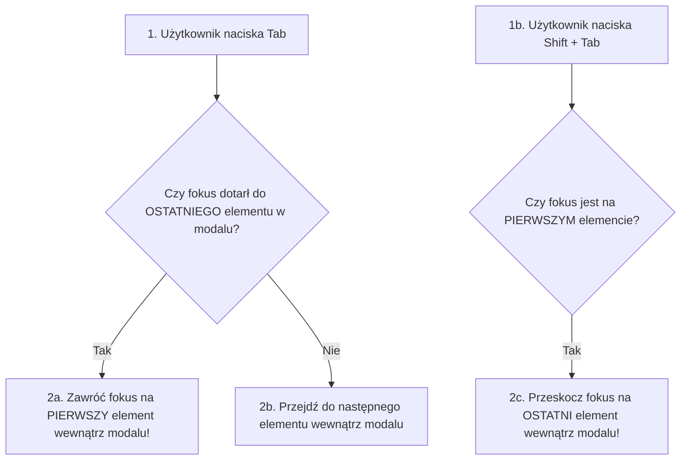

# Modalne Okna Dialogowe i WCAG (Cz. 2 - Pułapka Fokusa Focus Trap i Obsługa Klawisza Esc)

Witaj w drugiej części modułu poświęconego dostępnym oknom dialogowym w JavaScript (WCAG 2.1).

W poprzedniej lekcji poznałeś atrybuty ARIA oraz strukturę semantyczną. Dzisiaj jako Twój mentor omówię z Tobą serce nawigacji klawiaturą w modalach: **Pułapkę Fokusa (Focus Trap)**, zapamiętywanie elementu wyzwalającego oraz obsługę klawisza **`<kbd>Esc</kbd>`**.

---

## 🎓 Krok 1: Dlaczego stosujemy Pułapkę Fokusa (Focus Trap)?

Gdy użytkownik klawiatury otwiera okno modalne, naciśnięcie klawisza `<kbd>Tab</kbd>` **nie może pozwolić fokusowi na ucieczkę poza okno dialogowe** na zasłoniętą część strony!



### Trzy Obowiązkowe Zasady Nawigacji Modalu (WCAG):
1. **Focus Recovery (Zapamiętanie Fokusa):** Przed otwarciem modalu zapamiętujemy element, w który kliknął użytkownik (`document.activeElement`). Po zamknięciu modalu przywracamy w niego fokus.
2. **Focus Trap (Pułapka Fokusa):** Przejście klawiszem `<kbd>Tab</kbd>` pętli się wyłącznie wewnątrz elementów klikalnych okna.
3. **Klawisz `<kbd>Esc</kbd>`:** Naciśnięcie klawisza `Escape` natychmiast zamyka modal.

---

## 🛠️ Warsztat z Mentorem: Implementacja Pułapki Fokusa (`FocusTrap.js`)

Zbudujmy uniwersalną klasę `FocusTrap`:

```javascript
export class FocusTrap {
  constructor(modalElement) {
    this.modal = modalElement;
    this.previousActiveElement = null;
    this.focusableElements = [];
    this.firstFocusable = null;
    this.lastFocusable = null;

    this.handleKeyDown = this.handleKeyDown.bind(this);
  }

  activate() {
    // 1. Zapamiętujemy element, który wywołał modal
    this.previousActiveElement = document.activeElement;

    // 2. Pobieramy wszystkie aktywne elementy interaktywne wewnątrz modalu
    const selector = 'a[href], button:not([disabled]), textarea:not([disabled]), input:not([disabled]), select:not([disabled]), [tabindex]:not([tabindex="-1"])';
    this.focusableElements = Array.from(this.modal.querySelectorAll(selector));

    if (this.focusableElements.length > 0) {
      this.firstFocusable = this.focusableElements[0];
      this.lastFocusable = this.focusableElements[this.focusableElements.length - 1];

      // 3. Przenosimy fokus na pierwszy element w modalu (np. przycisk zamknij)
      this.firstFocusable.focus();
    }

    // 4. Podpinamy nasłuchiwacz klawiatury
    document.addEventListener('keydown', this.handleKeyDown);
  }

  deactivate() {
    document.removeEventListener('keydown', this.handleKeyDown);

    // 5. Przywracamy fokus na element wyzwalający sprzed otwarcia!
    if (this.previousActiveElement && typeof this.previousActiveElement.focus === 'function') {
      this.previousActiveElement.focus();
    }
  }

  handleKeyDown(event) {
    // Obsługa zamykania klawiszem Escape
    if (event.key === 'Escape' || event.key === 'Esc') {
      event.preventDefault();
      this.modal.dispatchEvent(new CustomEvent('modal:close'));
      return;
    }

    // Obsługa zapętlania klawisza Tab
    if (event.key === 'Tab') {
      if (event.shiftKey) {
        // Shift + Tab (Cofanie)
        if (document.activeElement === this.firstFocusable) {
          event.preventDefault();
          this.lastFocusable.focus();
        }
      } else {
        // Tab (Zwykły)
        if (document.activeElement === this.lastFocusable) {
          event.preventDefault();
          this.firstFocusable.focus();
        }
      }
    }
  }
}
```

### 🔍 Rozbicie składni linia po linii (Od Mentora):

- **`document.activeElement`** — Pamięta dokładnie ten element w przeglądarce, który obecnie posiada fokus klawiatury.
- **`event.shiftKey`** — Wykrywa, czy użytkownik trzyma jednocześnie klawisz `Shift` przy naciśnięciu `Tab` (nawigacja wstecz).
- **`event.preventDefault()`** — Dusi domyślne przeskoczenie fokusa poza okno modalne i pozwala ręcznie przeskoczyć na `firstFocusable` lub `lastFocusable`.

---

## 🛠️ Interaktywne Połączenie Wymogów Klawiaturowych (Connection Matcher)

Sprawdź swoje opanowanie wzorców A11y dla okien modalnych — połącz klawisz/metodę z jej funkcją:

<data-connection-matcher title="Połącz klawisze i metody nawigacji z wymogami dostępności WCAG 2.1">
    <div class="cmw-item" data-left="Shift + Tab" data-right="Cofanie fokusa z przeskokiem z pierwszego elementu modalu na sam koniec"></div>
    <div class="cmw-item" data-left="Klawisz Escape" data-right="Natychmiastowe zamykanie aktywnego okna modalnego i przywracanie fokusa"></div>
    <div class="cmw-item" data-left="document.activeElement" data-right="Zapamiętanie elementu wyzwalającego w celu przywrócenia fokusa po zamknięciu modalu"></div>
    <div class="cmw-item" data-left="Focus Trap (Pułapka Fokusa)" data-right="Zabezpieczenie przed ucieczką fokusa klawiatury na zablokowaną treść pod spodem"></div>
</data-connection-matcher>

---

### <span class="header-koala"><span>🦾</span><span>Executive Summary</span><span>🦾</span></span> Co masz wynieść z tej lekcji:

- **Focus Trap** zapętla nawigację `<kbd>Tab</kbd>` wewnątrz okna dialogowego.
- Zawsze zapamiętuj **`document.activeElement`** przed otwarciem i przywracaj fokus po zamknięciu modalu.
- Zamykaj modal po naciśnięciu klawisza **`Escape`**.
