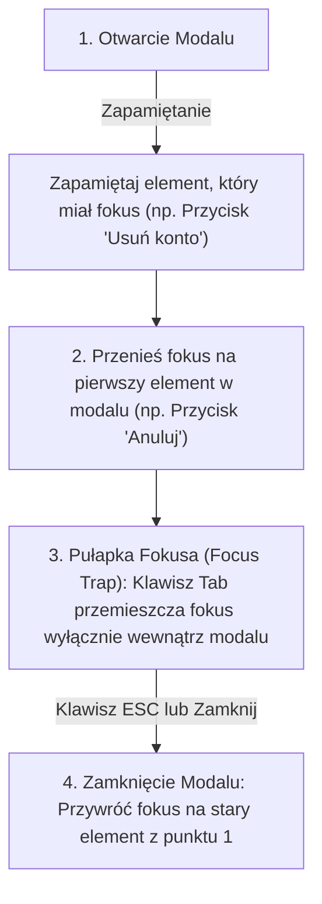

# Modalne Okno Dialogowe zgodne z WCAG

Modalne okno dialogowe (Modal / Dialog) to jeden z najpopularniejszych, ale zarazem najtrudniejszych do poprawnego zaimplementowania elementów interfejsu.

Jeśli modal nie jest prawidłowo zabezpieczony pod kątem dostępności cyfrowej (**WCAG 2.1**), osoba nawigująca klawiaturą może opuścić okno i wejść fokusem w tło strony pod modalem, stając się całkowicie "zaślepioną" w aplikacji.

W tej lekcji stworzymy **Mini-projekt 10: Dostępne Okno Modalne Potwierdzenia Akcji z Pułapką Fokusa (Focus Trap)**.

---

## 🧠 Model mentalny: Zasady działania Pułapki Fokusa (Focus Trap)

Kiedy otwierasz modalne okno dialogowe, interfejs musi spełnić 4 twarde wymogi WCAG:



---

## ⚙️ Krok 1: Struktura Dostępnego HTML (`index.html`)

Stwórz folder `C:\xampp\htdocs\modal-wcag\` i plik `index.html`:

```html
<!DOCTYPE html>
<html lang="pl">
<head>
    <meta charset="UTF-8">
    <title>Dostępne Okno Modalne WCAG</title>
    <style>
        body { font-family: system-ui, sans-serif; max-width: 600px; margin: 2rem auto; padding: 1rem; }
        .backdrop { position: fixed; inset: 0; background: rgba(0,0,0,0.5); display: flex; align-items: center; justify-content: center; z-index: 100; }
        .backdrop[hidden] { display: none; }
        .modal-box { background: white; padding: 2rem; border-radius: 8px; max-width: 400px; width: 100%; box-shadow: 0 10px 15px -3px rgba(0,0,0,0.1); }
        .actions { display: flex; justify-content: flex-end; gap: 0.5rem; margin-top: 1.5rem; }
        button { padding: 0.5rem 1rem; border: none; border-radius: 4px; cursor: pointer; }
        .btn-danger { background: #dc2626; color: white; }
        .btn-secondary { background: #e2e8f0; }
        button:focus-visible { outline: 3px solid #2563eb; outline-offset: 2px; }
    </style>
</head>
<body>
    <h1>Zarządzanie Kontem</h1>
    <p>Kliknij poniższy przycisk, aby bezpiecznie usunąć konto:</p>

    <!-- Przycisk Otwierający Modal -->
    <button id="open-modal-btn" type="button" class="btn-danger">Usuń Konto</button>

    <!-- Dostępne Okno Modalne WCAG -->
    <div id="modal-backdrop" class="backdrop" hidden>
        <div id="modal-dialog" 
             class="modal-box" 
             role="dialog" 
             aria-modal="true" 
             aria-labelledby="modal-title" 
             aria-describedby="modal-desc">
            
            <h2 id="modal-title">Potwierdzenie Usunięcia</h2>
            <p id="modal-desc">Czy na pewno chcesz bezpowrotnie usunąć swoje konto? Operacji nie można cofnąć.</p>

            <div class="actions">
                <button id="cancel-btn" type="button" class="btn-secondary">Anuluj</button>
                <button id="confirm-btn" type="button" class="btn-danger">Potwierdzam, usuń</button>
            </div>
        </div>
    </div>

    <script type="module" src="app.js"></script>
</body>
</html>
```

### 🔍 Wyjaśnienie atrybutów WCAG / ARIA:

- **`role="dialog"`** — Informuje czytniki ekranowe, że ten element jest oknem dialogowym.
- **`aria-modal="true"`** — Wyjaśnia, że treść pod modalem jest w tym momencie niedostępna dla interakcji.
- **`aria-labelledby="modal-title"`** — Przymocowuje nagłówek z tytułem modalu jako jego automatyczny opis mówiony.

---

## ⚙️ Krok 2: Logika Pułapki Fokusa i Obsługi Klawiatury (`app.js`)

Utwórzmy plik `app.js`:

```javascript
const openBtn = document.querySelector('#open-modal-btn');
const backdrop = document.querySelector('#modal-backdrop');
const modalDialog = document.querySelector('#modal-dialog');
const cancelBtn = document.querySelector('#cancel-btn');
const confirmBtn = document.querySelector('#confirm-btn');

// Zmienna przechowująca zapamiętany element przed otwarciem modalu
let lastActiveElement = null;

/**
 * Uruchamia pułapkę fokusa (Focus Trap)
 */
function setupFocusTrap(container) {
  const focusables = Array.from(
    container.querySelectorAll('button, [href], input, select, textarea, [tabindex]:not([tabindex="-1"])')
  );

  if (focusables.length === 0) return () => {};

  const firstElement = focusables[0];
  const lastElement = focusables[focusables.length - 1];

  // 1. Przenosimy fokus na pierwszy interaktywny przycisk w modalu
  firstElement.focus();

  const handleKeyDown = (event) => {
    // Zamknięcie klawiszem ESC
    if (event.key === 'Escape') {
      closeModal();
      return;
    }

    if (event.key !== 'Tab') return;

    // Shift + Tab (Cofanie fokusu)
    if (event.shiftKey) {
      if (document.activeElement === firstElement) {
        event.preventDefault();
        lastElement.focus(); // Przeskakujemy na koniec
      }
    } else {
      // Tab (Fokus do przodu)
      if (document.activeElement === lastElement) {
        event.preventDefault();
        firstElement.focus(); // Przeskakujemy na początek
      }
    }
  };

  container.addEventListener('keydown', handleKeyDown);

  // Funkcja sprzątająca listener przy zamykaniu
  return () => {
    container.removeEventListener('keydown', handleKeyDown);
  };
}

let cleanupFocusTrap = null;

function openModal() {
  // 1. Zapamiętujemy element, który miał fokus przed otwarciem
  lastActiveElement = document.activeElement;

  // 2. Pokazujemy modal
  if (backdrop) backdrop.hidden = false;

  // 3. Aktywujemy pułapkę fokusa
  if (modalDialog) {
    cleanupFocusTrap = setupFocusTrap(modalDialog);
  }
}

function closeModal() {
  if (backdrop) backdrop.hidden = true;

  if (cleanupFocusTrap) {
    cleanupFocusTrap();
    cleanupFocusTrap = null;
  }

  // 4. PRZYWRACAMY FOKUS na przycisk, który otworzył modal!
  if (lastActiveElement instanceof HTMLElement) {
    lastActiveElement.focus();
  }
}

// Rejestrujemy zdarzenia
openBtn?.addEventListener('click', openModal);
cancelBtn?.addEventListener('click', closeModal);
confirmBtn?.addEventListener('click', () => {
  alert('Konto zostało usunięte.');
  closeModal();
});

// Zamknięcie po kliknięciu w szare tło (Backdrop)
backdrop?.addEventListener('click', (event) => {
  if (event.target === backdrop) closeModal();
});
```

---

## 🎯 🛠️ Mini-projekt 10: Testowanie Nawigacji z Klawiatury

1. Otwórz plik w przeglądarce (`http://localhost/modal-wcag/`).
2. Naciśnij `<kbd>Tab</kbd>` i uderz klawisz `<kbd>Enter</kbd>` na przycisku „Usuń Konto”.
3. Modal otworzy się, a fokus automatycznie przeskoczy na przycisk „Anuluj”.
4. Naciskaj klawisz `<kbd>Tab</kbd>` bez końca. Zauważ, że **fokus nie wyjdzie poza modal** (krąży między „Anuluj” a „Potwierdzam”).
5. Naciśnij klawisz `<kbd>Esc</kbd>`. Modal zamknie się, a fokus **powróci z powrotem na przycisk „Usuń Konto”**!

---

## 🛠️ Diagnostyka i rozwiązywanie problemów

<data-gate>
  <data-quiz>
    <question>
      Dlaczego bezwzględnie należy przywracać fokus na pierwotny element (lastActiveElement.focus()) po zamknięciu modalnego okna?
    </question>
    <options>
      <item>Zapobiega to przeładowaniu całej strony po zamknięciu modalu.</item>
      <item correct>Użytkownik nawigujący klawiaturą lub czytnikiem ekranu po usunięciu okna z widoku zgubiłby swoją pozycję na stronie i musiałby zaczynać tabowanie od samego nagłówka serwisu.</item>
      <item>Funkcja window.close() działa tylko po przywróceniu fokusu.</item>
    </options>
    <div data-hint="error">
      Zastanów się: co się dzieje z fokusem klawiatury, gdy element w którym przebywał nagle znika ze strony (`hidden = true`)? Fokus przeskakuje na body!
    </div>
    <div data-hint="success">
      Znakomicie! Przywrócenie fokusu na element wyzwalający to kluczowy punkt dostępności cyfrowej wg wytycznych WCAG.
    </div>
  </data-quiz>
</data-gate>

---

### <span class="header-koala"><span>🦾</span><span>Executive Summary</span><span>🦾</span></span> Co masz wynieść z tej lekcji:

- Okna modalne wymagają atrybutów **`role="dialog"`** i **`aria-modal="true"`**.
- **Focus Trap** utrzymuje fokus klawiatury wyłącznie wewnątrz otwartego modalu.
- Zawsze **zapamiętuj i przywracaj fokus** (`lastActiveElement.focus()`) po zamknięciu okna.
