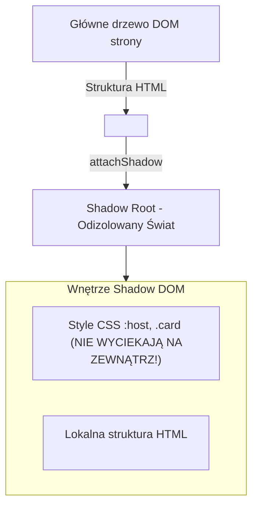

# Natywne Web Components bez frameworków

Tworzenie wielokrotnego użytku widgetów interfejsu (takich jak przyciski, karty produktów czy powiadomienia) nie wymaga instalowania ciężkich frameworków.

Przeglądarki internetowe dostarczają natywnego standardu **Web Components**, na który składają się **Custom Elements** oraz **Shadow DOM**.

W tej lekcji stworzymy **Mini-projekt 11: Autonomiczny Widget Karty Produktu `<product-card>`**.

---

## 🧠 Model mentalny: Izolacja w Shadow DOM

Zwykłe style CSS na stronie potrafią wyciekać do wewnątrz komponentów i psuć ich wygląd. **Shadow DOM** tworzy niewidzialną, odizolowaną przestrzeń (drzewo cienia):



---

## ⚙️ Krok 1: Pisanie Klasy Custom Element (`ProductCard.js`)

Stwórz folder `C:\xampp\htdocs\web-components-demo\` i plik `ProductCard.js`:

```javascript
/**
 * Natywny komponent karty produktu
 */
export class ProductCard extends HTMLElement {
  constructor() {
    super();
    // 1. Tworzymy odizolowany Shadow DOM
    this.attachShadow({ mode: 'open' });
  }

  // 2. Cykl życia: Komponent został wstawiony do drzewa DOM
  connectedCallback() {
    this.render();
  }

  // 3. Obserwowane atrybuty HTML
  static get observedAttributes() {
    return ['name', 'price', 'image'];
  }

  // 4. Reakcja na zmianę atrybutu w HTML
  attributeChangedCallback(name, oldValue, newValue) {
    if (oldValue !== newValue) {
      this.render();
    }
  }

  render() {
    if (!this.shadowRoot) return;

    const name = this.getAttribute('name') || 'Produkt bez nazwy';
    const price = this.getAttribute('price') || '0.00';
    const image = this.getAttribute('image') || 'https://via.placeholder.com/150';

    // Style wewnątrz Shadow DOM NIE WYCIEKAJĄ na zewnątrz!
    this.shadowRoot.innerHTML = `
      <style>
        :host {
          display: block;
          font-family: system-ui, sans-serif;
        }
        .card {
          border: 1px solid #e2e8f0;
          border-radius: 8px;
          padding: 1rem;
          background: #ffffff;
          box-shadow: 0 2px 4px rgba(0,0,0,0.05);
          max-width: 250px;
        }
        img { width: 100%; height: auto; border-radius: 4px; }
        h3 { margin: 0.5rem 0; font-size: 1.1rem; color: #0f172a; }
        .price { font-weight: bold; color: #16a34a; font-size: 1.2rem; }
        button {
          width: 100%;
          background: #2563eb;
          color: white;
          border: none;
          padding: 0.5rem;
          border-radius: 4px;
          cursor: pointer;
          margin-top: 0.5rem;
        }
      </style>

      <div class="card">
        
        <h3>${name}</h3>
        <p class="price">${price} PLN</p>
        <button type="button">Dodaj do Koszyka</button>
      </div>
    `;

    // Podpinamy zdarzenie kliknięcia wewnątrz komponentu
    this.shadowRoot.querySelector('button')?.addEventListener('click', () => {
      this.dispatchEvent(new CustomEvent('cart:add', {
        bubbles: true,
        composed: true, // Pozwala zdarzeniu wydostać się z Shadow DOM!
        detail: { name, price }
      }));
    });
  }
}

// 5. Rejestrujemy znacznik w przeglądarce (Nazwa MUSI zawierać myślnik!)
customElements.define('product-card', ProductCard);
```

### 🔍 Wyjaśnienie składni Web Components od zera:

- **`class ProductCard extends HTMLElement`** — Rozszerzamy natywną klasę elementu HTML.
- **`this.attachShadow({ mode: 'open' })`** — Inicjalizuje drzewo cienia Shadow DOM.
- **`customElements.define('product-card', ProductCard)`** — Rejestruje nasz własny znacznik HTML. Nazwa **bezwzględnie musi posiadać myślnik `-`** (np. `product-card`), aby chronić przed konfliktem z natywnym HTML.
- **`composed: true`** — Pozwala autorskiemu zdarzeniu `CustomEvent` przekroczyć barierę Shadow DOM i dotrzeć do głównego drzewa strony.

---

## 🎯 🛠️ Mini-projekt 11: Użycie Własnego Tagu w HTML (`index.html`)

Utwórzmy plik `index.html`:

```html
<!DOCTYPE html>
<html lang="pl">
<head>
    <meta charset="UTF-8">
    <title>Web Components Demo</title>
    <style>body { font-family: system-ui, sans-serif; margin: 2rem; }</style>
</head>
<body>
    <h1>Sklep internetowy (Natywne Web Components)</h1>

    <!-- Używamy naszego własnego znacznika tak jak natywnego HTML! -->
    <div style="display: flex; gap: 1rem;">
        <product-card 
            name="Laptop Gamingowy" 
            price="4500.00" 
            image="https://picsum.photos/200/150?random=1">
        </product-card>

        <product-card 
            name="Klawiatura Mechaniczna" 
            price="350.00" 
            image="https://picsum.photos/200/150?random=2">
        </product-card>
    </div>

    <script type="module">
        import './ProductCard.js';

        // Nasłuchujemy zdarzenia wyemitowanego z wnętrza Web Komponentu!
        document.addEventListener('cart:add', (event) => {
            alert(`Dodano do koszyka: ${event.detail.name} za ${event.detail.price} PLN`);
        });
    </script>
</body>
</html>
```

---

## 🛠️ Diagnostyka i rozwiązywanie problemów

<data-gate>
  <data-quiz>
    <question>
      Dlaczego nowo definiowany Custom Element w JavaScript MUSI posiadać myślnik w swojej nazwie (np. <product-card> zamiast <productcard>)?
    </question>
    <options>
      <item>Myślnik pozwala przeglądarce na kompresję pliku JS.</item>
      <item correct>Gwarantuje to rozróżnienie natywnych znaczników HTML dostarczanych przez W3C od autorskich elementów tworzonych przez programistów, chroniąc przed konfliktami nazw w przyszłości.</item>
      <item>Shadow DOM działa tylko na elementach z myślnikiem.</item>
    </options>
    <div data-hint="error">
      Zastanów się: co by się stało, gdybyś nazwał swój komponent `<dialog>`, a za rok W3C wprowadziło natywny znacznik `<dialog>` do specyfikacji HTML?
    </div>
    <div data-hint="success">
      Wspaniale! Przestrzeń nazw z myślnikiem jest zarezerwowana dla programistów. W3C gwarantuje, że żaden natywny znacznik HTML nigdy nie będzie zawierał myślnika w nazwie.
    </div>
  </data-quiz>
</data-gate>

---

### <span class="header-koala"><span>🦾</span><span>Executive Summary</span><span>🦾</span></span> Co masz wynieść z tej lekcji:

- **Web Components** tworzą izolowane, wielokrotnego użytku widgety UI bez zewnętrznych zależności.
- **Shadow DOM** izoluje CSS — style ze środka nie wyciekają na zewnątrz i vice versa.
- Nazwa Custom Element **musi zawierać myślnik** (np. `<product-card>`).
