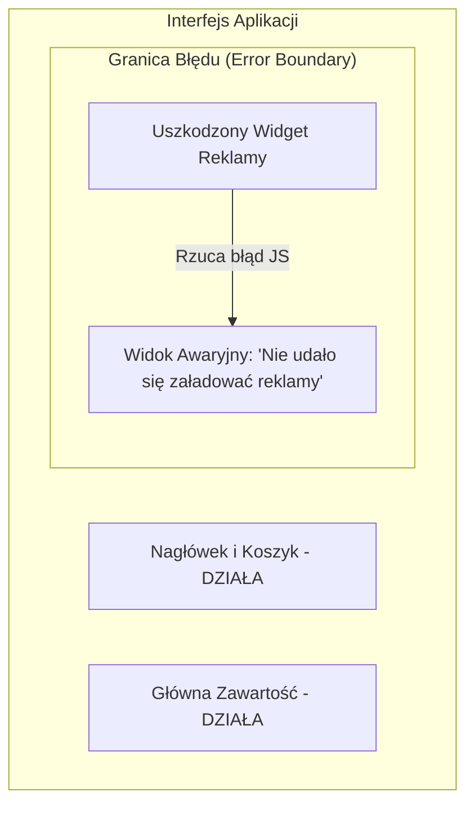

# Obsługa Błędów w UI (Graceful Degradation i Error Boundaries)

W rozbudowanej aplikacji webowej awaria jednego niszowego modułu (np. błąd w kodzie baneru reklamowego czy skrypcie opinii) nie może powodować „białego ekranu śmierci” (*White Screen of Death*) i uniemożliwiać użytkownikowi dokończenia zakupów.

Strategie **Graceful Degradation** (Łagodne obniżenie funkcjonalności) oraz **Error Boundaries** (Granice Błędów) pozwalają izolować awarie, chroniąc główny przepływ aplikacji.

---

## 🧠 Model mentalny: Izolacja Awarii (Bulkheading)

Termin *Bulkheading* wywodzi się z budownictwa okrętowego — statek podzielony jest szczelnymi przegrodami. Wyciek w jednej komorze nie zatapia całej jednostki.



Wyłapujemy błąd wewnątrz lokalnej granicy i zastępujemy uszkodzony komponent eleganckim widokiem zastępczym (*Fallback UI*).

---

## ⚙️ Decyzja 1: Tworzenie komponentu Error Boundary w czystym JS

Możemy stworzyć uniwersalną osłonę błędów, przechwytującą błędy wykonania podczas renderowania komponentów podrzędnych:

```javascript
/**
 * Uniwersalny wrapper Error Boundary dla komponentów UI
 */
export class UIErrorBoundary {
  /**
   * @param {HTMLElement} containerElement
   * @param {Function} componentRenderFn
   * @param {Function} fallbackRenderFn
   */
  constructor(containerElement, componentRenderFn, fallbackRenderFn) {
    this.container = containerElement;
    this.componentRender = componentRenderFn;
    this.fallbackRender = fallbackRenderFn;
  }

  render(props) {
    try {
      this.container.innerHTML = '';
      const content = this.componentRender(props);
      this.container.appendChild(content);
    } catch (error) {
      console.error('[UI Error Boundary Przechwycono Błąd]:', error);
      
      // Renderujemy bezpieczny widok zastępczy (Fallback)
      this.container.innerHTML = '';
      const fallbackContent = this.fallbackRender(error, () => this.render(props));
      this.container.appendChild(fallbackContent);
    }
  }
}
```

---

## ⚙️ Decyzja 2: Globalne przechwytywanie błędów (`window.onerror` i `unhandledrejection`)

Nie wszystkie błędy występują w trakcie synchronicznego renderowania. Błędy w procedurach asynchronicznych (np. nieobsłużone odrzucenie `Promise`) należy łapać na poziomie globalnym:

```javascript
// 1. Przechwytywanie nieobsłużonych obietnic (Unhandled Promise Rejections)
window.addEventListener('unhandledrejection', (event) => {
  console.error('Nieobsłużony błąd asynchroniczny:', event.reason);
  
  showGlobalToast('Wystąpił problem z połączeniem. Spróbuj ponownie.');
  event.preventDefault(); // Zapobiega wypisaniu błędu w domyślnej konsoli
});

// 2. Globalny uchwyt błędów wykonania skryptów
window.addEventListener('error', (event) => {
  // Ignorujemy błędy ze skryptów z zewnętrznych domen (CORS)
  if (event.filename && !event.filename.includes(window.location.origin)) {
    return;
  }
  
  console.error(`Błąd w ${event.filename}:${event.lineno}:`, event.message);
});
```

---

## ⚙️ Decyzja 3: Graceful Degradation (Łagodne Wyłączanie Opcji)

Gdy zaawansowana funkcja (np. API Geolokalizacji czy natywne powiadomienia Push) jest niedostępna lub zablokowana przez użytkownika, aplikacja powinna **_ukryć ten przycisk lub zaoferować alternatywę_**, zamiast rzucać wyjątkiem.

```javascript
export function initLocationFeature() {
  const locationBtn = document.getElementById('location-btn');
  if (!locationBtn) return;

  // Sprawdzamy wsparcie funkcji w przeglądarce (Feature Detection)
  if (!('geolocation' in navigator)) {
    locationBtn.hidden = true; // Łagodne ukrycie braku wsparcia
    return;
  }

  locationBtn.addEventListener('click', () => {
    navigator.geolocation.getCurrentPosition(
      (pos) => updateMap(pos.coords),
      (err) => showFallbackLocationInput(err) // Alternatywa: ręczny wpis miasta
    );
  });
}
```

---

## 🎯 Ćwiczenie weryfikacyjne: Przycisk "Ponów próbę" w widoku zastępczym

Stwórzmy bezpieczny widok zastępczy, który daje użytkownikowi możliwość naprawienia sytuacji:

```javascript
function renderErrorFallback(error, retryFn) {
  const box = document.createElement('div');
  box.className = 'error-fallback-box';
  box.innerHTML = `
    <h3>Coś poszło nie tak...</h3>
    <p class="error-text">${error.message}</p>
    <button type="button" class="retry-btn">Spróbuj ponowić</button>
  `;

  box.querySelector('.retry-btn').addEventListener('click', () => {
    retryFn(); // Wywołuje ponowną próbę renderowania komponentu
  });

  return box;
}
```

---

## 🛠️ Diagnostyka i rozwiązywanie problemów

<data-gate>
  <data-quiz>
    <question>
      Dlaczego użycie globalnego bloku "try/catch" wokół całego kodu w pliku index.js NIE przechwyci błędów wewnątrz funkcji "setTimeout(() => { throw new Error(); }, 1000)"?
    </question>
    <options>
      <item>Funkcja setTimeout automatycznie naprawia błędy w tle.</item>
      <item correct>Kod wewnątrz setTimeout wykonuje się asynchronicznie z nowej ramki Pętli Zdarzeń, gdy główny blok try/catch już dawno zakończył swoje wykonanie i zszedł ze Stosu Wywołań.</item>
      <item>Funkcja throw działa tylko dla obiektów Promise.</item>
    </options>
    <div data-hint="error">
      Zastanów się: kiedy kończy się wykonanie synchronicznego bloku `try/catch` w pliku głównym? A kiedy po sekundzie odpala się kod z `setTimeout`?
    </div>
    <div data-hint="success">
      Wyśmienita odpowiedź! Błędy asynchroniczne z callbacków lub obietnic muszą być wyłapywane wewnątrz samego callbacka lub przez zdarzenie `unhandledrejection`.
    </div>
  </data-quiz>
</data-gate>

---

### <span class="header-koala"><span>🦾</span><span>🐨</span><span>🦾</span></span> Co masz wynieść z tej lekcji:

- **Error Boundaries** izolują awarie uszkodzonych komponentów, zapobiegając zamrożeniu całej strony.
- Usługę **`unhandledrejection`** stosuj do rejestrowania porzuconych obietnic (`Promise`).
- **Feature Detection (`'feature' in window`)** pozwala na łagodne ukrywanie niedostępnych funkcji (Graceful Degradation).
