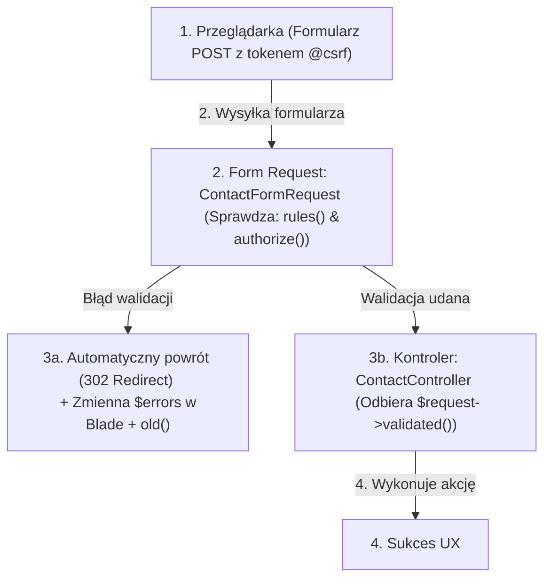

# Kontrolery i Obsługa Formularzy (Cz. 1 - Form Requests, Walidacja i Ochrona CSRF)

Witaj w pierwszej części modułu poświęconego bezpiecznej i czystej obsłudze formularzy w Laravel 11. 

Jako Twój mentor poprowadzę Cię przez architekturę **Form Requests**, automatyczną walidację oraz krytyczny mechanizm ochrony przed atakami **CSRF (Cross-Site Request Forgery)**.

---

## 🎓 Krok 1: Dlaczego wydzielamy walidację do Form Requests?

W tradycyjnym skrypcie PHP kod walidacyjny pisało się wewnątrz pliku odbierającego formularz. Prowadziło to do powstawania gigantycznych, trudnych do testowania kontrolerów.

W Laravel 11 stosujemy wzorzec **Form Request** — dedykowaną klasę żyjącą w `app/Http/Requests/`, której jedynym zadaniem jest sprawdzanie uprawnień oraz poprawności danych wejściowych przed wpuszczeniem ich do kontrolera:



---

## 🎓 Krok 2: Ochrona przed Atakiem CSRF (`@csrf`)

**CSRF (Cross-Site Request Forgery)** to atak, w którym złośliwy serwis nakłania przeglądarkę zalogowanego użytkownika do bezwiednego wysłania żądania POST do Twojej aplikacji.

Laravel domyślnie chroni całą aplikację przed tym zagrożeniem. Każdy formularz wysyłający dane metodami `POST`, `PUT`, `PATCH` lub `DELETE` **musi zawierać dyrektywę `@csrf`**:

```html
<form action="/kontakt" method="POST">
    <!-- Generuje ukryte pole <input type="hidden" name="_token" value="abc123xyz..."> -->
    @csrf

    <!-- Pola formularza -->
</form>
```

> [!CAUTION]
> Jeśli pominiesz dyrektywę `@csrf` w formularzu, Laravel odrzuci zapytanie z kodem błędu **`419 Page Expired`**!

---

## 🛠️ Warsztat z Mentorem: Tworzenie Klasy `ContactFormRequest`

Wygenerujmy klasę walidacji poleceniem Artisan:

```bash
php artisan make:request ContactFormRequest
```

Otwórz wygenerowany plik `app/Http/Requests/ContactFormRequest.php`:

```php
<?php

namespace App\Http\Requests;

use Illuminate\Foundation\Http\FormRequest;

final class ContactFormRequest extends FormRequest
{
    /**
     * Sprawdza, czy użytkownik ma uprawnienia do wysłania tego formularza
     */
    public function authorize(): bool
    {
        return true; // Każdy odwiedzający może wysłać formularz kontaktowy
    }

    /**
     * Reguły walidacji danych wejściowych
     */
    public function rules(): array
    {
        return [
            'name'    => ['required', 'string', 'min:3', 'max:50'],
            'email'   => ['required', 'email:rfc,dns'],
            'subject' => ['required', 'string', 'min:5', 'max:100'],
            'message' => ['required', 'string', 'min:10', 'max:2000'],
        ];
    }

    /**
     * Autorskie komunikaty błędów po polsku (UX)
     */
    public function messages(): array
    {
        return [
            'name.required'    => 'Wpisanie imienia i nazwiska jest obowiązkowe.',
            'name.min'         => 'Imię musi zawierać co najmniej 3 znaki.',
            'email.required'   => 'Proszę podać adres e-mail.',
            'email.email'      => 'Podany adres e-mail jest nieprawidłowy.',
            'message.required' => 'Wiadomość nie może być pusta.',
            'message.min'      => 'Wiadomość musi mieć co najmniej 10 znaków.',
        ];
    }
}
```

### 🔍 Rozbicie składni linia po linii (Od Mentora):

- **`authorize(): bool`** — Zwraca `true` lub `false`. Jeśli zwrócisz `false`, Laravel automatycznie odrzuci zapytanie z błędem `403 Forbidden`.
- **`'email' => ['required', 'email:rfc,dns']`** — Rygorystyczna walidacja e-mail sprawdzająca zarówno składnię RFC, jak i istnienie rekordu DNS domeny pocztowej!
- **`messages(): array`** — Przekształca surowe angielskie błędy w przyjazne dla użytkownika zdania w języku polskim.

---

## 🛠️ Warsztat z Mentorem: Użycie Form Request w Kontrolerze

Spójrz, jak niesamowicie czysty staje się Twój kontroler `app/Http/Controllers/ContactController.php`:

```php
<?php

namespace App\Http\Controllers;

use App\Http\Requests\ContactFormRequest;
use Illuminate\Http\RedirectResponse;
use Illuminate\View\View;

final class ContactController extends Controller
{
    public function show(): View
    {
        return view('contact');
    }

    /**
     * Dzięki wstrzyknięciu ContactFormRequest, kod wewnątrz tej metody 
     * wykona się TYLKO WTEDY, gdy dane przejdą walidację!
     */
    public function submit(ContactFormRequest $request): RedirectResponse
    {
        // 1. Pobieramy wyłącznie bezpieczne, przetestowane dane!
        $validated = $request->validated();

        // 2. Tutaj wykonujemy logikę (wysyłka e-maila / zapis w bazie)...

        // 3. Przekierowujemy z powrotem z komunikatem Flash w sesji
        return redirect()
            ->route('contact.show')
            ->with('success', 'Wiadomość została pomyślnie wysłana!');
    }
}
```

---

## 🛠️ Interaktywna Weryfikacja Umiejętności: Formularze Laravel

Sprawdź swoje zrozumienie mechaniki Form Requests i bezpieczeństwa CSRF — połącz element z jego rolą w architekturze:

<data-connection-matcher title="Połącz mechanizmy formularzy w Laravel z ich rolą w architekturze">
    <div class="cmw-item" data-left="@csrf" data-right="Generuje token zabezpieczający formularz przed atakiem Cross-Site Request Forgery (CSRF)"></div>
    <div class="cmw-item" data-left="FormRequest (rules())" data-right="Dedykowana klasa zawierająca reguły walidacji danych wejściowych poza kontrolerem"></div>
    <div class="cmw-item" data-left="$request->validated()" data-right="Zwraca wyłącznie wyczyszczone i zweryfikowane pola z przesłanego formularza"></div>
    <div class="cmw-item" data-left="419 Page Expired" data-right="Kod błędu zwracany przez Laravel przy braku lub wygaśnięciu tokena CSRF"></div>
</data-connection-matcher>

---

### <span class="header-koala"><span>🦾</span><span>Executive Summary</span><span>🦾</span></span> Co masz wynieść z tej lekcji:

- Każdy formularz POST/PUT w Laravel **musi zawierać dyrektywę `@csrf`**.
- Walidację wydzielaj do klas **Form Request (`php artisan make:request`)**.
- W kontrolerze używaj **`$request->validated()`** dla gwarancji pracy na bezpiecznych danych.
