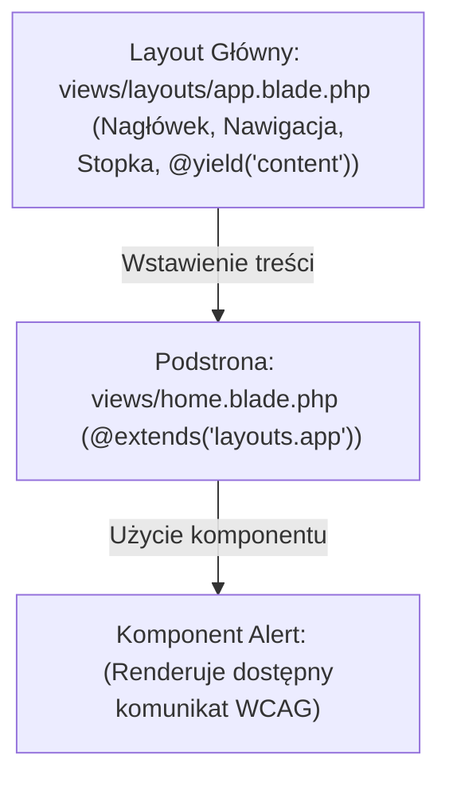

# Szablony Blade i Komponenty UI w Laravel

Podczas budowania stron internetowych w Laravel nie piszemy powtarzającego się kodu HTML na każdej podstronie. Laravel dostarcza niezwykle szybkiego i eleganckiego silnika szablonów **Blade**.

W tej lekcji dowiesz się, jak tworzyć główny układ strony (*Layout*), używać dyrektyw Blade oraz budować **wielokrotnego użytku Komponenty UI** zgodne ze standardami dostępności cyfrowej (**WCAG 2.1**).

Zbudujemy **Mini-projekt 2: Dostępny Układ Strony z Komponentami Blade**.

---

## 🧠 Model mentalny: Dziedziczenie Układów i Komponenty Blade

Silnik Blade pozwala na dzielenie widoku na układ główny oraz małe autonomiczne komponenty:



- **`@extends('layouts.app')`:** Mówi podstronie, jakiego układu głównego użyć.
- **`<x-alert>`:** Tworzy czysty, wielokrotnego użytku komponent HTML z własnymi propsami.

---

## ⚙️ Krok 1: Tworzenie Głównego Układu Strony (`views/layouts/app.blade.php`)

Stwórzmy w projekcie Laravel plik `resources/views/layouts/app.blade.php`:

```html
<!DOCTYPE html>
<html lang="pl">
<head>
    <meta charset="UTF-8">
    <meta name="viewport" content="width=device-width, initial-scale=1.0">
    <title>@yield('title', 'Moj Portal Laravel')</title>
    <style>
        body { font-family: system-ui, sans-serif; max-width: 800px; margin: 2rem auto; padding: 1rem; }
        header { border-bottom: 2px solid #e2e8f0; padding-bottom: 1rem; margin-bottom: 2rem; }
        footer { border-top: 1px solid #e2e8f0; margin-top: 3rem; padding-top: 1rem; color: #64748b; }
        .alert { padding: 1rem; border-radius: 6px; margin-bottom: 1rem; }
        .alert-success { background: #dcfce7; color: #166534; border: 1px solid #86efac; }
        .alert-error { background: #fee2e2; color: #991b1b; border: 1px solid #fca5a5; }
    </style>
</head>
<body>
    <header>
        <nav>
            <strong>Moj Portal Laravel</strong> | 
            <a href="/">Strona Główna</a> | 
            <a href="/uslugi">Usługi</a>
        </nav>
    </header>

    <main id="main-content">
        <!-- Tutaj zostanie wstawiona treść z poszczególnych podstron -->
        @yield('content')
    </main>

    <footer>
        <p>&copy; {{ date('Y') }} Moj Portal Laravel. Wszelkie prawa zastrzeżone.</p>
    </footer>
</body>
</html>
```

### 🔍 Wyjaśnienie dyrektyw Blade od zera:

- **`@yield('title', 'Domyślny Tytuł')`** — Miejsce w układzie głównym, w które podstrona wstrzyknie swój własny tytuł strony.
- **`@yield('content')`** — Miejsce, w które zostanie wklejona cała treść podstrony.
- **`{{ date('Y') }}`** — Podwójne nawiasy klamrowe `{{ ... }}` to w Blade odpowiednik bezpiecznego `echo htmlspecialchars(...)`. Automatycznie chronią przed atakami XSS!

---

## ⚙️ Krok 2: Tworzenie Komponentu Komunikatu UI (`<x-alert>`)

Stwórzmy dostępny komponent alertu przy użyciu Artisan:

```bash
php artisan make:component Alert
```

Artisan stworzy plik widoku w `resources/views/components/alert.blade.php`. Otwórz go i wklej kod:

```html
@props(['type' => 'info'])

@php
    $classes = match($type) {
        'success' => 'alert alert-success',
        'error' => 'alert alert-error',
        default => 'alert',
    };
    $role = $type === 'error' ? 'alert' : 'status';
@endphp

<div {{ $attributes->merge(['class' => $classes, 'role' => $role]) }}>
    {{ $slot }}
</div>
```

### 🔍 Wyjaśnienie komponentów Blade:

- **`@props(['type' => 'info'])`** — Deklaruje właściwości (props), które komponent akceptuje od rodzica (np. `<x-alert type="success">`).
- **`{{ $slot }}`** — Specjalna zmienna zawierająca całą treść przekazaną wewnątrz znacznika komponentu.
- **`{{ $attributes->merge(...) }}`** — Łączy automatyczne atrybuty HTML (np. dodatkowe klasy czy ID) przekazane z zewnątrz.

---

## 🎯 🛠️ Mini-projekt 2: Tworzenie Podstrony z Komponentami (`views/home.blade.php`)

Stwórzmy plik widoku podstrony `resources/views/home.blade.php`:

```html
@extends('layouts.app')

@section('title', 'Strona Główna - Portal Services')

@section('content')
    <h1>Witaj w Portalu Usług</h1>
    <p>Oto nowoczesny szablon zbudowany na silniku Blade w Laravel 11.</p>

    <!-- Użycie naszego natywnego Komponentu Blade z Dostępnością WCAG -->
    <x-alert type="success">
        <strong>Sukces!</strong> Twoje konto zostało pomyślnie aktywowane.
    </x-alert>

    <x-alert type="error">
        <strong>Uwaga:</strong> Niektóre funkcje są obecnie niedostępne w trybie konserwacji.
    </x-alert>

    <h3>Lista dostępnych kategorii:</h3>
    <ul>
        @foreach(['Informatyka', 'Finanse', 'Projektowanie UI/UX'] as $kat)
            <li>{{ $kat }}</li>
        @endforeach
    </ul>
@endsection
```

Podepnijmy ten widok w `routes/web.php`:

```php
Route::get('/home', function () {
    return view('home');
});
```

---

## 🛠️ Diagnostyka i rozwiązywanie problemów

<data-gate>
  <data-quiz>
    <question>
      Jaka jest różnica między wypisaniem tekstu {{ $zmienna }} a {!! $zmienna !!} w silniku Blade?
    </question>
    <options>
      <item>Wersja z wykrzyknikami działa tylko na serwerach z bazą danych MySQL.</item>
      <item correct>Składnia {{ $zmienna }} automatycznie oczyszcza tekst funkcją htmlspecialchars() (ochrona XSS), podczas gdy {!! $zmienna !!} wypisuje surowy kod HTML bez oczyszczania.</item>
      <item>Składnia podwójnych nawiasów klamrowych konwertuje tekst na język angielski.</item>
    </options>
    <div data-hint="error">
      Zastanów się: co się stanie, gdy wyświetlisz dane wpisane przez użytkownika za pomocą `{!! $userText !!}`? Wstrzyknięty JS wykona się na stronie!
    </div>
    <div data-hint="success">
      Wspaniale! Zawsze stosuj `{{ $zmienna }}` dla bezpiecznego wypisywania treści na stronie.
    </div>
  </data-quiz>
</data-gate>

---

### <span class="header-koala"><span>🦾</span><span>Executive Summary</span><span>🦾</span></span> Co masz wynieść z tej lekcji:

- Twórz układy główne za pomocą **`@extends('layouts.app')`** oraz **`@yield('content')`**.
- Podwójne nawiasy **`{{ $zmienna }}`** bezpiecznie oczyszczają tekst przed atakiem **XSS**.
- Buduj komponenty UI za pomocą komendy **`php artisan make:component`** i wywołuj je w HTML przez **`<x-alert>`**.
