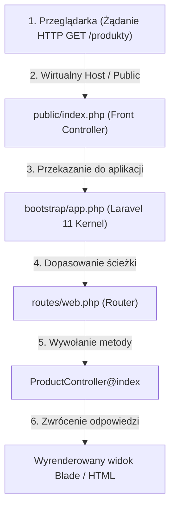

# Tworzenie projektu i pierwsze ścieżki (Cz. 1 - Instalacja, Artisan i Fundamenty Routingu)

Witaj w pierwszej części modułu wprowadzającego do **Laravel 11+** — najnowocześniejszego i najpopularniejszego frameworka PHP na świecie.

Jako Twój mentor przeprowadzę Cię przez architekturę **Routingu (Kierowania Żądań)**, instalację środowiska oraz interfejs wiersza poleceń **Artisan CLI**.

---

## 🎓 Krok 1: Jak Laravel przetwarza żądania HTTP?

Gdy użytkownik wpisuje w przeglądarce adres `https://sklep.pl/produkty`, żądanie przechodzi przez precyzyjną ścieżkę architektoniczną:



### Kluczowe pliki projektu Laravel 11:
- **`public/index.php`:** Jedyny publicznie dostępny plik w aplikacji (*Front Controller*). Wszystkie zapytania kierowane są do niego.
- **`routes/web.php`:** Miejsce definicji ścieżek dla interfejsu przeglądarkowego HTML.
- **`routes/api.php`:** Miejsce definicji bezstanowych ścieżek REST API zwracających dane w formacie JSON.
- **`app/`:** Sercowy folder aplikacji zawierający Kontrolery, Modele, Polityki i Usługi.

---

## 🎓 Krok 2: Definiowanie Ścieżek w `routes/web.php`

W Laravel ścieżki definiujemy przy użyciu fasady **`Route`**:

```php
use Illuminate\Support\Facades\Route;

// 1. Prosta ścieżka zwracająca ciąg tekstowy
Route::get('/welcome', function () {
    return 'Witaj w aplikacji Laravel 11!';
});

// 2. Ścieżka zwracająca szablon Blade (resources/views/about.blade.php)
Route::get('/o-nas', function () {
    return view('about');
});

// 3. Ścieżka przekazująca żądanie do kontrolera
Route::get('/produkty', [ProductController::class, 'index'])->name('products.index');
```

---

## 🛠️ Warsztat z Mentorem: Narzędzie Artisan CLI

**Artisan** to wbudowany interfejs wiersza poleceń w Laravel. Pozwala na automatyczne generowanie klas, migracji i kontrolerów.

Otwórz terminal w folderze swojego projektu i wypróbuj komendy:

```bash
# Wyświetlenie listy wszystkich dostępnych poleceń Artisan
php artisan

# Uruchomienie lokalnego serwera deweloperskiego pod adresem http://127.0.0.1:8000
php artisan serve

# Tworzenie nowego kontrolera w folderze app/Http/Controllers/
php artisan make:controller ProductController

# Wyświetlenie pełnej tabeli zarejestrowanych ścieżek w aplikacji
php artisan route:list
```

---

## 🛠️ Interaktywne Wyzwanie Pojęć Routingu (Connection Matcher)

Sprawdź swoje opanowanie fundamentów Laravel 11 — połącz polecenie lub plik z jego rolą w architekturze:

<data-connection-matcher title="Połącz polecenia Artisan i pliki Laravel z ich rolą w architekturze">
    <div class="cmw-item" data-left="php artisan serve" data-right="Uruchamia lokalny serwer deweloperski PHP pod adresem http://127.0.0.1:8000"></div>
    <div class="cmw-item" data-left="routes/web.php" data-right="Główny plik rejestracji ścieżek interfejsu przeglądarkowego HTML"></div>
    <div class="cmw-item" data-left="php artisan route:list" data-right="Wyświetla w terminalu czytelną tabelę wszystkich zarejestrowanych ścieżek HTTP"></div>
    <div class="cmw-item" data-left="public/index.php" data-right="Jedyny plik publiczny (Front Controller) przyjmujący wszystkie żądania przychodzące"></div>
</data-connection-matcher>

---

### <span class="header-koala"><span>🦾</span><span>Executive Summary</span><span>🦾</span></span> Co masz wynieść z tej lekcji:

- **`public/index.php`** działa jako Front Controller przyjmujący wszystkie żądania.
- Ścieżki rejestrujesz w pliku **`routes/web.php`** z użyciem fasady `Route::get()`.
- Używaj poleceń **`php artisan serve`** do pracy lokalnej oraz **`php artisan route:list`** do audytu ścieżek.
