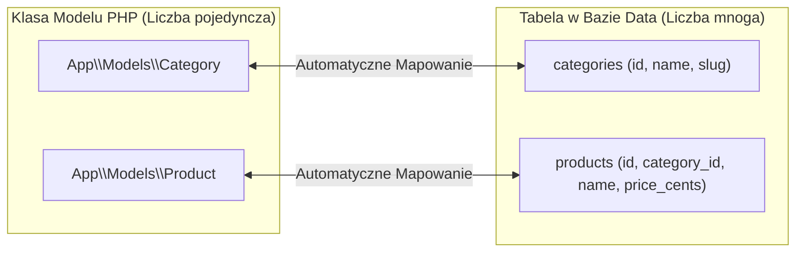
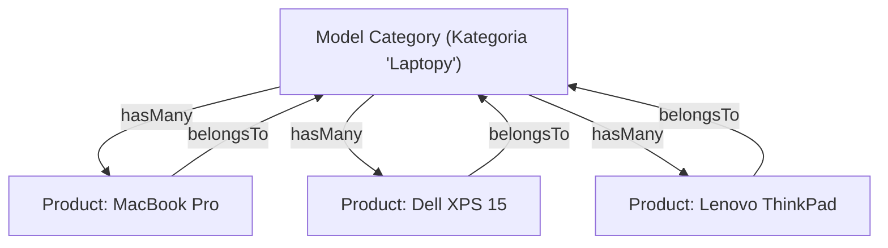

# Eloquent ORM — Modele i Relacje (Cz. 1 - Definiowanie Relacji 1-do-1 oraz 1-do-N)

Witaj w pierwszej części modułu poświęconego **Eloquent ORM** w Laravel 11. Jako Twój mentor przeprowadzę Cię krok po kroku przez proces projektowania relacji bazodanowych w kodzie PHP.

Zamiast pisać trudne w utrzymaniu zapytania SQL z ręcznym łączeniem tabel `JOIN`, nauczysz się odwzorowywać strukturę relacyjną w postaci zwięzłych obiektów PHP.

---

## 🎓 Krok 1: Jak Eloquent mapuje obiekty na tabele (Konwencje Nazewnictwa)

Eloquent opiera się na zasadzie **Konwencji ponad Konfiguracją (Convention over Configuration)**. Jeśli przestrzegasz domyślnych nazw w Laravel, framework wykonuje automatyczne mapowanie bez ani jednej zbędnej linii konfiguracji.



### Reguły konwencji Eloquent:
1. **Nazwa Modelu:** Pisana w liczbie pojedynczej wielką literą (**PascalCase**), np. `Product`, `Category`, `UserProfile`.
2. **Nazwa Tabeli:** Automatycznie zamieniana na liczbę mnogą małymi literami (**snake_case**), np. `products`, `categories`, `user_profiles`.
3. **Klucz Główny:** Domyślnie kolumna `id` typu BigInteger z autoincrement.
4. **Klucz Obcy (Foreign Key):** Nazwa powiązanego modelu w liczbie pojedynczej + prefiks `_id`, np. `category_id`, `user_id`.

---

## 🎓 Krok 2: Relacja 1-do-Wielu (`hasMany` oraz `belongsTo`)

Rozpatrzmy klasyczny scenariusz w sklepie internetowym:
- **Jedna Kategoria** (np. „Laptopy”) zawiera w sobie **wiele Produktów** („MacBook”, „Dell XPS”, „ThinkPad”).
- **Jeden Produkt** (np. „MacBook”) należy do **jednej konkretnej Kategorii**.

To podstawowa relacja **Jeden-do-Wielu (1-do-N)**.



---

## 🛠️ Warsztat z Mentorem: Pisanie Kodu Modelu `Category` (`app/Models/Category.php`)

Stwórzmy lub otwórzmy model kategorii w swoim projekcie. Przeanalizujemy każdy element tego kodu:

```php
<?php

namespace App\Models;

use Illuminate\Database\Eloquent\Factories\HasFactory;
use Illuminate\Database\Eloquent\Model;
use Illuminate\Database\Eloquent\Relations\HasMany;

final class Category extends Model
{
    use HasFactory;

    /**
     * Pola, które można masowo wypełniać (Mass Assignment)
     */
    protected $fillable = [
        'name',
        'slug',
        'is_visible',
    ];

    /**
     * Rzutowanie typów kolumn (Attribute Casting)
     */
    protected $casts = [
        'is_visible' => 'boolean',
    ];

    /**
     * Definowanie relacji 1-do-N: Kategoria posiada wiele produktów
     */
    public function products(): HasMany
    {
        return $this->hasMany(Product::class, 'category_id', 'id');
    }
}
```

### 🔍 Rozbicie składni linia po linii (Od Mentora):

- **`final class Category extends Model`** — Wszystkie modele w Laravel dziedziczą po bazowej klasie `Illuminate\Database\Eloquent\Model`.
- **`protected $fillable = [...]`** — **Bariera bezpieczeństwa**. Deklaruje, które pola wolno wypełniać masowo przy użyciu `Category::create($request->all())`. Chroni przed atakiem *Mass Assignment Vulnerability*.
- **`public function products(): HasMany`** — Nazwa metody w modelu odpowiadającym relacji powinna być w **liczbie mnogiej** (`products`), ponieważ zwraca kolekcję wielu elementów.
- **`return $this->hasMany(Product::class);`** — Metoda `hasMany()` przyjmuje jako pierwszy argument klasę modelu potomnego (`Product::class`).
- **`'category_id', 'id'`** — Opcjonalne argumenty. Domyślnie Eloquent sam szuka pola `category_id`. Jeśli w Twojej bazie kolumna nazywa się inaczej (np. `cat_fk`), przekazujesz ją jako drugi argument: `$this->hasMany(Product::class, 'cat_fk')`.

---

## 🛠️ Warsztat z Mentorem: Pisanie Kodu Modelu `Product` (`app/Models/Product.php`)

Napiszmy teraz powiązany model produktu, definiując odwrotną stronę relacji:

```php
<?php

namespace App\Models;

use Illuminate\Database\Eloquent\Factories\HasFactory;
use Illuminate\Database\Eloquent\Model;
use Illuminate\Database\Eloquent\Relations\BelongsTo;

final class Product extends Model
{
    use HasFactory;

    protected $fillable = [
        'category_id',
        'sku',
        'name',
        'price_cents',
        'is_active',
    ];

    protected $casts = [
        'is_active' => 'boolean',
        'price_cents' => 'integer',
    ];

    /**
     * Definowanie relacji N-do-1: Produkt należy do konkretnej kategorii
     */
    public function category(): BelongsTo
    {
        return $this->belongsTo(Category::class, 'category_id', 'id');
    }
}
```

### 🔍 Rozbicie składni odwrotnej relacji:

- **`public function category(): BelongsTo`** — Nazwa metody jest w **liczbie pojedynczej** (`category`), ponieważ każdy produkt ma tylko jedną kategorię nadrzędną.
- **`return $this->belongsTo(Category::class);`** — Metoda `belongsTo()` informuje Eloquenta, że w tabeli `products` znajduje się klucz obcy `category_id` wskazujący na tabelę `categories`.

---

## 🧪 Przykłady Praktycznego Użycia w Kodzie Aplikacji

Spójrz, jak niesamowicie zwięzły staje się Twój kod, gdy używasz tak zdefiniowanych relacji:

### 1. Pobieranie wszystkich produktów z danej kategorii:
```php
use App\Models\Category;

// Pobieramy kategorię 'Laptopy'
$category = Category::where('slug', 'laptopy')->firstOrFail();

// Eloquent sam wykonuje zapytanie i zwraca kolekcję produktów!
foreach ($category->products as $product) {
    echo $product->name . " - " . ($product->price_cents / 100) . " PLN<br>";
}
```

### 2. Pobranie kategorii dla wybranego produktu:
```php
use App\Models\Product;

$product = Product::findOrFail(1);

// Odczytujemy nazwę kategorii bezpośrednio ze zmiennej relacyjnej!
echo "Produkt: " . $product->name;
echo " Kategoria: " . $product->category->name;
```

---

## 🛠️ Interaktywna Weryfikacja Umiejętności: Dopasowanie Relacji

Sprawdź swoje zrozumienie pojęć poznanych w części 1 — połącz właściwości i metody Eloquenta z ich funkcją w architekturze:

<data-connection-matcher title="Połącz metody relacji Eloquent 1-do-N z ich mechaniką w kodzie">
    <div class="cmw-item" data-left="hasMany(Product::class)" data-right="Relacja 1-do-N definiowana w modelu rodzica (np. Category -> Products)"></div>
    <div class="cmw-item" data-left="belongsTo(Category::class)" data-right="Relacja N-do-1 definiowana w modelu potomnym posiadającym klucz obcy category_id"></div>
    <div class="cmw-item" data-left="$category->products" data-right="Dynamiczna właściwość zwracająca zebraną Kolekcję obiektów PHP"></div>
    <div class="cmw-item" data-left="$category->products()" data-right="Wywołanie metody zwracające Query Builder do nakładania filtrów SQL (np. ->where())"></div>
</data-connection-matcher>

---

### <span class="header-koala"><span>🦾</span><span>Executive Summary</span><span>🦾</span></span> Co masz wynieść z tej lekcji:

- Model w liczbie pojedynczej (`Category`) mapuje się na tabelę w liczbie mnogiej (`categories`).
- Relację 1-do-N definiujesz metodą **`hasMany()`** w rodzicu i **`belongsTo()`** w dziecku.
- **`$model->relation`** zwraca gotową kolekcję obiektów, a **`$model->relation()`** pozwala dopisywać filtry SQL (`where`).
