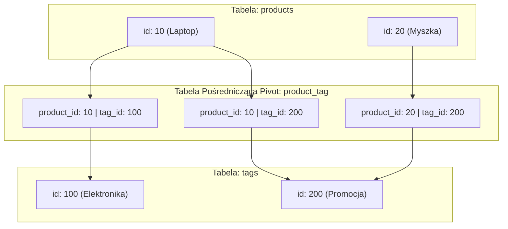

# Eloquent ORM — Modele i Relacje (Cz. 2 - Relacje N-do-N, Tabele Pivot i Warsztat)

Witaj w drugiej części modułu o relacjach w Eloquent ORM. W poprzedniej lekcji opanowałeś relacje 1-do-Wielu (`hasMany` / `belongsTo`). 

Dzisiaj przejdziemy do trudniejszego, ale niezwykle powszechnego scenariusza w architekturze baz danych: **Relacji Wiele-do-Wielu (N-do-N)**.

Nauczysz się obsługiwać **Tabele Pośredniczące (Pivot Tables)** oraz operacje **`attach()`**, **`detach()`** i **`sync()`**.

---

## 🎓 Krok 1: Jak działają Relacje Wiele-do-Wielu?

Rozpatrzmy system oznaczania produktów tagami (etykietami):
- **Jeden Produkt** (np. „Laptop Gamingowy”) może posiadać **wiele Tagów** („Elektronika”, „Wyprzedaż”, „Promocja”).
- **Jeden Tag** (np. „Promocja”) może być przypisany do **wielu Produktów** („Laptop”, „Myszka”, „Klawiatura”).

Relacyjnych baz danych nie da się połączyć bezpośrednio metodą N-do-N bez użycia trzeciej, pośredniczącej tabeli łączącej, zwanej **Tabelą Pivot**.



### Konwencja Nazewnictwa Tabeli Pivot w Laravel:
1. Nazwa tabeli pośredniczącej składa się z nazw obu połączonych modeli w **liczbie pojedynczej**.
2. Nazwy muszą być połączone znakiem podkreślenia `_` w **kolejności alfabetycznej**!
   - Przykład: Połączenie modeli `Product` oraz `Tag` daje nazwę tabeli **`product_tag`** (P przed T).
   - Przykład: Połączenie modeli `User` oraz `Role` daje nazwę tabeli **`role_user`** (R przed U).

---

## 🛠️ Warsztat z Mentorem: Definiowanie `belongsToMany()` w Modelach

Otwórzmy pliki modeli i przeanalizujmy kod relacji N-do-N.

### 1. Plik Modelu `Product` (`app/Models/Product.php`):
```php
<?php

namespace App\Models;

use Illuminate\Database\Eloquent\Model;
use Illuminate\Database\Eloquent\Relations\BelongsToMany;

final class Product extends Model
{
    /**
     * Relacja N-do-N: Produkt posiada wiele tagów
     */
    public function tags(): BelongsToMany
    {
        return $this->belongsToMany(Tag::class)
                    ->withTimestamps()
                    ->withPivot('discount_percent');
    }
}
```

### 2. Plik Modelu `Tag` (`app/Models/Tag.php`):
```php
<?php

namespace App\Models;

use Illuminate\Database\Eloquent\Model;
use Illuminate\Database\Eloquent\Relations\BelongsToMany;

final class Tag extends Model
{
    /**
     * Odwrotna relacja N-do-N: Tag należy do wielu produktów
     */
    public function products(): BelongsToMany
    {
        return $this->belongsToMany(Product::class)
                    ->withTimestamps();
    }
}
```

### 🔍 Rozbicie składni relacji `belongsToMany()` od zera:

- **`$this->belongsToMany(Tag::class)`** — Metoda definiująca połączenie N-do-N.
- **`->withTimestamps()`** — Nakazuje Laravelowi automatyczne uzupełnianie kolumn `created_at` i `updated_at` w tabeli pośredniczącej `product_tag` przy każdym podpięciu!
- **`->withPivot('discount_percent')`** — Pobiera dodatkowe autorskie kolumny z tabeli łączącej Pivot. Dostęp do nich uzyskamy w kodzie przez `$product->tags->first()->pivot->discount_percent`.

---

## 🎓 Krok 2: Operacje na Relacji Pivot (`attach`, `detach`, `sync`)

W relacjach N-do-N nie używamy metody `save()`. Zamiast tego Laravel dostarcza niezwykle potężnych metod synchronizujących:

### 1. `attach($tagId)` — Podpinanie nowego tagu:
```php
$product = Product::find(1);

// Podpięcie jednego tagu o ID 5
$product->tags()->attach(5);

// Podpięcie z dodatkowymi danymi dla kolumny pivot!
$product->tags()->attach(5, ['discount_percent' => 15]);
```

### 2. `detach($tagId)` — Odpinanie tagu:
```php
// Odpięcie tagu o ID 5 od produktu
$product->tags()->detach(5);

// Odpięcie WSZYSTKICH tagów od tego produktu naraz!
$product->tags()->detach();
```

### 3. `sync($tagIds)` — **Najważniejsza metoda produkcyjna!**
Metoda `sync()` przyjmuje tablicę ID i automatycznie doprowadza stan tabeli łączącej do podanej listy (dokłada brakujące, odpina usunięte):

```php
// Użytkownik zaznaczył w formularzu tagi [1, 3, 7]
$selectedTagIds = [1, 3, 7];

// Jedna linia kodu automatycznie robi czyszczenie i aktualizację w bazie!
$product->tags()->sync($selectedTagIds);
```

```mermaid
graph TD
    OldPivot["Aktualny stan w Pivot: Tagi [1, 2, 4]"] -->|Wywołanie sync([1, 3, 7])| SyncProcess["Metoda sync() w Laravel"]
    SyncProcess -->|Odpina nieobecny tag 2 i 4| Detach[detach 2, 4]
    SyncProcess -->|Pozostawia istniejący tag 1| Keep[Keep 1]
    SyncProcess -->|Podpina nowe tagi 3 i 7| Attach[attach 3, 7]
    SyncProcess -->|Wynik w bazie| NewPivot["Nowy stan w Pivot: Tagi [1, 3, 7]"]
```

---

## 🛠️ Interaktywny Trening Operacji na Tabelach Pivot (Sortable List)

Ułóż w odpowiedniej kolejności proces synchronizowania wybranych w formularzu tagów z produktem w kontrolerze:

<data-sortable-list title="Ułóż kolejność kroków synchronizowania relacji N-do-N przy zapisie formularza">
  <item data-correct="2">Odebranie i walidacja wybranej tablicy identyfikatorów tagów ($request->validated()['tags'])</item>
  <item data-correct="1">Użytkownik zaznacza pola checkbox z tagami w formularzu i klika Zapisz</item>
  <item data-correct="3">Wywołanie metody $product->tags()->sync($tagIds) w celu bezpiecznej synchronizacji tabeli łączącej</item>
</data-sortable-list>

---

### <span class="header-koala"><span>🦾</span><span>Executive Summary</span><span>🦾</span></span> Co masz wynieść z tej lekcji:

- Relację N-do-N definiujesz metodą **`belongsToMany()`** w obu modelach.
- Tabela łącząca Pivot ma domyślną nazwę złożoną z nazw modeli w liczbie pojedynczej połączonych alfabetycznie (np. **`product_tag`**).
- Używaj **`sync([$ids])`** do bezpiecznej aktualizacji zaznaczonych elementów z formularza.
- Metoda **`withPivot('pole')`** pozwala odczytywać dodatkowe dane z tabeli łączącej.
