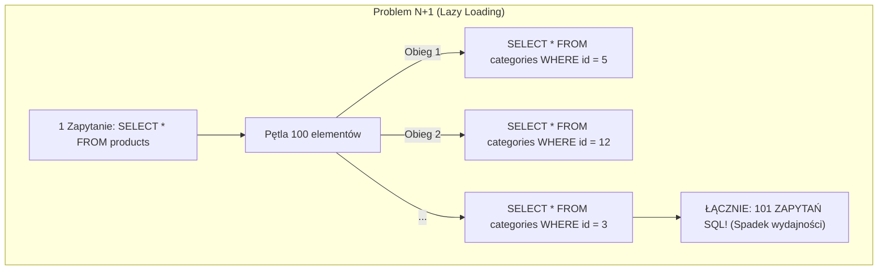
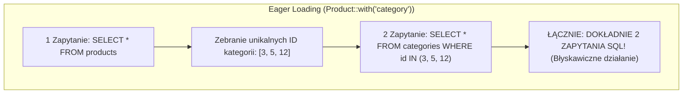

# Eloquent ORM — Modele i Relacje (Cz. 3 - Problem N+1, Eager Loading with() i Utrwalenie)

Witaj w trzeciej, zwieńczającej części modułu poświęconego relacjom w Eloquent ORM. 

W tej lekcji zajmiemy się wycinkiem **wydajnościowym oraz profilowaniem zapytań SQL**. Poznasz szczegółowo architekturę **Eager Loadingu (`with()`)**, nauczysz się dusić w zarodku problem **N+1 zapytań** oraz włączysz produkcyjne zabezpieczenie **`preventLazyLoading()`** w Laravel 11.

---

## 🎓 Krok 1: Co naprawdę dzieje się w bazie danych? (Problem N+1)

Zrozumienie problemu N+1 zapytań to granica dzieląca początkującego programistę od architekta oprogramowania.

Wyobraźmy sobie plik szablonu Blade wyświetlający listę 100 produktów wraz z nazwą ich kategorii:

### ❌ Złe podejście: Leniwe Ładowanie (Lazy Loading)
```php
// W Kontrolerze:
$products = Product::all(); // 1 ZAPYTANIE DO BAZY: SELECT * FROM products

// W Szablonie Blade (Pętla @foreach):
@foreach($products as $product)
    <p>{{ $product->name }} - {{ $product->category->name }}</p>
@endforeach
```

Co dzieje się pod spodem w logach SQL serwera MySQL?
1. Executed: `SELECT * FROM products;` (Wynik: 100 produktów)
2. In loop #1: `SELECT * FROM categories WHERE id = 5;`
3. In loop #2: `SELECT * FROM categories WHERE id = 12;`
4. ...
5. In loop #100: `SELECT * FROM categories WHERE id = 3;`

**Wynik:** Aplikacja wykonała **1 + 100 = 101 osobnych zapytań do bazy danych!** Strona zwalnia z kilkunastu milisekund do kilku sekund, a serwer bazy danych ulega przeciążeniu.



---

## ⚙️ Krok 2: Rozwiązanie — Wcześniejsze Ładowanie (Eager Loading z `with()`)

Stosując metodę `with('category')`, nakazujesz Laravelowi pobranie wszystkich potrzebnych relacji w zaledwie **dwóch łącznych zapytaniach SQL**, bez względu na to, czy na liście znajduje się 10 czy 100 000 produktów!

### ✅ Poprawne podejście: Eager Loading
```php
// W Kontrolerze:
$products = Product::with('category')->get();
```

Co dzieje się pod spodem w logach SQL serwera MySQL?
1. Executed: `SELECT * FROM products;` (Wyciąga 100 produktów i zbiera unikalne ID kategorii, np. `[3, 5, 12]`)
2. Executed: `SELECT * FROM categories WHERE id IN (3, 5, 12);`

**Wynik:** Dokładnie **2 ZAPYTANIA SQL!** Laravel w pamięci RAM przydziela obiekty kategorii do odpowiadających produktów.



---

## 🎓 Krok 3: Zaawansowane Techniki Eager Loadingu

### 1. Głębokie Ładowanie Wielopoziomowe (Nested Eager Loading):
Jeśli chcesz pobrać produkt, jego kategorię, jego tagi ORAZ autora każdej opinii:
```php
$products = Product::with([
    'category',
    'tags',
    'reviews.user' // Ładuje opinie I zalogowanego użytkownika który napisał daną opinię!
])->get();
```

### 2. Ograniczanie Kolumn (Dla oszczędności pamięci RAM):
Jeśli z tabeli `categories` potrzebujesz jedynie kolumn `id` oraz `name`:
```php
// UWAGA: Musisz zawsze podać kolumnę 'id', by Eloquent potrafił zmapować relację!
$products = Product::with('category:id,name')->get();
```

---

## 🛡️ Produkcyjna Ochrona: `preventLazyLoading()` w Laravel 11

Aby żaden programista w zespole przypadkowo nie wdrożył na produkcję kodu z problemem N+1 zapytań, Laravel 11 pozwala na **bezwzględne zablokowanie Leniwego Ładowania w środowisku lokalnym**.

Otwórz plik `app/Providers/AppServiceProvider.php` i wklej ten kod:

```php
<?php

namespace App\Providers;

use Illuminate\Database\Eloquent\Model;
use Illuminate\Support\ServiceProvider;

class AppServiceProvider extends ServiceProvider
{
    public function boot(): void
    {
        // Wyrzuca wyjątek przy próbie użycia Lazy Loadingu poza produkcją!
        Model::preventLazyLoading(! $this->app->isProduction());
    }
}
```

Teraz, jeśli ktokolwiek napisze w szablonie `$product->category` bez wcześniejszego `with('category')`, aplikacja w środowisku deweloperskim od razu rzuci czytelny wyjątek `LazyLoadingViolationException`!

---

## 🛠️ Podsumowujące Wyzwanie Dydaktyczne (Connection Matcher)

Utrwal całą wiedzę zebraną w trzech częściach modułu o Eloquent ORM — połącz techniki wydajnościowe z ich rezultatem w architekturze:

<data-connection-matcher title="Zwieńczenie Modułu: Połącz techniki Eloquent ORM z ich wpływem na wydajność">
    <div class="cmw-item" data-left="Product::with('category')" data-right="Eager Loading redukujący zapytania SQL z N+1 do dokładnie 2 zapytań"></div>
    <div class="cmw-item" data-left="Model::preventLazyLoading()" data-right="Reguła w AppServiceProvider rzucająca wyjątek przy wykryciu Leniwego Ładowania"></div>
    <div class="cmw-item" data-left="with(['reviews.user'])" data-right="Głębokie wielopoziomowe ładowanie relacji potomnych"></div>
    <div class="cmw-item" data-left="with('category:id,name')" data-right="Ograniczenie pobieranych kolumn z relacji dla oszczędności pamięci RAM"></div>
</data-connection-matcher>

---

### <span class="header-koala"><span>🦾</span><span>Executive Summary</span><span>🦾</span></span> Co masz wynieść z tej lekcji:

- **Problem N+1 zapytań** występuje, gdy odczytujesz relację w pętli bez wcześniejszego ładowania.
- Metoda **`Product::with('relacja')->get()`** sprowadza zapytania SQL do zaledwie 2 zapytań.
- Używaj **`Model::preventLazyLoading()`** w `AppServiceProvider` dla automatycznego wykrywania błędów w środowisku deweloperskim.
