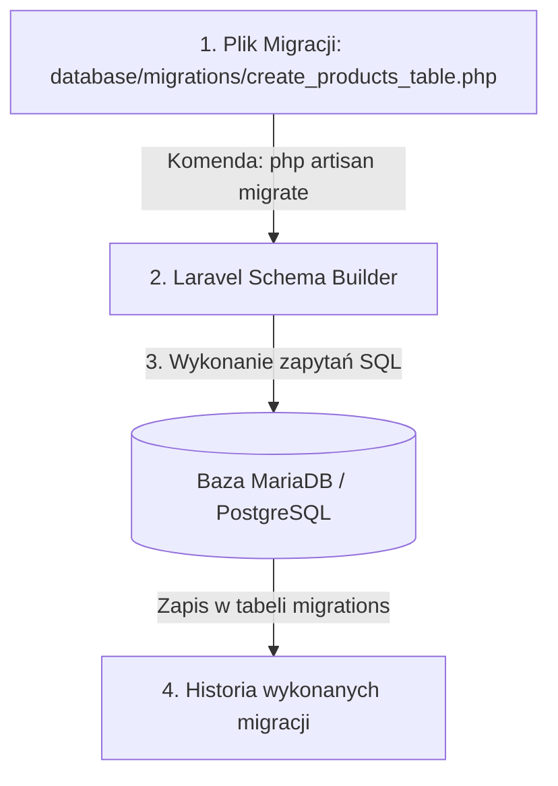

# Migracje i Struktura Bazy Danych w Laravel

Praca z bazami danych w zespołach programistycznych wymaga tworzenia historii zmian w strukturze tabel. W Laravel do tego celu służą **Migracje** — kontrola wersji dla Twojej bazy danych.

W tej lekcji dowiesz się, jak tworzyć migracje, definiować klucze obce, unikalne indeksy oraz jak zasilać bazę przykładowymi danymi za pomocą **Factory i Seederów**.

Zbudujemy **Mini-projekt 4: Struktura Bazy Danych dla Systemu Sklepowego w Migracjach**.

---

## 🧠 Model mentalny: Migracje jako Git dla Bazy Danych

Zamiast ręcznie klikać w phpMyAdmin, piszesz plik migracji w PHP. Każdy programista w zespole wpisuje `php artisan migrate` i otrzymuje **identyczną strukturę tabel**:



- **`up()`:** Kod wykonujący zmiany (np. tworzenie nowej tabeli).
- **`down()`:** Kod cofający zmiany (np. usuwanie tabeli przy `php artisan migrate:rollback`).

---

## ⚙️ Krok 1: Tworzenie Migracji Tabeli Produktów (`create_products_table.php`)

Wygenerujmy migrację komendą Artisan:

```bash
php artisan make:migration create_products_table
```

Otwórz wygenerowany plik w `database/migrations/` i zdefiniuj kolumny:

```php
<?php

use Illuminate\Database\Migrations\Migration;
use Illuminate\Database\Schema\Blueprint;
use Illuminate\Support\Facades\Schema;

return new class extends Migration
{
    public function up(): void
    {
        Schema::create('products', function (Blueprint $table) {
            $table->id(); // Autoincrementing BigInt Primary Key
            $table->string('sku')->unique(); // Unikalny kod towaru
            $table->string('name');
            $table->text('description')->nullable();
            $table->integer('price_cents'); // Cena w groszach/centach
            $table->boolean('is_active')->default(true);
            $table->timestamps(); // Tworzy kolumny created_at oraz updated_at
        });
    }

    public function down(): void
    {
        Schema::dropIfExists('products');
    }
};
```

### 🔍 Wyjaśnienie metod Schema Buildera od zera:

- **`$table->id()`** — Tworzy klucz główny typu BigInteger z autonumeracją.
- **`$table->string('sku')->unique()`** — Tworzy kolumnę tekstową (VARCHAR 255) i nakłada unikalny indeks.
- **`->nullable()`** — Modyfikator oznaczający, że dana kolumna może przyjmować wartość `NULL`.
- **`->default(true)`** — Ustawia domyślną wartość dla kolumny przy wstawianiu nowego rekordu.
- **`$table->timestamps()`** — Automatycznie dodaje dwie kolumny: `created_at` (data utworzenia) oraz `updated_at` (data ostatniej edycji).

---

## ⚙️ Krok 2: Zasilanie bazy danymi testowymi (Seedery i Factory)

Stwórzmy fabrykę danych testowych `ProductFactory`:

```bash
php artisan make:factory ProductFactory
```

Plik `database/factories/ProductFactory.php`:

```php
<?php

namespace Database\Factories;

use Illuminate\Database\Eloquent\Factories\Factory;

class ProductFactory extends Factory
{
    public function definition(): array
    {
        return [
            'sku'         => 'PROD-' . fake()->unique()->numberBetween(1000, 9999),
            'name'        => fake()->words(3, true),
            'description' => fake()->paragraph(),
            'price_cents' => fake()->numberBetween(999, 99900),
            'is_active'   => true,
        ];
    }
}
```

Uruchamiamy migracje i zasilanie bazy danymi w terminalu:

```bash
php artisan migrate:fresh --seed
```

---

## 🛠️ Interaktywne Połączenie Poleceń Migracji (Connection Matcher)

Sprawdź swoją wiedzę z zakresu obsługi migracji i fabryk w Laravel — połącz polecenie Artisan z jego działaniem:

<data-connection-matcher title="Dopasuj polecenie Laravel Artisan do operacji na bazie danych">
    <div class="cmw-item" data-left="php artisan migrate" data-right="Wykonuje wszystkie jeszcze niewykonane migracje"></div>
    <div class="cmw-item" data-left="php artisan migrate:fresh" data-right="Kasuje wszystkie tabele i uruchamia migracje od zera"></div>
    <div class="cmw-item" data-left="php artisan migrate:rollback" data-right="Cofa ostatnią paczkę (batch) wykonanych migracji"></div>
    <div class="cmw-item" data-left="$table->timestamps()" data-right="Tworzy kolumny created_at oraz updated_at"></div>
</data-connection-matcher>

---

### <span class="header-koala"><span>🦾</span><span>Executive Summary</span><span>🦾</span></span> Co masz wynieść z tej lekcji:

- **Migracje** zapewniają kontrolę wersji bazy danych w zespole programistycznym.
- Twórz migracje poleceniem **`php artisan make:migration`** i uruchamiaj przez **`php artisan migrate`**.
- Zasilaj bazę danymi testowymi przy użyciu **Factory i Seederów**.
