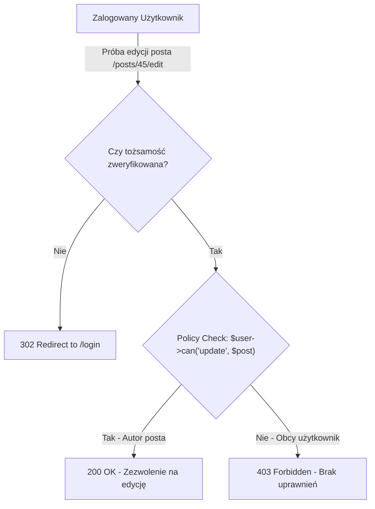

# System Logowania i Uprawnienia (Cz. 2 - Autoryzacja z Gates, Policies i Dyrektywami)

Witaj w drugiej części modułu o uwierzytelnianiu i autoryzacji w Laravel 11+.

W poprzedniej lekcji poznałeś logowanie (*Authentication* — Kim jesteś?). Dzisiaj przejdziemy do **Autoryzacji** (*Authorization* — Co wolno Ci zrobić?). Nauczysz się pisać **Gates (Bramki)**, **Policies (Polityki uprawnień)** oraz dyrektywę Blade **`@can`**.

---

## 🎓 Krok 1: Uwierzytelnianie vs Autoryzacja

- **Uwierzytelnianie (Authentication):** Sprawdzenie tożsamości (np. „Jestem zalogowany jako Jan Kowalski”).
- **Autoryzacja (Authorization):** Sprawdzenie praw do wykonania konkretnej akcji (np. „Czy Jan Kowalski ma prawo edytować wpis o ID 45?”).



---

## 🎓 Krok 2: Tworzenie Polityki Uprawnień (`PostPolicy.php`)

Klasy Polityk (**Policies**) grupują logikę autoryzacji wokół konkretnego modelu (np. `Post`, `Order`, `Product`).

Wygenerujmy politykę komendą Artisan:

```bash
php artisan make:policy PostPolicy --model=Post
```

Otwórz wygenerowany plik `app/Policies/PostPolicy.php`:

```php
<?php

namespace App\Policies;

use App\Models\Post;
use App\Models\User;

final class PostPolicy
{
    /**
     * Zezwala administratorom na wykonywanie wszystkich akcji (Super Admin Rule)
     */
    public function before(User $user, string $ability): ?bool
    {
        if ($user->isAdmin()) {
            return true;
        }

        return null; // Przekazuje decyzje do konkretnych metod poniżej
    }

    /**
     * Czy użytkownik może edytować dany wpis?
     */
    public function update(User $user, Post $post): bool
    {
        // Tylko autor danego posta ma prawo do jego edycji!
        return $user->id === $post->user_id;
    }

    /**
     * Czy użytkownik może usunąć dany wpis?
     */
    public function delete(User $user, Post $post): bool
    {
        return $user->id === $post->user_id;
    }
}
```

### 🔍 Rozbicie składni Polityki od zera:

- **`before(User $user, string $ability)`** — Metoda uruchamiająca się przed jakąkolwiek inną w polityce. Jeśli zwróci `true`, użytkownik otrzymuje pełne uprawnienia (przydatne dla kont administratorów).
- **`update(User $user, Post $post): bool`** — Sprawdza, czy klucz główny zalogowanego użytkownika (`$user->id`) jest równy kluczowi obcemu zapisanemu w poście (`$post->user_id`).

---

## 🛠️ Warsztat z Mentorem: Użycie Polityk w Kontrolerze i Szablonie Blade

### 1. Weryfikacja w Kontrolerze (`PostController.php`):
```php
public function edit(Post $post): View
{
    // Jeśli użytkownik nie jest autorem, Laravel wyrzuci wyjątek 403 Forbidden!
    $this->authorize('update', $post);

    return view('posts.edit', compact('post'));
}
```

### 2. Ukrywanie Przycisków w Blade (`@can`):
```html
@can('update', $post)
    <a href="{{ route('posts.edit', $post) }}" class="btn-edit">
        Edytuj Wpis
    </a>
@endcan

@can('delete', $post)
    <button type="submit" class="btn-delete">
        Usuń Wpis
    </button>
@endcan
```

---

## 🛠️ Interaktywne Połączenie Pojęć Autoryzacji (Connection Matcher)

Sprawdź swoje opanowanie autoryzacji w Laravel — połącz dyrektywy i metody z ich funkcją w kodzie:

<data-connection-matcher title="Połącz mechanizmy autoryzacji Laravel z ich rolą w kodzie">
    <div class="cmw-item" data-left="@can('update', $post)" data-right="Dyrektywa Blade renderująca przycisk edycji tylko dla uprawnionych użytkowników"></div>
    <div class="cmw-item" data-left="$this->authorize('update', $post)" data-right="Metoda kontrolera rzucająca wyjątek 403 Forbidden przy braku uprawnień"></div>
    <div class="cmw-item" data-left="php artisan make:policy" data-right="Polecenie Artisan tworzące nową klasę polityki uprawnień powiązaną z modelem"></div>
    <div class="cmw-item" data-left="Gate::define('admin-access')" data-right="Bramka globalna służąca do sprawdzania ogólnych uprawnień bez konkretnego modelu"></div>
</data-connection-matcher>

---

### <span class="header-koala"><span>🦾</span><span>Executive Summary</span><span>🦾</span></span> Co masz wynieść z tej lekcji:

- **Autoryzacja** weryfikuje uprawnienia użytkownika do wykonania akcji.
- Twórz polityki poleceniem **`php artisan make:policy ModelPolicy`**.
- Używaj **`$this->authorize('update', $post)`** w kontrolerze oraz dyrektywy **`@can`** w Blade.
