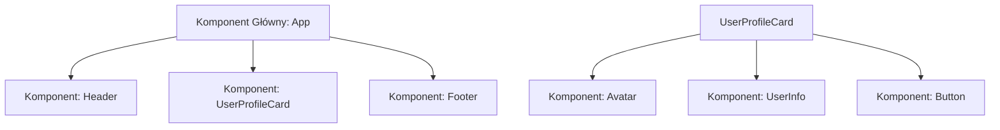

# Pierwszy komponent w Vite React

Witaj w kursie **React 19+**. React to najpopularniejsza na świecie biblioteka JavaScript do budowania nowoczesnych, szybkich i dostępnych cyfrowo interfejsów użytkownika (UI), stworzona przez inżynierów firmy Meta (Facebook).

W tej lekcji stworzymy pierwszy projekt React przy użyciu bundlera **Vite**, poznamy architekturę opartą na komponentach oraz opanujemy składnię **JSX/TSX**.

Zbudujemy **Mini-projekt 1: Interaktywną Kartę Profilu Użytkownika w JSX**.

---

## 🧠 Model mentalny: Czym jest Komponent i Wirtualny DOM?

W tradycyjnym programowaniu pisałeś jeden duży plik HTML. W React cała strona składa się z małych, autonomicznych klocków nazywanych **Komponentami**:



- **Wirtualny DOM (Virtual DOM):** React tworzy lekką kopię drzewa DOM w pamięci RAM. Gdy dane ulegną zmianie, React przelicza tylko różnicę (*Diffing Algorithm*) i aktualizuje w prawdziwym przeglądarkowym DOM wyłącznie ten jeden fragment, który uległ zmianie.
- **Składnia JSX (JavaScript XML):** Pozwala na pisanie kodu HTML bezpośrednio wewnątrz funkcji JavaScript!

---

## ⚙️ Krok 1: Tworzenie projektu React 19 w Vite

Otwórz terminal w swoim wybranym folderze i uruchom zwięzłe polecenie narzędzia Vite:

```bash
npx create-vite moj-react-app --template react
```

Przejdź do utworzonego folderu, zainstaluj paczki i uruchom serwer deweloperski:

```bash
cd moj-react-app
npm install
npm run dev
```

Strona otworzy się pod adresem: `http://localhost:5173/`.

---

## ⚙️ Krok 2: Anatomia pierwszego komponentu w JSX (`UserProfileCard.jsx`)

Stwórz w folderze `src/` nowy plik `UserProfileCard.jsx` i wpisz poniższy kod:

```jsx
import React from 'react';

/**
 * Komponent karty profilu użytkownika w JSX
 */
export function UserProfileCard() {
  const user = {
    name: 'Katarzyna Nowak',
    role: 'Lead Architekt Software',
    avatar: 'https://i.pravatar.cc/150?img=9',
    isOnline: true,
  };

  return (
    <div className="profile-card">
      

      <div className="profile-info">
        <h2>{user.name}</h2>
        <p className="role-text">{user.role}</p>

        <span className={`status-badge ${user.isOnline ? 'online' : 'offline'}`}>
          {user.isOnline ? '🟢 Dostępny teraz' : '⚪ Niedostępny'}
        </span>
      </div>
    </div>
  );
}
```

---

## 🛠️ Interaktywne Wyzwanie Programistyczne JSX (Web Challenge)

Napisz własną regułę CSS dla karty profilowej w JSX w edytorze poniżej:

<data-gate>
  <data-web-challenge id="react-jsx-card-challenge">
    <template data-type="html">
<div class="profile-card">
  <h2 class="user-name">Katarzyna Nowak</h2>
  <span class="status-badge">🟢 Dostępny</span>
</div>
    </template>
    
    <template data-type="css-readonly">
.profile-card {
  padding: 1.5rem;
  border-radius: 12px;
}
    </template>
    
    <template data-type="css">
/* Skonfiguruj tło .profile-card oraz kolor nagłówka .user-name */
.profile-card {
  background-color: #ffffff;
  border: 1px solid #e2e8f0;
}
.user-name {
  color: #0f172a;
}
    </template>
    
    <template data-type="requirements">
      [
        {"id": "card-border", "text": "Ustaw obramowanie .profile-card na 1px solid #e2e8f0", "type": "selector-css", "selector": ".profile-card", "property": "border", "value": "1px solid #e2e8f0"},
        {"id": "name-color", "text": "Ustaw kolor tekstu .user-name na #0f172a", "type": "selector-css", "selector": ".user-name", "property": "color", "value": "#0f172a"}
      ]
    </template>
  </data-web-challenge>
</data-gate>

---

### <span class="header-koala"><span>🦾</span><span>Executive Summary</span><span>🦾</span></span> Co masz wynieść z tej lekcji:

- Komponenty w React to funkcje tworzące zbiór klocków UI, pisane z **wielkiej litery** (np. `function MyComponent()`).
- Składnia **JSX** łączy HTML z JavaScriptem: używaj **`className=""`** oraz nawiasów **`{wyrażenie}`**.
- Wskazuj unikalne atrybuty **`key`** przy renderowaniu list w pętli `map()`.
