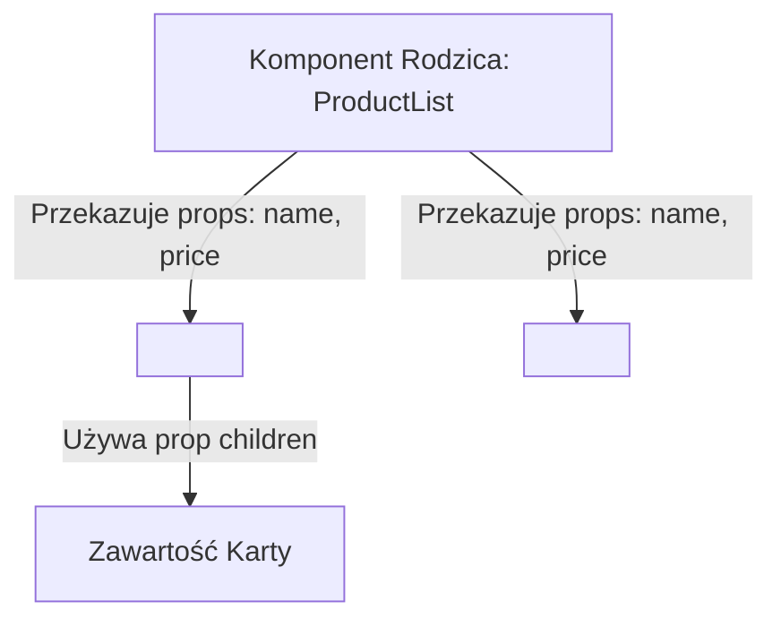

# Rekwizyty (Props) i Kompozycja UI w React

Komponenty w React przypominają czyste funkcje matematyczne — przyjmują dane wejściowe i zwracają wygenerowane elementy interfejsu. Dane przekazywane do komponentów z zewnątrz nazywamy **Rekwizytami (Props)**.

W tej lekcji dowiesz się, jak przekazywać dane przez Props, stosować destrukturyzację, używać specjalnego rekwizytu **`children`** oraz stosować **kompozycję komponentów**.

Zbudujemy **Mini-projekt 2: System Kart Produktowych z Kompozycją Props**.

---

## 🧠 Model mentalny: Przepływ Propsów i Kompozycja UI

Propsy zawsze przepływają **w jednym kierunku** — od komponentu rodzica do komponentu dziecka:



- **Propsy są tylko do odczytu (Read-Only):** Komponent dziecko nie ma prawa modyfikować otrzymanych propsów!
- **Kompozycja (`children`):** Pozwala na wstawianie jednych komponentów wewnątrz drugich tak jak natywne znaczniki HTML (`<div>...</div>`).

---

## ⚙️ Krok 1: Tworzenie Uniwersalnego Kontenera z `children` (`CardBox.jsx`)

Stwórz plik `src/CardBox.jsx`:

```jsx
import React from 'react';

/**
 * Uniwersalny kontener opakowujący z rekwizytem children
 */
export function CardBox({ title, children, variant = 'default' }) {
  return (
    <div className={`card-box card-box--${variant}`}>
      {title && <h3 className="card-title">{title}</h3>}
      
      {/* Specjalny rekwizyt children renderuje wszystko co wstawiono wewnątrz znacznika */}
      <div className="card-body">
        {children}
      </div>
    </div>
  );
}
```

### 🔍 Wyjaśnienie destrukturyzacji i prop `children` od zera:

- **`function CardBox({ title, children, variant = 'default' })`** — **Destrukturyzacja**. Zamiast pisać `props.title` i `props.children`, od razu wyciągamy zmienne z obiektu propsów w nagłówku funkcji.
- **`variant = 'default'`** — Domyślna wartość propsa, jeśli rodzic nie poda własnego wariantu.
- **`{title && <h3 ...>{title}</h3>}`** — Warunkowe renderowanie z operatorem `&&`. Nagłówek `<h3>` wyrenderuje się tylko wtedy, gdy prop `title` został przekazany i nie jest pusty.
- **`{children}`** — Specjalne słowo zastrzeżone w React. Renderuje wszystkie elementy wstawione wewnątrz komponentu (np. `<CardBox><p>Tekst</p></CardBox>`).

---

## ⚙️ Krok 2: Tworzenie Komponentu Przyscisku Akcji (`Button.jsx`)

Stwórz plik `src/Button.jsx`:

```jsx
import React from 'react';

export function Button({ label, onClick, variant = 'primary', disabled = false }) {
  return (
    <button 
      type="button"
      className={`btn btn--${variant}`}
      onClick={onClick}
      disabled={disabled}
    >
      {label}
    </button>
  );
}
```

---

## 🎯 🛠️ Mini-projekt 2: Składanie Systemu Kart w `ProductCatalog.jsx`

Stwórz plik `src/ProductCatalog.jsx` łączący nasze zdefiniowane komponenty:

```jsx
import React from 'react';
import { CardBox } from './CardBox';
import { Button } from './Button';

export function ProductCatalog() {
  const products = [
    { id: 'p1', name: 'Monitor 4K Dell', price: 1899, inStock: true },
    { id: 'p2', name: 'Słuchawki Wokółuszne', price: 499, inStock: false },
  ];

  const handleAddToCart = (productName) => {
    alert(`Dodano do koszyka: ${productName}`);
  };

  return (
    <section className="catalog-section">
      <h2>Katalog Produktów</h2>

      <div className="product-grid">
        {products.map(product => (
          <CardBox key={product.id} title={product.name} variant={product.inStock ? 'default' : 'disabled'}>
            <p className="product-price">Cena: <strong>{product.price} PLN</strong></p>
            <p className="stock-status">
              Stan: {product.inStock ? '🟢 Dostępny' : '🔴 Brak w magazynie'}
            </p>

            <Button 
              label={product.inStock ? 'Dodaj do Koszyka' : 'Wyprzedane'}
              disabled={!product.inStock}
              onClick={() => handleAddToCart(product.name)}
            />
          </CardBox>
        ))}
      </div>
    </section>
  );
}
```

---

## 🛠️ Diagnostyka i rozwiązywanie problemów

<data-gate>
  <data-quiz>
    <question>
      Dlaczego próba zmodyfikowania propsa bezpośrednio w komponecie (props.title = "Nowy") rzuci błąd lub nie zmieni widoku w React?
    </question>
    <options>
      <item>Propsy można modyfikować tylko w parzyste dni tygodnia.</item>
      <item correct>Propsy są z definicji obiektami tylko do odczytu (Read-Only). Komponent dziecko otrzymuje dane od rodzica i nie ma prawa ich zmieniać. Aby zmienić dane, należy użyć Stanu (State).</item>
      <item>Metoda Object.freeze wyłącza destrukturyzację zmiennych.</item>
    </options>
    <div data-hint="error">
      Zastanów się: co by się stało ze spójnością aplikacji, gdyby 10 różnych komponentów dzieci mogło modyfikować dane rodzica bez jego wiedzy?
    </div>
    <div data-hint="success">
      Wspaniale! Niezmienność propsów gwarantuje jednokierunkowy, przewidywalny przepływ danych w React.
    </div>
  </data-quiz>
</data-gate>

---

### <span class="header-koala"><span>🦾</span><span>Executive Summary</span><span>🦾</span></span> Co masz wynieść z tej lekcji:

- **Propsy** przekazują dane w jednym kierunku od rodzica do dziecka i są **tylko do odczytu**.
- Używaj **destrukturyzacji `{ label, onClick }`** dla czystego i czytelnego kodu.
- Rekwizyt **`children`** umożliwia elastyczną kompozycję komponentów (np. opakowywanie w kontenerach).
