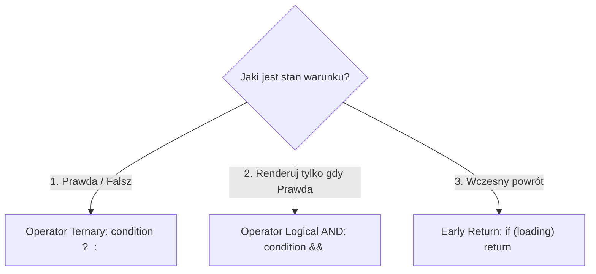

# Renderowanie Warunkowe i Listy (Cz. 1 - Operatory Ternary, && oraz Pętla map)

Witaj w pierwszej części modułu poświęconego dynamicznym widokom w React 19+.

Jako Twój mentor poprowadzę Cię przez techniki **renderowania warunkowego** oraz wyrenderujesz swoje pierwsze tablice danych z użyciem czystej metody JavaScript **`.map()`**.

---

## 🎓 Krok 1: Wzorce Renderowania Warunkowego w JSX

W React nie piszemy tradycyjnych pętli `for` ani instrukcji `if-else` wewnątrz kodu JSX. Ponieważ JSX jest wyrażeniem, stosujemy konstrukcje zwracające wartość:



### 1. Wzorzec Ternary (`warunek ? Prawda : Fałsz`):
Stosuj go, gdy chcesz wyświetlić jeden z dwóch wariantów interfejsu (np. przycisk Zaloguj vs Wyloguj):

```jsx
{isLoggedIn ? (
  <UserProfile user={currentUser} />
) : (
  <LoginForm onLogin={handleLogin} />
)}
```

### 2. Wzorzec Logical AND (`warunek && Komponent`):
Stosuj go, gdy chcesz wyświetlić dany element **tylko wtedy, gdy warunek jest prawdziwy** (np. plakietka powiadomień):

```jsx
{hasUnreadMessages && <span className="notification-badge">Nowa wiadomość!</span>}
```

> [!CAUTION]
> **Pułapka cyfry 0 w `&&`:** Jeśli zmienna `count` ma wartość `0`, zapis `{count && <Component />}` wyrenderuje cyfrę `0` bezpośrednio w kodzie HTML strony! Aby tego uniknąć, zawszę zamieniaj warunek na wartość boolean: `{count > 0 && <Component />}`.

---

## 🎓 Krok 2: Renderowanie Tablic z Metodą `.map()`

W React listy elementów renderujemy przekształcając tablicę obiektów JS w tablicę elementów JSX przy użyciu metody `.map()`:

```jsx
const categories = ['Elektronika', 'Książki', 'Odzież'];

return (
  <ul>
    {categories.map((category, index) => (
      <li key={index}>{category}</li>
    ))}
  </ul>
);
```

---

## 🛠️ Warsztat z Mentorem: Komponent Filtrowanego Katalogu (`ProductGrid.jsx`)

Połączmy renderowanie warunkowe i mapowanie tablicy w realnym komponencie:

```jsx
import React, { useState } from 'react';

export function ProductGrid() {
  const [products] = useState([
    { id: 'p1', name: 'Monitor Dell 27"', price: 1299, category: 'Hardware', inStock: true },
    { id: 'p2', name: 'Klawiatura Mechaniczna', price: 349, category: 'Accessories', inStock: false },
    { id: 'p3', name: 'Mysz Bezprzewodowa', price: 199, category: 'Accessories', inStock: true },
  ]);

  const [onlyInStock, setOnlyInStock] = useState(false);

  // Filtrujemy listę przed wyrenderowaniem
  const visibleProducts = products.filter(p => (onlyInStock ? p.inStock : true));

  return (
    <div className="catalog-wrapper">
      <h2>Katalog Sprzętu</h2>

      <label className="filter-checkbox">
        <input 
          type="checkbox" 
          checked={onlyInStock} 
          onChange={(e) => setOnlyInStock(e.target.checked)} 
        />
        Pokaż tylko dostępne w magazynie
      </label>

      {/* WZORZEC RENDEROWANIA WARUNKOWEGO: Gdy brak wyników */}
      {visibleProducts.length === 0 ? (
        <div className="empty-alert">Brak produktów spełniających wybrane kryteria.</div>
      ) : (
        <div className="grid-container">
          {/* WZORZEC RENDEROWANIA LISTY: Pętla map() */}
          {visibleProducts.map(product => (
            <div key={product.id} className="product-card">
              <h3>{product.name}</h3>
              <p>Cena: <strong>{product.price} PLN</strong></p>
              
              {/* Plakietka dostępności z operatorem ternary */}
              <span className={`badge ${product.inStock ? 'badge-success' : 'badge-danger'}`}>
                {product.inStock ? 'Dostępny' : 'Brak w magazynie'}
              </span>
            </div>
          ))}
        </div>
      )}
    </div>
  );
}
```

---

## 🛠️ Interaktywne Wyzwanie Programistyczne w Edytorze Monaco

Napisz reguły CSS dla kart produktowych i plakietek dostępności w wyzwaniu poniżej:

<data-gate>
  <data-web-challenge id="react-conditional-rendering-challenge-clean">
    <template data-type="html">
<div class="product-card">
  <h3>Monitor Dell 27"</h3>
  <span class="badge badge-success">Dostępny</span>
</div>
    </template>
    
    <template data-type="css-readonly">
.product-card {
  padding: 1.25rem;
  border-radius: 8px;
}
    </template>
    
    <template data-type="css">
/* Ustaw tło .product-card na #ffffff oraz .badge-success na #dcfce7 */
.product-card {
  background-color: #ffffff;
  border: 1px solid #e2e8f0;
}
.badge-success {
  background-color: #dcfce7;
  color: #166534;
}
    </template>
    
    <template data-type="requirements">
      [
        {"id": "card-border", "text": "Ustaw obramowanie .product-card na 1px solid #e2e8f0", "type": "selector-css", "selector": ".product-card", "property": "border", "value": "1px solid #e2e8f0"},
        {"id": "badge-bg", "text": "Ustaw kolor tła .badge-success na #dcfce7", "type": "selector-css", "selector": ".badge-success", "property": "background-color", "value": "#dcfce7"}
      ]
    </template>
  </data-web-challenge>
</data-gate>

---

### <span class="header-koala"><span>🦾</span><span>Executive Summary</span><span>🦾</span></span> Co masz wynieść z tej lekcji:

- Stosuj operator **`A ? B : C`** do renderowania jednego z dwóch wariantów widoku.
- Stosuj operator **`warunek && <Komponent />`** do renderowania elementów opcjonalnych.
- Listy elementów przekształcaj metodą **`array.map()`**.
