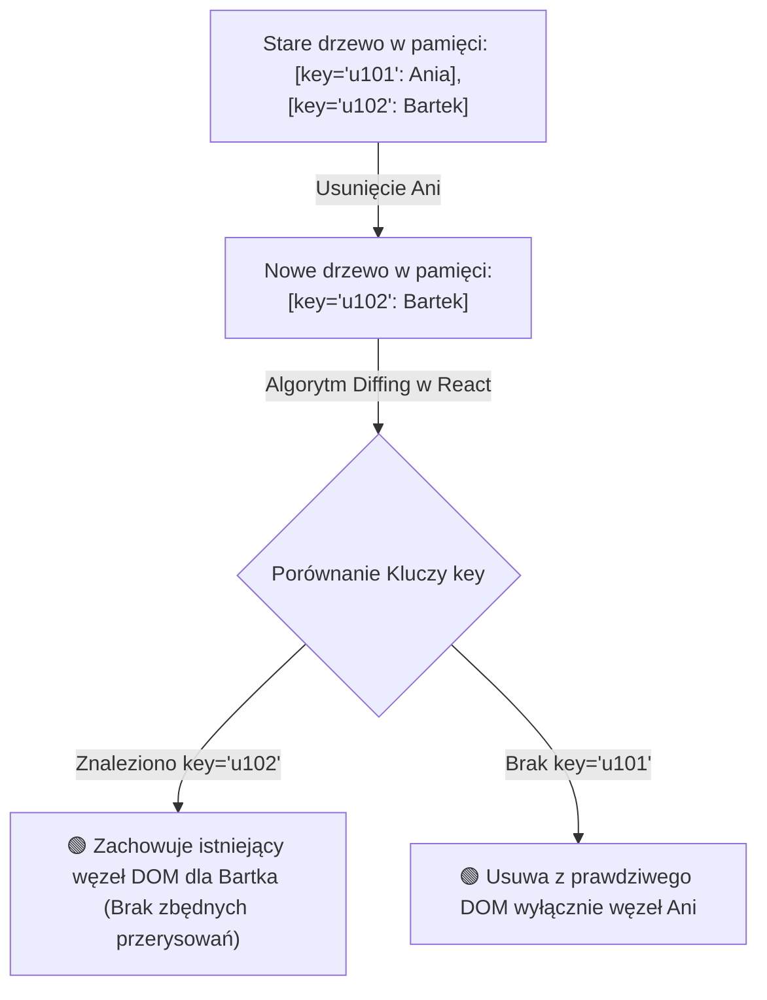
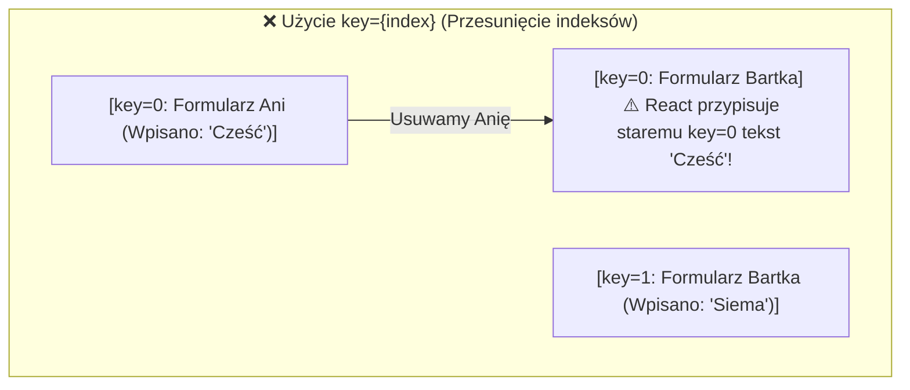

# Renderowanie Warunkowe i Listy (Cz. 2 - Algorytm Diffing, Rola Unikalnych Kluczy key i Warsztat)

Witaj w drugiej części modułu poświęconego renderowaniu list w React 19+.

W poprzedniej lekcji poznałeś pętlę `.map()`. Dzisiaj jako Twój mentor omówię z Tobą wewnętrzny **Algorytm Rekonsyliacji (Diffing Algorithm)** oraz dowiesz się, dlaczego użycie indeksu pętli `key={index}` doprowadza do niebezpiecznych błędów w formularzach i stanie komponentów.

---

## 🎓 Krok 1: Jak działa Algorytm Diffing w Wirtualnym DOM?

Gdy dane w Twojej aplikacji ulegają zmianie, React tworzy nowe drzewo Wirtualnego DOM i porównuje je z poprzednim. Aby wiedzieć, które elementy na liście zostały dodane, przesunięte lub usunięte, React wymaga podania **unikalnego rekwizytu `key`**:



---

## 🎓 Krok 2: Dlaczego NIE wolno stosować `key={index}`?

Wielu początkujących programistów pisze: `items.map((item, index) => <li key={index}>)`.

### Dlaczego to powszechny i groźny błąd?
Indeks z pętli zmienia się przy każdej reorganizacji tablicy! Jeśli masz na liście 3 formularze i usuniesz pierwszy z nich, stary element nr 2 staje się elementem nr 1 (jego nowy indeks wynosi `0`).

React porówna stare `key=0` z nowym `key=0` i uzna, że to ten sam komponent! W efekcie pole tekstowe pierwszego elementu zachowa stan usuniętego formularza!



---

## 🛠️ Warsztat z Mentorem: Bezpieczna Lista ze Stabilnymi Kluczami (`EditableList.jsx`)

Zbudujmy listę ze stabilnymi identyfikatorami, pozwalającą na dodawanie, edycję i usuwanie pozycji bez uszczerbku dla stanu:

```jsx
import React, { useState } from 'react';

export function EditableList() {
  const [users, setUsers] = useState([
    { id: 'usr-101', name: 'Katarzyna Nowak', role: 'Architekt' },
    { id: 'usr-102', name: 'Piotr Wiśniewski', role: 'DevOps' },
    { id: 'usr-103', name: 'Tomasz Kowalski', role: 'Frontend Lead' },
  ]);

  // Usuwanie po unikalnym ID (Immutability z filter)
  const handleDelete = (id) => {
    setUsers(prevUsers => prevUsers.filter(u => u.id !== id));
  };

  // Zmiana kolejności (Przesunięcie pierwszego elementu na koniec)
  const handleRotate = () => {
    setUsers(prevUsers => {
      if (prevUsers.length < 2) return prevUsers;
      const [first, ...rest] = prevUsers;
      return [...rest, first];
    });
  };

  return (
    <div className="editable-wrapper">
      <h3>Lista Zespołu (Stabilne Klucze key)</h3>
      <button className="btn-rotate" onClick={handleRotate}>
        🔄 Obróć Kolejność
      </button>

      <ul className="user-list">
        {users.map(user => (
          // PRAWIDŁOWE: Używamy stałego, unikalnego identyfikatora z bazy / UUID!
          <li key={user.id} className="user-item">
            <input type="text" defaultValue={user.name} />
            <span className="user-role">{user.role}</span>
            <button className="btn-del" onClick={() => handleDelete(user.id)}>
              Usuń
            </button>
          </li>
        ))}
      </ul>
    </div>
  );
}
```

### 🔍 Rozbicie składni linia po linii (Od Mentora):

- **`key={user.id}`** — Klucz powiązany trwale z daną osobą (`usr-101`). Bez względu na to, jak obrócimy lub przefiltrujemy listę, ten konkretny unikalny tekst wczyta właściwy stan inputu!
- **`defaultValue={user.name}`** — Niekompletne (uncontrolled) pole tekstowe demonstracyjnie pokazujące, że stan pola nie gubi się przy rotacji elementów.

---

## 🛠️ Interaktywne Wyzwanie Kolejności Algorytmu Diffing (Sortable List)

Ułóż w odpowiedniej chronologicznej kolejności kroki algorytmu Rekonsyliacji (Diffing) przy zmianie listy w React:

<data-sortable-list title="Ułóż kolejność przetwarzania listy przez Algorytm Diffing w React">
  <item data-correct="2">Porównanie unikalnych rekwizytów key nowego drzewa ze starym drzewem w pamięci RAM</item>
  <item data-correct="1">Modyfikacja stanu w komponent (np. setUsers()) wyzwalająca utworzenie nowego Wirtualnego DOM</item>
  <item data-correct="3">Identyfikacja zmienionych i przesuniętych węzłów na podstawie ich niezmiennych kluczy key</item>
  <item data-correct="4">Aktualizacja wyłącznie zmienionych węzłów w prawdziwym przeglądarkowym drzewie DOM</item>
</data-sortable-list>

---

### <span class="header-koala"><span>🦾</span><span>Executive Summary</span><span>🦾</span></span> Co masz wynieść z tej lekcji:

- **Rekwizyt `key`** pozwala algorytmowi Diffing bezbłędnie identyfikować elementy na liście.
- Nigdy nie stosuj **`key={index}`** dla list o zmiennej kolejności lub usuwanych elementach.
- Używaj stałych identyfikatorów z bazy danych (**`item.id`**) lub unikalnych ciągów **`UUID`**.
