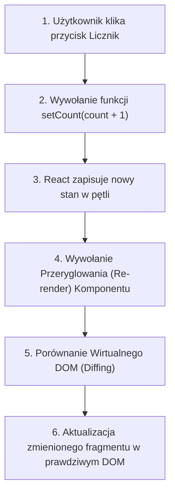

# Zarządzanie Stanem z useState (Cz. 1 - Mechanizm useState, Przeryglowanie i Niezmienność Stanu)

Witaj w pierwszej części drugiego modułu kursu React 19+.

Jako Twój mentor przeprowadzę Cię przez najczęściej używany Hook w bibliotece React: **`useState()`**. Dowiesz się, dlaczego zwykłe zmienne JavaScript nie powodują odświeżenia widoku, oraz opanujesz fundamentalną zasadę **Niezmienności Stanu (State Immutability)**.

---

## 🎓 Krok 1: Dlaczego Zwykła Zmienna nie Działa w UI?

Wyobraźmy sobie prosty licznik polubień. Dlaczego ponosimy porażkę, gdy piszemy kod ze zwykłą zmienną `let`?

```jsx
// ❌ ZŁE PODEJŚCIE (Nie działa w React):
export function CounterBad() {
  let count = 0;

  const handleClick = () => {
    count = count + 1; // Zmienna w pamięci się zmienia, ALE REACT O TYM NIE WIE!
    console.log('Aktualna wartość:', count);
  };

  return <button onClick={handleClick}>Licznik: {count}</button>;
}
```

### Co dzieje się pod spodem?
Gdy zmieniasz wartość `count = count + 1`, wartość w pamięci RAM rzeczywiście rośnie, ale **React nie wie, że komponent powinien zostać przerysowany**.

Aby poinformować Reacta o zmianie danych i wywołać **Przeryglowanie (Re-render)**, musimy użyć Hooka **`useState()`**:



---

## 🎓 Krok 2: Anatomia Hooka `useState()`

Hook **`useState(initialValue)`** zwraca tablicę dwuelementową, którą destrukturyzujemy w jednej linii:

```jsx
import React, { useState } from 'react';

const [count, setCount] = useState(0);
```

1. **`count` (Wartość stanu):** Aktualna wartość danych przechowywanych przez Reacta dla tego komponentu.
2. **`setCount` (Funkcja aktualizująca):** Dedykowana funkcja służąca do ustawiania nowej wartości stanu i zamawiania przerysowania widoku.

---

## 🎓 Krok 3: Święta Zasada Niezmienności Stanu (Immutability)

W React **NIGDY nie wolno bezpośrednio modyfikować obiektów ani tablic w stanie**!

### ❌ Krytyczny błąd (Modyfikacja bezpośrednia):
```jsx
const [user, setUser] = useState({ name: 'Jan', role: 'Dev' });

// BŁĄD: Modyfikujemy obiekt bezpośrednio! React porówna stary obiekt z nowym (ten sam adres w pamięci) i ANULUJE RENDER!
user.name = 'Piotr'; 
setUser(user); 
```

### ✅ Poprawne podejście (Kopia z operatorem Spread `...`):
```jsx
// DOBRZE: Tworzymy NOWY obiekt z kopią starych pól i nową wartością!
setUser(prevUser => ({
  ...prevUser,
  name: 'Piotr'
}));
```

---

## 🛠️ Warsztat z Mentorem: Interaktywny Komponent Koszyka (`ShoppingCart.jsx`)

Zbudujmy bezpieczny komponent koszyka z licznikiem sztuk:

```jsx
import React, { useState } from 'react';

export function ShoppingCart() {
  const [quantity, setQuantity] = useState(1);
  const [product] = useState({ name: 'Klawiatura Mechaniczna', price: 299 });

  const handleIncrement = () => {
    // Używamy bezpiecznej funkcji aktualizującej na podstawie poprzedniego stanu!
    setQuantity(prev => prev + 1);
  };

  const handleDecrement = () => {
    setQuantity(prev => (prev > 1 ? prev - 1 : 1));
  };

  return (
    <div className="cart-card">
      <h3>{product.name}</h3>
      <p className="price">Cena jednostkowa: {product.price} PLN</p>
      
      <div className="quantity-controls">
        <button onClick={handleDecrement} disabled={quantity <= 1}>-</button>
        <span className="count-display">{quantity}</span>
        <button onClick={handleIncrement}>+</button>
      </div>

      <p className="total">Suma: <strong>{quantity * product.price} PLN</strong></p>
    </div>
  );
}
```

### 🔍 Rozbicie składni linia po linii (Od Mentora):

- **`setQuantity(prev => prev + 1)`** — Stosujemy **aktualizator funkcji (functional updater)**. Przekazanie funkcji `prev => prev + 1` gwarantuje, że stan zawsze zwiększy się o 1, nawet jeśli wywołasz `setQuantity` kilkukrotnie w jednej milisekundzie!
- **`disabled={quantity <= 1}`** — Dynamiczne wyłączenie przycisku minusa, gdy liczba sztuk spadnie do 1.

---

## 🛠️ Interaktywne Połączenie Pojęć Stanu React (Connection Matcher)

Sprawdź swoje opanowanie mechanizmu `useState` — połącz cechę z jej rolą w architekturze:

<data-connection-matcher title="Połącz mechanizmy hooka useState z ich rolą w renderowaniu React">
    <div class="cmw-item" data-left="useState(initialValue)" data-right="Hook zwracający tablicę dwuelementową z wartością stanu oraz funkcją aktualizującą"></div>
    <div class="cmw-item" data-left="State Immutability (Niezmienność)" data-right="Zasada zabraniająca bezpośredniej modyfikacji obiektów w stanie bez użycia kopii"></div>
    <div class="cmw-item" data-left="setCount(prev => prev + 1)" data-right="Functional updater gwarantujący pracę na najświeższej wartości poprzedniego stanu"></div>
    <div class="cmw-item" data-left="Re-render (Przeryglowanie)" data-right="Cykl przerysowania komponentu wywoływany automatycznie przez funkcję setState"></div>
</data-connection-matcher>

---

### <span class="header-koala"><span>🦾</span><span>Executive Summary</span><span>🦾</span></span> Co masz wynieść z tej lekcji:

- Zwykłe zmienne `let` nie wywołują przerysowania widoku w React.
- Stan aktualizujesz wyłączną funkcją zwracaną z **`useState()`**.
- Zawsze zachowuj **niezmienność obiektów i tablic** przy użyciu operatora **`...spread`**.
