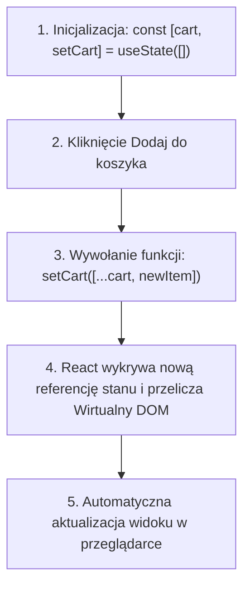

# Zarządzanie Stanem z useState w React

Wszystkie interaktywne aplikacje internetowe potrzebują pamięci podręcznej na dane wprowadzane przez użytkownika — otwarte zakładki, produkty w koszyku czy zawartość pola tekstowego. W React do przechowywania takich danych służy **Stan (State)** oraz Hook **`useState`**.

W tej lekcji dowiesz się, jak działa Hook `useState`, dlaczego **nie wolno modyfikować stanu bezpośrednio** oraz jak bezpiecznie aktualizować obiekty i tablice w stanie.

Zbudujemy **Mini-projekt 4: Reaktywny Koszyk Sklepowy z Hookiem useState**.

---

## 🧠 Model mentalny: Jak działa Hook `useState`?

W zwykłym JavaScript modyfikowałeś zmienną `count++` i ręcznie szukałeś elementu w DOM. W React wywołujesz funkcję aktualizującą stan (`setCount`), co nakazuje Reactowi **ponowne wyrenderowanie komponentu z nowymi danymi**:



---

## ⚙️ Krok 1: Składnia Hooka `useState` i Niezmienność Stanu

Hook `useState` zwraca dwuelementową tablicę:

```jsx
import React, { useState } from 'react';

// [1. Bieżąca wartość stanu, 2. Funkcja do zmiany stanu]
const [count, setCount] = useState(0);
```

> [!CAUTION]
> **Złota Zasada Stanu w React:** Nigdy nie pisz `cart.push(item)` ani `user.name = 'Nowe'`! React nie wykryje mutacji tego samego obiektu w pamięci RAM. Zawsze przekazuj **nową kopię obiektu/tablicy**.

---

## 🎯 🛠️ Mini-projekt 4: Reaktywny Koszyk Sklepowy (`InteractiveCart.jsx`)

Stwórz plik `src/InteractiveCart.jsx`:

```jsx
import React, { useState } from 'react';

export function InteractiveCart() {
  // Stan przechowywania tablicy produktów w koszyku
  const [cartItems, setCartItems] = useState([
    { id: 1, name: 'Książka: PHP 8.3 Architecture', price: 69.99, quantity: 1 },
  ]);

  // 1. Dodawanie nowego przedmiotu do stanu (Immutability z ...spread)
  const handleAddItem = () => {
    const newItem = {
      id: Date.now(),
      name: `Nowy Produkt #${cartItems.length + 1}`,
      price: 49.99,
      quantity: 1,
    };

    // Tworzymy NOWĄ tablicę dodając nowy element na koniec
    setCartItems(prevItems => [...prevItems, newItem]);
  };

  // 2. Modyfikowanie ilości wewnątrz stanu (Immutability z map)
  const handleUpdateQuantity = (id, delta) => {
    setCartItems(prevItems =>
      prevItems.map(item => {
        if (item.id === id) {
          const newQty = Math.max(1, item.quantity + delta);
          return { ...item, quantity: newQty }; // Zwracamy nowy obiekt przedmiotu
        }
        return item;
      })
    );
  };

  // 3. Usuwanie z koszyka (Immutability z filter)
  const handleRemoveItem = (id) => {
    setCartItems(prevItems => prevItems.filter(item => item.id !== id));
  };

  // Obliczenie sumy całkowitej
  const totalPrice = cartItems.reduce((sum, item) => sum + item.price * item.quantity, 0);

  return (
    <div className="cart-container">
      <h2>Twój Koszyk Zakupowy (useState)</h2>

      <button className="btn-add" onClick={handleAddItem}>
        + Dodaj Produkt
      </button>

      {cartItems.length === 0 ? (
        <p className="empty-cart">Koszyk jest pusty.</p>
      ) : (
        <div className="cart-list">
          {cartItems.map(item => (
            <div key={item.id} className="cart-item">
              <div className="item-info">
                <strong>{item.name}</strong>
                <span>{item.price.toFixed(2)} PLN</span>
              </div>

              <div className="item-controls">
                <button onClick={() => handleUpdateQuantity(item.id, -1)}>-</button>
                <span>{item.quantity}</span>
                <button onClick={() => handleUpdateQuantity(item.id, 1)}>+</button>
                <button className="btn-remove" onClick={() => handleRemoveItem(item.id)}>
                  Usuń
                </button>
              </div>
            </div>
          ))}
        </div>
      )}

      <hr />
      <h3>Razem do zapłaty: <strong>{totalPrice.toFixed(2)} PLN</strong></h3>
    </div>
  );
}
```

### 🔍 Wyjaśnienie aktualizacji stanu od zera:

- **`setCartItems(prevItems => [...prevItems, newItem])`** — Stosujemy wzorzec **funkcji aktualizującej (Updater Function)**. Gwarantuje ona, że pracujemy na najbardziej aktualnym stanie `prevItems`.
- **`[...prevItems, newItem]`** — Operator `...` rozpakowuje stare elementy, a na koniec dodajemy nowy element w nowej tablicy.
- **`prevItems.filter(item => item.id !== id)`** — Metoda `filter()` zwraca nową tablicę bez usuniętego przedmiotu.

---

## 🛠️ Diagnostyka i rozwiązywanie problemów

<data-gate>
  <data-quiz>
    <question>
      Co się stanie, gdy wykonasz kod items.push(newItem); setItems(items); zamiast setItems([...items, newItem])?
    </question>
    <options>
      <item>React automatycznie skasuje zawartość bazy danych.</item>
      <item correct>React porówna stary i nowy stan (oldState === newState). Ponieważ referencja tablicy w pamięci RAM się nie zmieniła, React pomyśli że dane są identyczne i NIE przerenderuje widoku w przeglądarce.</item>
      <item>Strona przeładuje się automatycznie 3 razy.</item>
    </options>
    <div data-hint="error">
      Zastanów się: `items.push()` modyfikuje tę samą tablicę pod tym samym adresem w RAM. Czy React wykryje nową referencję obiektu?
    </div>
    <div data-hint="success">
      Wspaniale! Pamiętaj: W React stan jest niezmienny. Zawsze przekazuj nową instancję tablicy lub obiektu.
    </div>
  </data-quiz>
</data-gate>

---

### <span class="header-koala"><span>🦾</span><span>Executive Summary</span><span>🦾</span></span> Co masz wynieść z tej lekcji:

- Stan deklarujesz Hookiem **`const [state, setState] = useState(initialValue)`**.
- Nigdy nie mutuj stanu bezpośrednio (`push`, `pop`, `=`).
- Zawsze przekazuj nowe kopie obiektów i tablic z operatorem spread **`[...array]`** lub metodami **`map()`** i **`filter()`**.
