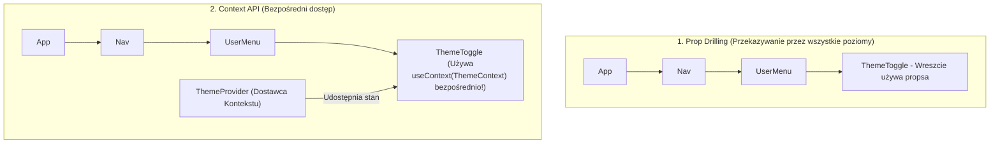

# Złożony Stan z useReducer i Context API

W miarę jak aplikacja React się rozrasta, przekazywanie stanów i funkcji modyfikujących przez 5 poziomów komponentów w dół (tzw. **Prop Drilling**) staje się uciążliwe i utrudnia utrzymanie kodu.

React dostarcza dwóch wbudowanych narzędzi rozwiązujących ten problem:
1. **`useReducer`:** Hook do zarządzania złożonym stanem za pomocą czystych funkcji reduktorów.
2. **`Context API`:** Mechanizm udostępniania stanu globalnego dla dowolnego komponentu w drzewie bez przekazywania propsów.

Zbudujemy **Mini-projekt 6: Globalny System Motywów (Dark/Light Mode) z Context API**.

---

## 🧠 Model mentalny: Rozwiązywanie Problemu Prop Drilling z Context API

Zamiast przekazywać stan motywu przez każdy pośredni komponent, **Context Provider** tworzy bezpieczną strefę dostępną dla każdego komponentu podrzędnego:



---

## ⚙️ Krok 1: Tworzenie Kontekstu Motywu (`ThemeContext.jsx`)

Stwórz plik `src/ThemeContext.jsx`:

```jsx
import React, { createContext, useContext, useState } from 'react';

// 1. Tworzymy obiekt Kontekstu
const ThemeContext = createContext(null);

/**
 * Komponent Dostawcy Kontekstu (Context Provider)
 */
export function ThemeProvider({ children }) {
  const [theme, setTheme] = useState('light'); // 'light' | 'dark'

  const toggleTheme = () => {
    setTheme(prev => (prev === 'light' ? 'dark' : 'light'));
  };

  return (
    <ThemeContext.Provider value={{ theme, toggleTheme }}>
      <div className={`app-theme-wrapper theme-${theme}`}>
        {children}
      </div>
    </ThemeContext.Provider>
  );
}

/**
 * Własny Hook ułatwiający korzystanie z kontekstu
 */
export function useTheme() {
  const context = useContext(ThemeContext);
  if (!context) {
    throw new Error('useTheme musi być używane wewnątrz <ThemeProvider>');
  }
  return context;
}
```

### 🔍 Wyjaśnienie składni Context API od zera:

- **`createContext(null)`** — Tworzy nowy magazyn kontekstu.
- **`<ThemeContext.Provider value={{ theme, toggleTheme }}>`** — Komponent dostawcy. Wszyscy jego potomkowie w drzewie JSX uzyskają dostęp do obiektu przekazanego w propsie `value`.
- **`useContext(ThemeContext)`** — Hook pobierający aktualną wartość z najbliższego dostawcy kontekstu nad nim.

---

## ⚙️ Krok 2: Użycie Kontekstu w Głębokim Komponencie (`ThemeToggler.jsx`)

Stwórz plik `src/ThemeToggler.jsx`:

```jsx
import React from 'react';
import { useTheme } from './ThemeContext';

export function ThemeToggler() {
  // Pobieramy dane bezpośrednio z kontekstu bez ani jednego propsa!
  const { theme, toggleTheme } = useTheme();

  return (
    <button 
      type="button" 
      className="theme-toggle-btn"
      onClick={toggleTheme}
    >
      Aktualny motyw: {theme === 'light' ? '☀️ Jasny' : '🌙 Ciemny'} (Kliknij aby zmienić)
    </button>
  );
}
```

---

## 🎯 🛠️ Mini-projekt 6: Opakowanie Aplikacji w Dostawcę (`App.jsx`)

Opakowujemy całe drzewo aplikacji w nasz `ThemeProvider`:

```jsx
import React from 'react';
import { ThemeProvider } from './ThemeContext';
import { ThemeToggler } from './ThemeToggler';

export default function App() {
  return (
    <ThemeProvider>
      <main className="main-content">
        <h1>Aplikacja z Globalnym Motywem React</h1>
        <p>Przycisk poniżej pobiera i zmienia stan motywu bez użycia ani jednego propsa!</p>
        
        <ThemeToggler />
      </main>
    </ThemeProvider>
  );
}
```

---

## 🛠️ Diagnostyka i rozwiązywanie problemów

<data-gate>
  <data-quiz>
    <question>
      Jaki problem w architekturze komponentów React rozwiązuje zastosowanie Context API?
    </question>
    <options>
      <item>Zapobiega przeładowywaniu przeglądarki internetowej przy błędach 404.</item>
      <item correct>Eliminuje problem Prop Drilling - zjawisko uciążliwego przekazywania danych przez wiele pośrednich poziomów komponentów, które same z tych danych nie korzystają.</item>
      <item>Konwertuje style CSS na kod w języku C++.</item>
    </options>
    <div data-hint="error">
      Zastanów się: co musiałbyś zrobić, gdyby komponent na samym dole drzewa potrzebował danych z samej góry bez Contextu? Przekazać props przez 10 komponentów po drodze!
    </div>
    <div data-hint="success">
      Wspaniale! Context API udostępnia dane bezpośrednio do dowolnego komponentu podrzędnego w drzewie JSX.
    </div>
  </data-quiz>
</data-gate>

---

### <span class="header-koala"><span>🦾</span><span>Executive Summary</span><span>🦾</span></span> Co masz wynieść z tej lekcji:

- **Context API** eliminuje uciążliwy problem przekazywania propsów przez wiele poziomów (**Prop Drilling**).
- Twórz kontekst funkcją **`createContext()`** i udostępniaj dane przez **`<Context.Provider value={...}>`**.
- Odczytuj dane w komponentach podrzędnych Hookiem **`useContext(Context)`**.
