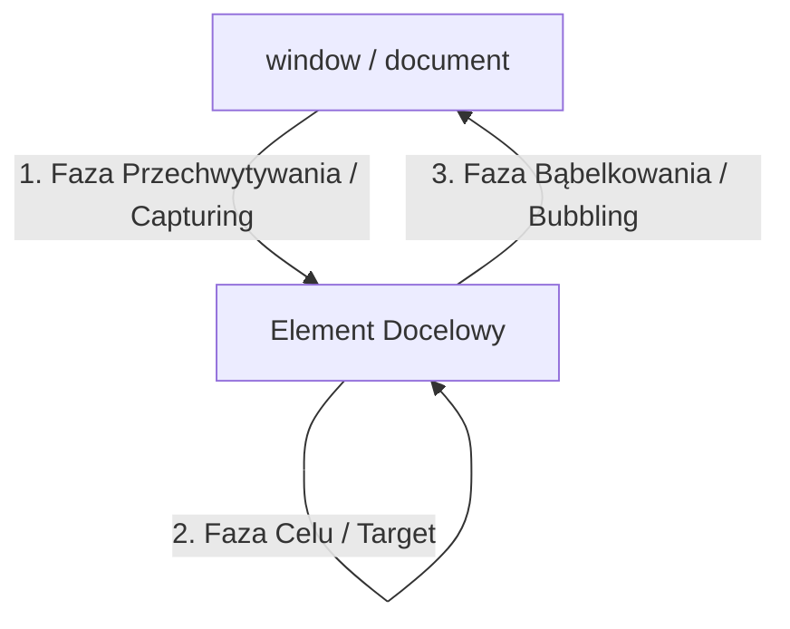

# Eventy i Obsługa Zdarzeń

Zdarzenia (*Events*) to sygnały wysyłane przez przeglądarkę, informujące o interakcji użytkownika (np. kliknięciu, przewinięciu, wciśnięciu klawisza) lub zmianie stanu dokumentu.

---

## 🧠 Model mentalny: Przepływ Zdarzenia w DOM (Fazy)

Zdarzenie w drzewie DOM przechodzi przez trzy fazy:



1. **Capturing:** Zdarzenie schodzi z samej góry (`window`) w dół do elementu docelowego.
2. **Target:** Zdarzenie dociera do wybranego elementu.
3. **Bubbling:** Zdarzenie powraca w górę drzewa DOM do samego `window`.

---

## ⚙️ Decyzja 1: Delegacja Zdarzeń (Event Delegation)

Dzięki fazie bąbelkowania nie musisz dodawać nasłuchiwaczy do każdego z 1000 przycisków na liście. Zamiast tego dodajesz **jeden nasłuchiwacz na rodzicu**:

```javascript
const list = document.querySelector('#items-list');

list?.addEventListener('click', (event) => {
  const target = event.target;
  
  // Sprawdzamy czy kliknięto w przycisk usuwania
  if (target instanceof HTMLElement && target.matches('.delete-btn')) {
    const itemId = target.dataset.id;
    console.log('Usuwanie elementu:', itemId);
  }
});
```

---

## 🛠️ Diagnostyka i rozwiązywanie problemów

<data-gate>
  <data-quiz>
    <question>
      Do czego służy metoda "event.preventDefault()" w obsłudze zdarzenia wysłania formularza ('submit')?
    </question>
    <options>
      <item>Wyłącza obsługę CSS dla formularza.</item>
      <item correct>Zatrzymuje domyślną akcję przeglądarki (przeładowanie strony i wysłanie zapytania HTTP GET/POST) pozwalając na przetworzenie danych w JavaScript.</item>
      <item>Usuwa pola formularza z drzewa DOM.</item>
    </options>
    <div data-hint="error">
      Zastanów się: co domyślnie robi przeglądarka po naciśnięciu Entera w formularzu? Przeładowuje całą stronę!
    </div>
    <div data-hint="success">
      Znakomicie! `preventDefault()` powstrzymuje natywną zachowawczość przeglądarki, dając pełną kontrolę skryptowi JS.
    </div>
  </data-quiz>
</data-gate>

---

### <span class="header-koala"><span>🦾</span><span>🐨</span><span>🦾</span></span> Co masz wynieść z tej lekcji:

- **Delegacja zdarzeń** oszczędza pamięć RAM poprzez wstawienie jednego nasłuchiwacza na elemencie nadrzędnym.
- **`event.preventDefault()`** blokuje domyślną akcję przeglądarki (np. przeładowanie strony przy submit).
- Zdarzenia **bąbelkują** w górę drzewa DOM od celu do obiektu `window`.
