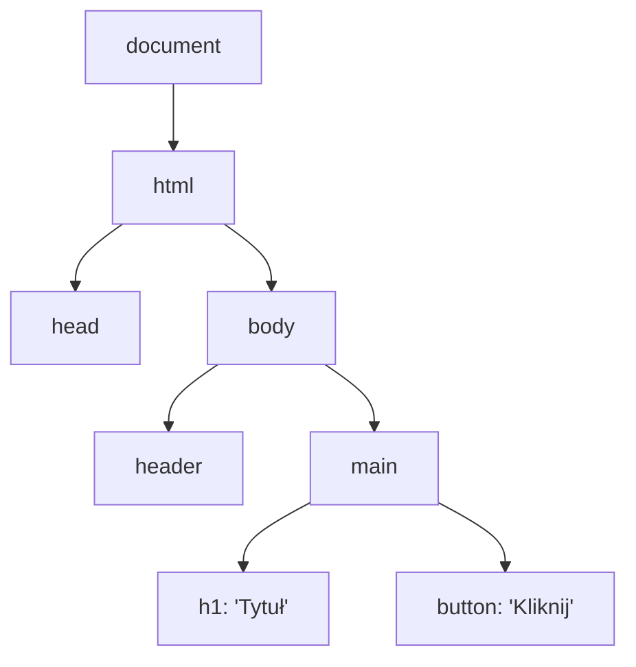

# JS i DOM

Wprowadzenie języka JavaScript na stronę WWW przekształca statyczny dokument HTML w dynamiczne środowisko aplikacji. Drzewo **DOM** (*Document Object Model*) to strukturalna reprezentacja dokumentu w pamięci przeglądarki, do której skrypty JS uzyskują natychmiastowy dostęp.

---

## 🧠 Model mentalny: Drzewo DOM jako struktura węzłów

Każdy Znacznik HTML staje się **węzłem obiektu** (`Node`) w pamięci RAM:



Nawigacja i wyszukiwanie w drzewie DOM odbywa się przy użyciu optymalnych metod wyszukiwania:

- **`document.querySelector(selector)`** — zwraca pierwszy pasujący element (lub `null`).
- **`document.querySelectorAll(selector)`** — zwraca statyczną kolekcję `NodeList`.

---

## ⚙️ Decyzja 1: Pobieranie i walidacja elementów z DOM

Zawsze sprawdzaj, czy pobrany element istnieje, zanim wywołasz na nim metody:

```javascript
// Bezpieczne pobranie elementu z weryfikacją
const mainHeader = document.querySelector('.main-header');

if (mainHeader instanceof HTMLElement) {
  mainHeader.classList.add('is-active');
} else {
  console.warn('Nie znaleziono nagłówka w strukturze DOM.');
}
```

---

## ⚙️ Decyzja 2: Odczytywanie i Modyfikowanie Właściwości

Modifikuj atrybuty i klasy za pomocą dedykowanego interfejsu `classList`:

```javascript
const button = document.querySelector('#submit-btn');

if (button) {
  // Przełączanie klas w bezpieczny sposób
  button.classList.toggle('btn--loading');
  
  // Bezpieczne zmienianie atrybutów aria
  button.setAttribute('aria-busy', 'true');
}
```

---

## 🛠️ Diagnostyka i rozwiązywanie problemów

<data-gate>
  <data-quiz>
    <question>
      Jaka jest różnica między metodami "querySelector" a "getElementById"?
    </question>
    <options>
      <item>getElementById działa tylko dla elementów nagłówkowych.</item>
      <item correct>querySelector przyjmuje dowolny selektor CSS (np. .class, #id, [data-attr]), podczas gdy getElementById przyjmuje wyłącznie samą nazwę identyfikatora ID bez znaku #.</item>
      <item>querySelector zwraca tablicę z wszystkimi elementami na stronie.</item>
    </options>
    <div data-hint="error">
      Zastanów się: do `getElementById` przekazujesz `'app'`, a do `querySelector` przekazujesz `'#app'`.
    </div>
    <div data-hint="success">
      Wyśmienicie! `querySelector` jest najbardziej uniwersalną i unifikującą metodą wyszukiwania w drzewie DOM.
    </div>
  </data-quiz>
</data-gate>

---

### <span class="header-koala"><span>🦾</span><span>🐨</span><span>🦾</span></span> Co masz wynieść z tej lekcji:

- **DOM** to reprezentacja węzłów obiektu HTML w pamięci RAM.
- Zawsze używaj **`classList`** do zarządzania klasami CSS zamiast modyfikowania pola `className`.
- Zawsze sprawdzaj istnienie elementu przed wywołaniem na nim metod.
