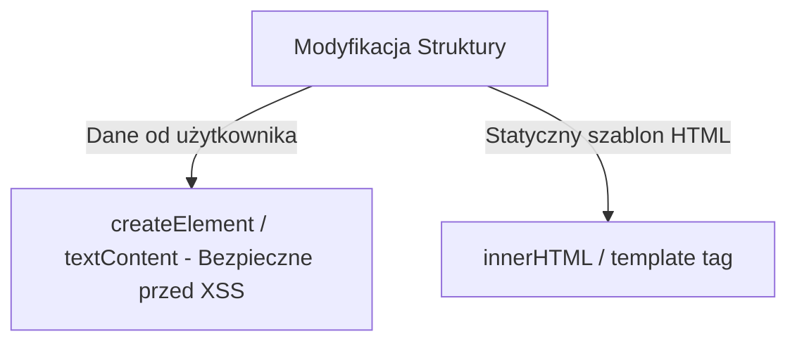

# Manipulacja Strukturą i Stanem

Dynamiczne tworzenie, modyfikowanie oraz usuwanie elementów z drzewa DOM wymaga dbałości o wydajność i bezpieczeństwo.

---

## 🧠 Model mentalny: `innerHTML` vs `createElement`

- **`innerHTML`:** Parsuje ciąg znaków jako HTML. Szybki w zapisie, ale stwarza ryzyko **XSS** przy braku sanitizacji i niszczy istniejące nasłuchiwacze zdarzeń wewnątrz nadrzędnego kontenera.
- **`createElement` / `append`:** Buduje węzły obiektowe bezpośrednio w pamięci. W pełni bezpieczne i zachowujące istniejące struktury.



---

## ⚙️ Decyzja 1: Bezpieczna modyfikacja zawartości tekstowej

Zawsze używaj `textContent` (lub `innerText`) zamiast `innerHTML`, gdy ustawiasz tekst pobrany od użytkownika:

```javascript
const userComment = '';

const commentElement = document.createElement('div');
// BEZPIECZNE: Przeglądarka traktuje wejście jako czysty tekst, nie kod HTML
commentElement.textContent = userComment;

document.getElementById('comments')?.appendChild(commentElement);
```

---

## 🛠️ Diagnostyka i rozwiązywanie problemów

<data-gate>
  <data-quiz>
    <question>
      Dlaczego ponowne nadpisanie container.innerHTML += '<div>...</div>' usuwa wcześniej podpięte nasłuchiwacze zdarzeń (addEventListener) z dzieci tego kontenera?
    </question>
    <options>
      <item>Przeglądarka nakłada blokadę bezpieczeństwa na nadpisywane elementy.</item>
      <item correct>Użycie operatora += z innerHTML niszczy i ponownie tworzy od zera wszystkie węzły DOM wewnątrz kontenera, przez co dotychczasowe obiekty w pamięci zostają skasowane wraz ze swoimi listenerami.</item>
      <item>Metoda innerHTML automatycznie czyści pamięć RAM z nieużywanych zmiennych.</item>
    </options>
    <div data-hint="error">
      Zastanów się: `innerHTML +=` powoduje przekonwertowanie aktualnego HTML na string, doklejenie ciągu i ponowne utworzenie całego drzewa od nowa!
    </div>
    <div data-hint="success">
      Wyczerpująca odpowiedź! Aby dodać nowe elementy bez niszczenia istniejących węzłów i listenerów, używaj `appendChild()`, `append()` lub `insertAdjacentHTML()`.
    </div>
  </data-quiz>
</data-gate>

---

### <span class="header-koala"><span>🦾</span><span>🐨</span><span>🦾</span></span> Co masz wynieść z tej lekcji:

- **`textContent`** chroni przed atakami typu Cross-Site Scripting (XSS).
- **`innerHTML +=`** niszczy istniejące węzły DOM i ich nasłuchiwacze zdarzeń.
- Używaj **`append()`** lub **`insertAdjacentHTML()`** do dopisywania nowych treści.
