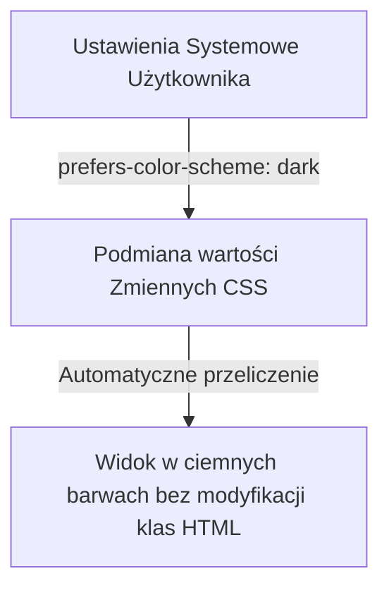

# Dark Mode i Dostępność A11y

Projektowanie motywu ciemnego (**Dark Mode**) oraz dbanie o cyfrową dostępność (**A11y**) to standardy nowoczesnego web-designu. Dark Mode zmniejsza zmęczenie wzroku w słabym oświetleniu i oszczędza baterię na ekranach OLED.

---

## 🧠 Model mentalny: Zmienne CSS i `prefers-color-scheme`

Najefektywniejsza realizacja motywów opiera się na **Zmiennych CSS** (Custom Properties) oraz zapytaniu mediów `prefers-color-scheme`.



---

## ⚙️ Decyzja 1: Tworzenie Elastycznego Systemu Kolorów w CSS

Nigdy nie wpisuj kolorów w kodzie na sztywno (`#ffffff` czy `#000000`). Używaj tokenów kolorów:

```css
:root {
  --bg-primary: #ffffff;
  --text-primary: #0f172a;
  --card-bg: #f8fafc;
}

/* Automatyczne dostosowanie do motywu systemowego */
@media (prefers-color-scheme: dark) {
  :root {
    --bg-primary: #0f172a;
    --text-primary: #f8fafc;
    --card-bg: #1e293b;
  }
}

/* Ręczny nadpis motywu klasą na elemencie html */
[data-theme="dark"] {
  --bg-primary: #0f172a;
  --text-primary: #f8fafc;
  --card-bg: #1e293b;
}

body {
  background-color: var(--bg-primary);
  color: var(--text-primary);
}
```

---

## ⚙️ Decyzja 2: Kontrast Kolorów i Standard WCAG 2.1

W motywie ciemnym unikaj czystej czerni (`#000000`) dla tła połączonej z czystą bielą (`#ffffff`) dla tekstu. Taki kontrast jest zbyt agresywny i wywołuje zjawisko powidoku (*halacji*).

Stosuj ciemne odcienie szarości/błękitu (np. `#121212` lub `#0f172a`) oraz sprawdzaj minimalny kontrast tekstu zgodnie z normami **WCAG 2.1 AA**:
- **Dla zwykłego tekstu:** Minimalny stosunek kontrastu to **4.5:1**.
- **Dla dużego tekstu (powyżej 24px):** Minimalny stosunek kontrastu to **3:1**.

---

## 🛠️ Diagnostyka i rozwiązywanie problemów

<data-gate>
  <data-quiz>
    <question>
      Dlaczego w motywie ciemnym (Dark Mode) zaleca się zmniejszenie nasycenia (saturation) żywych kolorów akcentowych (np. jaskrawego niebieskiego lub czerwonego)?
    </question>
    <options>
      <item>Jaskrawe kolory zużywają więcej energii na procesorze.</item>
      <item correct>Wysoko nasycone kolory na ciemnym tle wywołują wibracje chromatyczne i są bardzo trudne do rozczytania, pogarszając kontrast dla osób niedowidzących.</item>
      <item>Przeglądarki automatycznie ukrywają jaskrawe kolory w ciemnym motywie.</item>
    </options>
    <div data-hint="error">
      Zastanów się: jaskrawa czerwień na czarnym tle wydaje się „świecić” i wibrować, sprawiając bóle oczu.
    </div>
    <div data-hint="success">
      Wyczerpująca odpowiedź! W motywie ciemnym używaj stonowanych, pastelowych lub desaturowanych odcieni barw akcentowych.
    </div>
  </data-quiz>
</data-gate>

---

### <span class="header-koala"><span>🦾</span><span>🐨</span><span>🦾</span></span> Co masz wynieść z tej lekcji:

- **Zmienne CSS** pozwalają na czyste przełączanie motywów bez modyfikowania struktury HTML.
- Zachowaj **kontrast min. 4.5:1** (WCAG AA) dla tekstu czytelnego.
- Unikaj czystej czerni `#000000` i zbyt jaskrawych kolorów akcentowych w motywie ciemnym.
