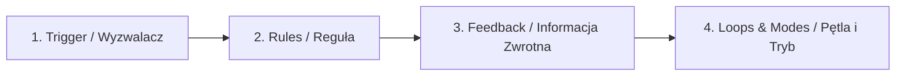

# Mikrointerakcje i Animacje UI

**Mikrointerakcje** to drobne, celowe elementy animowane w interfejsie, które odpowiadają na pojedynczą akcję użytkownika. Ich celem jest dbanie o informację zwrotną (*Feedback*) oraz dodawanie charakteru aplikacji.

---

## 🧠 Model mentalny: Anatomia Mikrointerakcji

Każda mikrointerakcja składa się z czterech etapów:



1. **Trigger:** Kliknięcie przycisku „Polub”, najechanie myszką, przeciągnięcie suwaka.
2. **Rules:** Co dzieje się w systemie po wyzwoleniu.
3. **Feedback:** Wizualna lub dźwiękowa zmiana (np. serce zmienia kolor na czerwony i delikatnie powiększa swój rozmiar).
4. **Loops & Modes:** Co dzieje się z przyciskiem przy powtórnym kliknięciu.

---

## ⚙️ Decyzja 1: Użycie CSS Transitions zamiast komend JS

Jeśli mikrointerakcja polega wyłącznie na zmianie wyglądu (np. zmiana koloru czy powiększenie), wykonaj ją w **czystym CSS**, wykorzystując sprzętową akcelerację GPU.

```css
.button-interactive {
  background-color: #2563eb;
  transform: scale(1);
  transition: transform 150ms cubic-bezier(0.4, 0, 0.2, 1), 
              background-color 150ms ease;
}

.button-interactive:hover {
  background-color: #1d4ed8;
  transform: scale(1.03);
}

.button-interactive:active {
  transform: scale(0.97); /* Sprężyste ugięcie przy kliknięciu */
}
```

---

## 🛠️ Diagnostyka i rozwiązywanie problemów

<data-gate>
  <data-quiz>
    <question>
      Dlaczego czas trwania mikrointerakcji przycisku (np. efekt ugięcia po kliknięciu) nie powinien przekraczać 200-300 milisekund?
    </question>
    <options>
      <item>Dłuższe animacje zużywają całe pasmo internetowe klienta.</item>
      <item correct>Animacje trwające dłużej niż 300ms są odbierane przez użytkownika jako spowolnienie lub ociąganie się interfejsu (Lethargic UI).</item>
      <item>CSS transition automatycznie wyłącza się po 300ms.</item>
    </options>
    <div data-hint="error">
      Zastanów się: mikrointerakcja ma dać natychmiastowe potwierdzenie akcji. Długa animacja zmusza użytkownika do czekania na zakończenie efektu.
    </div>
    <div data-hint="success">
      Wyczerpująca odpowiedź! Idealny czas reakcji mikrointerakcji UI mieści się w przedziale 100ms - 250ms.
    </div>
  </data-quiz>
</data-gate>

---

### <span class="header-koala"><span>🦾</span><span>🐨</span><span>🦾</span></span> Co masz wynieść z tej lekcji:

- **Mikrointerakcja** natychmiast potwierdza wykonanie akcji (Feedback).
- Używaj **CSS `transition`** na właściwościach `transform` i `opacity` dla najwyższej płynności.
- Optymalny czas trwania mikrointerakcji UI to **100 ms – 250 ms**.
