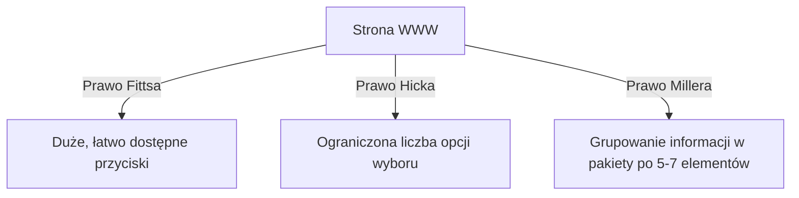

# Psychologia UX i Architektura UI

Tworzenie skutecznych interfejsów użytkownika wymaga zrozumienia ludzkiej percepcji i ograniczeń poznawczych. **Psychologia UX** dostarcza praw projektowych, które tłumaczą, dlaczego jedne strony wydają się intuicyjne, a inne wywołują frustrację.

---

## 🧠 Model mentalny: Obciążenie Poznawcze (Cognitive Load)

Ludzki mózg dysponuje ograniczoną pamięcią roboczą. Każdą decyzję w interfejsie traktuj jako **_koszt energetyczny_**.

- **Prawo Hicka:** Czas podjęcia decyzji rośnie wraz z liczbą i złożonością dostępnych opcji. Ograniczaj wybory.
- **Prawo Fittsa:** Czas dotarcia do celu zależy od odległości i rozmiaru celu. Najważniejsze przyciski akcji (CTA) powinny być duże i łatwo dostępne.
- **Prawo Jacobsa:** Użytkownicy spędzają większość czasu na *innych* stronach. Wolą, gdy Twoja strona działa tak samo, jak wszystkie znane im serwisy.

---

## 🛠️ Diagnostyka i rozwiązywanie problemów

<data-gate>
  <data-quiz>
    <question>
      Jakie działanie projektowe jest bezpośrednim zastosowaniem Prawa Hicka w sklepie internetowym?
    </question>
    <options>
      <item>Dodanie 50 różnych filtrów produktów w jednym rozwiniętym oknie bez podziału na kategorie.</item>
      <item correct>Podzielenie wielostopniowego procesu zamawiania (Checkout) na krótkie, zrozumiałe kroki z ograniczoną liczbą pól do wypełnienia w danym momencie.</item>
      <item>Użycie jaskrawego tła pod wszystkimi nagłówkami tekstu.</item>
    </options>
    

      Zastanów się: Prawo Hicka mówi, że im więcej wyborów dajesz naraz, tym dłużej użytkownik zastanawia się lub porzuca proces.
    

    

      Wyśmienita odpowiedź! Ograniczenie liczby decyzyjnych pól na jednym ekranie redukuje obciążenie poznawcze i podnosi konwersję.
    

  </data-quiz>
</data-gate>

---

### 🦾🐨🦾 Co masz wynieść z tej lekcji:

- **Prawo Hicka:** Mniej opcji widocznych naraz = szybsza decyzja użytkownika.
- **Prawo Fittsa:** Główne przyciski akcji muszą być duże i umieszczone w strefie wygodnej dla kciuka/myszy.
- **Prawo Jacobsa:** Korzystaj ze znanych konwencji UI zamiast wymyślać nawigację na nowo.
